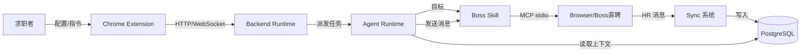
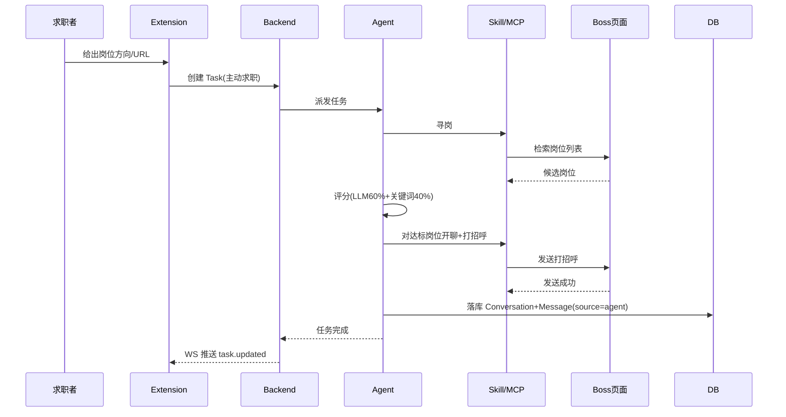
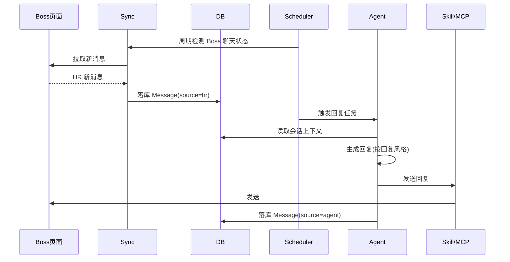
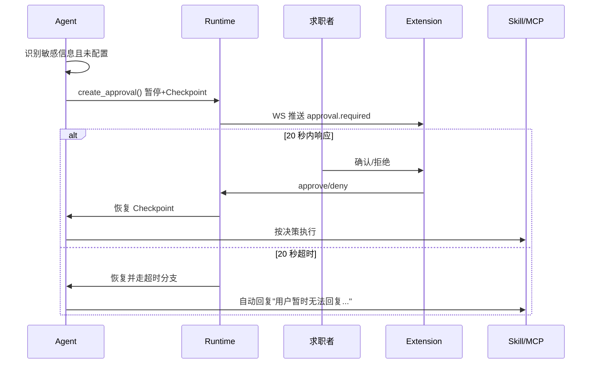

# AI求职Agent 产品需求文档（PRD）V2.0

## 文档信息

| 项 | 值 |
|---|---|
| 文档名称 | AI求职Agent 产品需求文档（PRD） |
| 版本 | V2.0 |
| 状态 | 设计基准（Design Baseline） |
| 适用范围 | V1，仅 Boss直聘 |
| 关联文档 | 02 系统总体架构 / 03 Agent状态机与Workflow / 09 数据库 / 10 API / 11 Chrome Extension / 14 Approval |
| 约束等级 | 本文档为产品行为契约，约束所有技术设计（02–16）的行为边界 |

---

## 1. 设计目标

定义 AI求职Agent V1 的**产品边界、核心能力、用户可控规则、异常与验收标准**，作为架构设计与开发实现的唯一产品基准。

本 PRD 不描述技术实现（见 02–16），但规定所有技术设计必须满足的产品行为：Agent 做什么、用户能控制什么、什么场景必须人工确认、什么行为被明确禁止。

---

## 2. 背景

### 2.1 项目定位

- **项目名称**：AI求职Agent
- **类型**：垂直领域 Agent（Vertical Domain Agent）
- **领域**：Boss直聘求职助手
- **V1 范围**：仅支持 Boss直聘；不设计其它招聘网站（拉勾/智联/猎聘等留待 V2+）。

### 2.2 问题背景

求职者在 Boss直聘上需高频重复执行：找岗 -> 评估匹配 -> 开聊 -> 打招呼 -> 回复 HR -> 被索要简历 -> 投递 -> 持续盯屏等消息。该流程机械、长尾、且难以 7×24 人工值守。需要一个能**真正操作浏览器、规划任务、维护状态**的 Agent 替用户完成闭环，而非仅生成话术的聊天机器人。

### 2.3 产品定性

本产品**不是**：

- 聊天机器人（Chatbot）
- RAG 问答系统
- 简单回复生成器
- 固定流程脚本机器人

本产品**是**：具有**浏览器操作能力 + 任务规划 + 状态管理 + 工具调用能力**的真实 Agent。

- LLM 负责：判断下一步、选择 Skill、选择 Tool、判断是否需要人工。
- Workflow 负责：状态流转、生命周期、任务管理。
- Skill 负责：业务目标封装（Goal-Oriented，不写 DOM 实现）。
- MCP 负责：浏览器能力。

---

## 3. 用户角色与典型场景

### 3.1 角色

| 角色 | 性质 | 说明 |
|---|---|---|
| 求职者 | 唯一用户（V1 单用户） | 配置规则后由 Agent 代为执行闭环；可在任意环节介入（手动发消息、Approval 确认、启停监听） |
| HR | 外部对象 | Boss直聘另一端真实招聘方；发消息、索要简历、确认面试 |
| Agent | 系统角色 | 代表求职者操作；所有"对外发送"行为受用户规则与 Approval 约束 |

### 3.2 典型场景

- **场景 A 主动求职**：用户给出岗位方向/URL -> Agent 寻岗 -> 评分 -> 对超阈值岗位开聊打招呼 -> HR 回复 -> 自动回复 -> HR 索要简历 -> 自动投递。
- **场景 B 被动响应**：用户离开 -> 后台监听发现 HR 新消息 -> 同步 DB -> Agent 生成回复 -> 发送 -> 再次同步。
- **场景 C 敏感确认**：HR 提出薪资/入职时间等敏感信息且用户未配置 -> Approval 暂停 -> 用户确认，或 20 秒超时自动回复。

---

## 4. 核心能力（9 项）

| # | 能力 | 说明 |
|---|---|---|
| 1 | 自动寻找岗位 | 按用户方向/URL 在 Boss直聘检索岗位 |
| 2 | 自动分析岗位匹配度 | LLM 60% + 关键词 40% 评分，输出详细依据 |
| 3 | 自动进入聊天 | 对达标岗位发起沟通，建立 Conversation |
| 4 | 自动主动打招呼 | 生成并发出首条打招呼消息 |
| 5 | 自动回复 HR | 按上下文与回复风格生成回复 |
| 6 | HR 索要简历后自动投递 | 仅在 HR 索要简历后投递，禁止发现即投 |
| 7 | 后台监听 HR 消息 | Service Worker + Scheduler 周期检测 |
| 8 | 保存完整聊天历史 | Agent/用户/HR 三方消息全量入库 |
| 9 | 长期维护求职上下文 | 跨会话记忆，DB 为真实数据源 |

---

## 5. 非目标（V1 不做）

- 不支持 Boss直聘以外的招聘平台。
- 不做简历自动生成/润色（仅上传 + 结构化摘要 + 合并）。
- 不做面试日历 / offer 管理等求职后流程。
- 不做多账号 / 多用户（V1 单用户）。
- 不自行实现浏览器自动化客户端（一律经 MCP）。
- 不做实时 DOM 读取作为 Agent 主数据源（以 DB 为准）。

---

## 6. 功能需求

> 每项能力以 FR-n 编号，给出输入 / 输出 / 规则 / 异常。

### 6.1 FR-1 自动寻找岗位

- **输入**：用户岗位方向关键词 / Boss 岗位列表 URL / 职位详情 URL。
- **输出**：候选岗位列表（含岗位元数据）。
- **规则**：仅 Boss直聘；同一岗位 ID 去重不重复处理；受"最大同时聊天数量"约束不无限开聊。
- **异常**：页面结构变化 -> 触发 browser_recovery_agent；无候选 -> 记录并通知用户。

### 6.2 FR-2 岗位匹配评分

- **输入**：岗位详情 + 用户求职规则 + 关键词（来自 Settings）。
- **输出**：总分（0–100）+ 详细评分依据（LLM 评语 + 关键词命中明细 + 扣分项）。
- **规则**：LLM 60% + 关键词匹配 40%；默认阈值 60 分进入下一步，可配置。
- **异常**：LLM 失败 -> Retry 2 次 -> 仍失败则该岗位标记评分失败、不进入下一步。

### 6.3 FR-3 自动进入聊天

- **输入**：达标岗位。
- **输出**：Conversation（系统生成 UUID）。
- **规则**：1 岗位 = 1 Conversation（HR + 岗位）；同一 HR 不同岗位 = 不同 Conversation；Conversation ID 为系统生成 UUID，**不依赖 Boss ID**（Boss external_id 仅作同步映射）。
- **异常**：已达最大同时聊天数量 -> 入队等待。

### 6.4 FR-4 自动主动打招呼

- **输入**：新建 Conversation。
- **输出**：发出的打招呼消息（入库，source=agent）。
- **规则**：按回复风格生成；不空洞套话；突出匹配度。
- **异常**：发送失败 -> Retry 2 次 -> 失败则停止任务并前端报错。

### 6.5 FR-5 自动回复 HR

- **输入**：HR 新消息 + 会话上下文（来自 DB，非实时 DOM）。
- **输出**：回复消息（source=agent）。
- **规则**：自动回复开关开 -> 自动回复；关 -> 转 Approval / 通知用户。
- **异常**：含敏感信息且用户未配置 -> 进 Approval。

### 6.6 FR-6 HR 索要简历后自动投递

- **输入**：HR 索要简历信号（LLM 意图判定）。
- **输出**：投递结果。
- **规则**：**必须** HR 先索要简历 -> 才自动投递；**禁止**发现岗位直接投递。自动投递开关关 -> 转 Approval。
- **异常**：无简历 -> 通知用户上传；投递失败 -> Retry 2 次。

### 6.7 FR-7 后台监听 HR 消息

- **输入**：后台监听开关 + 监听时间窗。
- **输出**：新消息同步 + 触发回复流程。
- **规则**：基于 Extension Service Worker + 后端 Scheduler；插件关闭 -> 监听继续；浏览器关闭 -> 监听停止；需用户主动"关闭程序"才彻底停。
- **异常**：Boss 未登录 / 页面不可达 -> 通知用户，不无限重试。

### 6.8 FR-8 保存完整聊天历史

- **输入**：所有来源消息（Agent 发 / 用户手发 / HR 发）。
- **输出**：messages 表记录（含 source、external_msg_id）。
- **规则**：DB 是真实数据源；去重靠 external_msg_id；LLM 主要读 DB。
- **异常**：同步冲突 -> 以 Boss 页面最新为准并记录。

### 6.9 FR-9 长期维护求职上下文

- **输入**：跨会话的会话 / 岗位 / 记忆。
- **输出**：Memory 记录，供后续任务检索。
- **规则**：长期上下文存 DB（Memory 表）；简历摘要 + Embedding 支持语义检索。

---

## 7. 用户设置（Settings）

| 分组 | 字段 |
|---|---|
| LLM 配置 | provider、base_url、api_key、model |
| 求职规则 | 期望薪资、地点、是否接受加班、是否接受外包、是否接受异地、是否接受试用期工资 |
| Agent 策略 | 自动回复开关、自动投递开关、最大同时聊天数量、后台监听时间 |
| 回复风格 | 默认：正式、礼貌、不过度客套、回答直接、突出匹配度、避免空洞套话；可自定义 |

> 求职规则字段同时作为岗位评分关键词来源（FR-2）与 Approval 触发判据（§10）。

---

## 8. 岗位评分规则

- **权重**：LLM 60% + 关键词匹配 40%。
- **关键词来源**：用户 Settings（求职规则）。
- **阈值**：默认 60 分进入下一步，可配置。
- **必须输出**：详细评分依据（LLM 评语 + 命中关键词 + 扣分项），便于用户审计。

---

## 9. 自动投递规则

```
发现岗位 -> 评分 -> 进入聊天 -> HR 索要简历 -> 自动投递
```

- **禁止**：发现岗位直接投递。
- 自动投递开关关时：HR 索要简历 -> 转 Approval。

---

## 10. 人工确认（Approval）规则

- **触发信息**：薪资 / 工作地点 / 入职时间 / 加班 / 外包 / 异地 / 试用期工资。
- **强制条件**：用户未配置的项 -> **必须** Approval。
- **流程**：Agent 暂停 -> `create_approval()` -> 通知用户 -> 等待 -> 恢复 Checkpoint。
- **超时**：20 秒无响应 -> 自动回复"我是用户的AI求职助手，目前用户暂时无法回复……"。
- **归属**：Approval 属 Runtime 层，**非 Skill**。

---

## 11. 后台监听规则

- **启停权属用户**：用户主动开启 / 关闭。
- **插件关闭** -> 监听继续（Service Worker + 后端 Scheduler 维持）。
- **浏览器关闭** -> 监听停止。
- **彻底终止** -> 需用户主动点"关闭程序"按钮，后端 Scheduler 才停。
- **监听流程**：

```
开启 -> Scheduler 启动 -> 检测 Boss 聊天状态 -> 发现新消息
     -> 同步 DB -> 入 Agent 处理 -> 生成回复 -> 发送 -> 再次同步
```

---

## 12. 数据流（产品视角）



要点：HR 消息经 Sync 落 DB；Agent 读 DB 上下文生成回复；回复经 Skill/MCP 发出后再次落 DB。DB 为真实数据源。

---

## 13. 状态流（产品视角）

- **任务状态**：`pending -> running -> waiting_approval -> succeeded / failed / canceled`（详细状态机见 doc 03）。
- **监听状态**：`idle / monitoring / paused / stopped`。
- **会话状态**：`active / waiting_hr / closed`。

---

## 14. 生命周期（产品视角）

- **Agent 一次只执行一个任务**；事件驱动模型：事件产生 -> Agent 启动 -> 执行任务 -> 保存状态 -> 结束。
- **新输入处置**：判断是否属于当前任务 -> 属则重新规划当前任务 / 不属则进入 Queue 等待。
- Agent 不负责长期监听（监听由 Scheduler + Service Worker 驱动，见 §11）。

---

## 15. 时序图（关键场景）

### 15.1 主动求职流程



### 15.2 HR 消息被动响应流程



### 15.3 Approval 流程



---

## 16. 接口（产品视角）

> 端点详细 schema 见 doc 10。此处仅列产品视角端点清单。

| 域 | 端点 |
|---|---|
| Agent | `GET /api/v1/agent/status`、`POST /api/v1/agent/start`、`POST /api/v1/agent/stop` |
| Task | `POST /api/v1/tasks`、`GET /api/v1/tasks`、`GET /api/v1/tasks/{id}` |
| Conversation | `GET /api/v1/conversations`、`GET /api/v1/conversations/{id}/messages` |
| Message | `POST /api/v1/messages/send` |
| Sync | `POST /api/v1/sync/messages` |
| Approval | `GET /api/v1/approvals/pending`、`POST /api/v1/approvals/{id}/approve`、`POST /api/v1/approvals/{id}/deny` |
| Settings | `PUT /api/v1/settings/llm`、`PUT /api/v1/settings/agent`、`PUT /api/v1/settings/job-rule` |
| Resume | 上传/查询（见 doc 10） |
| WebSocket | `/ws/sessions/{id}`，事件：`agent.step / tool.call / task.updated / message.received / message.sent / approval.required / task.failed` |

---

## 17. 异常处理（产品级）

| 异常 | 处理 |
|---|---|
| Boss 页面结构变化 | 触发 browser_recovery_agent（页面变化/DOM 异常/页面恢复） |
| LLM 调用失败 | Retry 2 次；仍失败则标记失败、不进入下一步 |
| 消息发送失败 | Retry 2 次；仍失败则停止任务、前端报错 |
| Boss 未登录/不可达 | 通知用户，不无限重试 |
| 同步冲突 | 以 Boss 页面最新为准并记录 |
| 所有失败 | 必记日志（时间/Task/Skill/Tool/参数/错误） |

---

## 18. Retry 与 Recovery（产品级）

- **自动 Retry**：最多 2 次。
- **仍失败**：停止任务，前端显示错误。
- **DOM 变化**：browser_recovery_agent 恢复页面后重试。
- **Recovery 边界**：Recovery 自身失败则上抛，停止任务并记录。

---

## 19. 非功能需求

- **可观测性**：结构化日志 + trace_id + latency；所有失败可追溯。
- **安全**：零信任输入校验；密钥不入库、不入记忆、不进日志明文。
- **并发**：单任务执行；最大同时聊天数量受控；队列排队。
- **数据完整性**：DB 为真实数据源；聊天历史全量保存；去重靠 external_msg_id。
- **环境隔离**：dev -> test -> staging -> prod。

---

## 20. 验收标准

- 9 项核心能力各可通过端到端用例验证。
- 评分输出含详细依据；阈值可配置且生效。
- 自动投递严格遵循"HR 索要简历后"前置；"发现即投"不可复现。
- Approval 20 秒超时自动回复可复现。
- 后台监听：插件关闭后继续、浏览器关闭后停止、用户主动关闭后彻底终止--三者可分别验证。
- Conversation ID 为系统 UUID，不依赖 Boss ID。
- 所有失败有日志、有 Retry（≤2）、有前端错误展示。

---

## 21. 扩展设计（V2+）

- 多平台支持（拉勾 / 智联 / 猎聘）--Skill 层抽象平台适配。
- 多账号 / 多用户。
- 简历自动润色 / 多版本管理。
- 面试日程 / offer 管理等求职后闭环。

---

## 22. 术语表

| 术语 | 含义 |
|---|---|
| Agent | 具备推理/规划/工具调用能力的执行主体 |
| Runtime | Agent 运行时（状态/Checkpoint/生命周期/Interrupt 恢复） |
| Skill | 业务目标封装（Goal-Oriented，不含 DOM 实现） |
| MCP | Model Context Protocol，浏览器能力层（stdio） |
| Conversation | 1 岗位 + 1 HR 的会话单元，系统 UUID 标识 |
| Approval | 人工确认（Runtime 层），敏感信息触发 |
| Checkpoint | LangGraph 状态快照，用于 Interrupt 恢复 |
| Sync | 聊天/消息同步（双同步器，DB 为真实数据源） |
| Memory | 长期求职上下文存储 |
