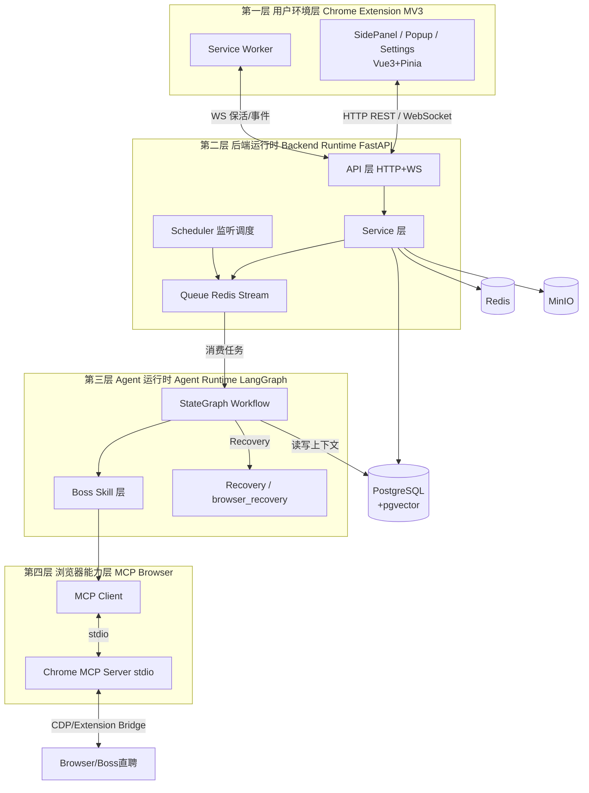
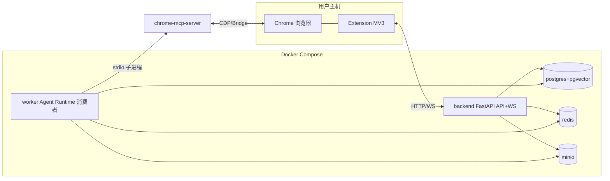
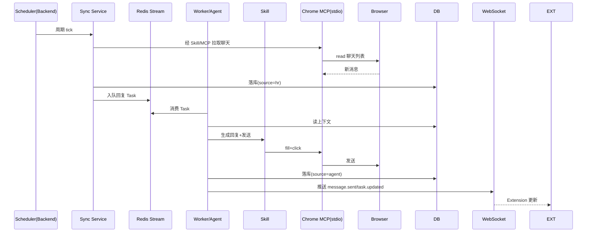

# 系统总体架构设计 V2.0

## 文档信息

| 项 | 值 |
|---|---|
| 文档名称 | 系统总体架构设计（HLD） |
| 版本 | V2.0 |
| 状态 | 设计基准 |
| 关联文档 | 01 PRD / 03 Agent状态机 / 04 Agent Runtime / 07 MCP与Tool / 11 Chrome Extension / 16 部署 |
| 定位 | 全局架构基准；其余文档（03–16）的组件、术语、接口均以本文为基，引用而非重定义 |

---

## 1. 设计目标

给出 AI求职Agent 的**全局架构**：四层划分、组件职责、通信协议、部署拓扑、数据流与边界约束。使任何一份子文档都能在此坐标系内定位自身模块，且开发人员可据此划分工作面与接口契约。

---

## 2. 背景

PRD（doc 01）已定义产品行为：真实 Agent（非脚本）、垂直 Boss直聘、单任务执行、DB 为真实数据源、Approval 属 Runtime、MCP 经 stdio。本文将这些行为约束映射为物理与逻辑架构。

关键架构约束（来自 Prompt，全文档遵守）：

1. Agent 不直接操作浏览器底层；Agent -> Skill -> MCP。
2. Skill 不写 DOM/XPath/CSS Selector；只描述目标。
3. MCP 一律 stdio（非 HTTP/SSE）；不自行实现 Browser Client。
4. Agent 一次只执行一个任务；事件驱动。
5. DB 是真实数据源；LLM 主要读 DB，不实时读 DOM。
6. 后台监听由 Extension Service Worker + 后端 Scheduler 驱动，不依赖 Boss 页面常驻。

---

## 3. 总体架构（四层）



四层职责一句话：

| 层 | 组件 | 职责 |
|---|---|---|
| L1 用户环境 | Chrome Extension MV3 | 用户交互、浏览器生命周期、WS 保活、通知、监听启停 |
| L2 后端运行时 | FastAPI + Scheduler + Queue | HTTP/WS 接口、Task 管理、调度、队列、业务编排 |
| L3 Agent 运行时 | LangGraph + Skill + Recovery | 状态机、ReAct 决策、Skill 调用、Checkpoint/Interrupt/Recovery |
| L4 浏览器能力 | MCP Client + Chrome MCP Server | 浏览器操作（navigate/click/fill/read/upload 等） |

---

## 4. 组件职责

### 4.1 Chrome Extension（L1）

- **SidePanel**：Agent 主控制台（状态/当前任务/Timeline/Chat/Approval/日志/输入）。
- **Popup**：快速控制（启停 Agent、查看状态、打开 SidePanel）。
- **Settings**：LLM/求职规则/Agent 策略/回复风格配置。
- **Service Worker**：插件生命周期、WebSocket 保活、浏览器事件监听、通知、监听启停控制（用户主动"关闭程序"按钮）。
- **Content Script**（如需）：页面上下文辅助（非主数据源）。

### 4.2 Backend Runtime（L2）

- **API 层**：REST 端点（Agent/Task/Conversation/Message/Sync/Approval/Settings/Resume）+ WebSocket（`/ws/sessions/{id}` 事件推送）。不写业务逻辑。
- **Service 层**：业务编排（Task 创建/派发、Settings 校验、Sync 协调、Approval 生命周期）。不直接写 SQL。
- **Scheduler**：后台监听调度器--周期触发 Sync 检测 Boss 聊天状态；受用户"关闭程序"控制。
- **Queue（Redis Stream）**：Task 排队、优先级、重试、并发控制。
- **Repository 层**：数据访问（SQLAlchemy async）。不依赖 HTTP。

### 4.3 Agent Runtime（L3）

- **StateGraph Workflow**：LangGraph 状态机（公共节点见 doc 03/06）。
- **Skill 层**：Boss 领域 Skill（Goal-Oriented，见 doc 08）。
- **Recovery**：browser_recovery_agent（DOM 变化/页面异常/页面恢复）。
- **Checkpoint/Interrupt**：状态快照与 Approval 中断恢复（见 doc 04/06/14）。

### 4.4 MCP Browser Layer（L4）

- **MCP Client**：管理 Chrome MCP Server 子进程生命周期；经 stdio 收发工具调用。
- **Chrome MCP Server**：浏览器能力提供方（18 个工具，见 doc 07）。
- **Browser**：Boss直聘页面（真实操作对象）。

---

## 5. 分层架构（Backend 内部）

严格自上而下依赖，禁止反向：

```
api (HTTP/WS 接口层)  ->  service (业务逻辑层)  ->  repository (数据访问层)  ->  database
        ↓                       ↓                        ↓
     schemas (DTO/Pydantic)  core (config/logging)    db (engine/session/Base)
                             infra (redis/minio client)
```

边界规则：

- Route 不允许写业务逻辑。
- Service 不允许直接写 SQL（经 Repository）。
- Repository 不允许依赖 HTTP。
- DTO（schemas）不允许泄露 ORM Model。
- 禁止跨层乱调用；禁止反向依赖。

> Phase 0 已落地：`core/config.py`、`core/logging.py`、`db/base.py`、`models/`（9 表）、`api/v1/health.py`、`api/deps.py`。Service/Repository/Infra 在 Phase 2+ 接入。

---

## 6. 通信协议

| 链路 | 协议 | 说明 |
|---|---|---|
| Extension <-> Backend | HTTP REST + WebSocket | REST 用于配置/查询/动作；WS 用于实时事件推送（agent.step/tool.call/approval.required 等） |
| Backend <-> Agent Runtime | 进程内调用 | LangGraph 运行于 Worker 进程内；非跨进程 |
| Backend <-> Queue | Redis Stream | Task 入队/消费/重试/ACK |
| Agent <-> Skill | 进程内调用 | Skill 为 Python 可调用对象 |
| Skill <-> MCP | MCP stdio | MCP Client 经 stdio 与 Chrome MCP Server 通信 |
| Chrome MCP Server <-> Browser | CDP / Extension Bridge | 浏览器控制 |
| Backend <-> DB | asyncpg (SQLAlchemy async) | 业务数据 + pgvector |
| Backend <-> MinIO | S3 API | 简历文件/截图/执行证据 |

MCP stdio 配置（冻结）：

```json
{
  "mcpServers": {
    "chrome-mcp": {
      "command": "node",
      "args": ["/path/to/mcp-server.js"]
    }
  }
}
```

> 选 stdio 而非 HTTP/SSE：本地 Agent 由 MCP Client 管理 Server 生命周期，不暴露本地端口，调试简单，符合桌面 Agent 模式。

---

## 7. 技术栈

| 领域 | 技术 | 状态 |
|---|---|---|
| 插件 | Chrome Extension MV3 | 冻结 |
| 前端 | Vue3 + TypeScript + Vite + Pinia | 冻结 |
| 后端 | Python + FastAPI + asyncio + Pydantic | 冻结 |
| Agent | LangGraph + LangChain | 冻结 |
| 浏览器控制 | Chrome MCP Server | 冻结 |
| MCP 协议 | stdio | 冻结 |
| 数据库 | PostgreSQL | 冻结 |
| 向量 | pgvector | 冻结 |
| 缓存/队列 | Redis + Redis Stream | 冻结 |
| 实时通信 | WebSocket | 冻结 |
| 文件存储 | MinIO | V1 纳入（简历/截图/证据） |
| 部署 | Docker Compose | V1 纳入 |

---

## 8. 部署拓扑



服务清单（docker-compose）：`backend`、`worker`、`postgres`、`redis`、`minio`。`chrome-mcp-server` 由 worker 以子进程拉起（stdio），不作为独立 compose 服务。

> 说明：backend 与 worker 共享代码库（FastAPI app + Agent Runtime），分别以 API 模式与消费者模式启动；V1 可合并为单进程以简化，生产建议拆分（见 doc 16）。

---

## 9. 数据流总览

### 9.1 主动求职数据流

```
用户指令 -> Extension -> Backend API -> Service 创建 Task -> Redis Stream
-> Worker 消费 -> Agent Runtime 执行
   -> Skill -> MCP Client --stdio--> Chrome MCP Server -> Browser
   -> 评分/开聊/打招呼 -> 落库 DB
-> WS 推送事件 -> Extension 展示
```

### 9.2 被动响应数据流

```
Scheduler 周期触发 -> Sync 拉取 Boss 新消息 -> 落库 DB
-> 创建回复 Task -> Redis Stream -> Worker -> Agent Runtime
   -> 读 DB 上下文 -> 生成回复 -> Skill/MCP 发送 -> 落库 DB
-> WS 推送 -> Extension 展示
```

### 9.3 关键不变量

- **DB 是真实数据源**：Agent 读 DB 上下文，不实时读 DOM。
- **所有消息全量入库**：Agent 发 / 用户手发 / HR 发，靠 external_msg_id 去重。
- **单任务执行**：Worker 一次只跑一个 Task；其余在 Stream 排队。

---

## 10. 状态流（系统级）

- **任务状态机**：`pending -> running -> waiting_approval -> succeeded / failed / canceled`（细节见 doc 03）。
- **Agent 运行态**：`idle / planning / executing / waiting_human / recovering / done`。
- **监听态**：`idle / monitoring / paused / stopped`（stopped 仅由用户"关闭程序"触发）。

---

## 11. 生命周期（系统级）

- **Extension 生命周期**：随浏览器启停；Service Worker 事件驱动，空闲回收，WS 断线重连。
- **Backend 生命周期**：常驻；Scheduler 周期触发；Queue 持久化（Redis Stream）。
- **Agent 任务生命周期**：事件产生 -> 启动 -> 执行 -> 保存 Checkpoint -> 结束/Interrupt。一次一个任务。
- **MCP Server 生命周期**：由 Worker 的 MCP Client 拉起/回收；任务结束后保活复用或按需重启（见 doc 07）。

---

## 12. 时序图（端到端：监听触发回复）



---

## 13. 接口（系统级跨层契约）

> 详细 schema 见 doc 10；组件间内部契约见各子文档。

| 契约 | 方向 | 形式 |
|---|---|---|
| REST API | Extension -> Backend | `/api/v1/*`（doc 10） |
| WS 事件 | Backend -> Extension | `/ws/sessions/{id}`，事件集见 doc 01 §16 |
| Task 消息 | Service -> Stream -> Worker | Redis Stream 消息体（doc 04） |
| Skill 调用 | Agent -> Skill | Python 函数契约（doc 08） |
| MCP 工具调用 | Skill -> MCP Client -> Server | MCP stdio JSON-RPC（doc 07） |
| Approval | Agent -> Runtime -> Extension | `create_approval()` + WS（doc 14） |

---

## 14. 异常处理（系统级）

| 异常类 | 处理位置 | 策略 |
|---|---|---|
| Boss 页面结构变化 | Agent Runtime / Recovery | 触发 browser_recovery_agent |
| MCP Server 崩溃/不可用 | MCP Client | 重启 Server；超时降级；记日志 |
| LLM 调用失败 | Agent Runtime | Retry 2 次；仍失败标记失败 |
| DB 连接失败 | Repository | 重连；事务回滚；上抛 |
| WS 断线 | Extension Service Worker | 自动重连 |
| Stream 消费失败 | Worker | Retry 2 次；进死信；停止任务 |
| Boss 未登录 | Sync/Skill | 通知用户；不无限重试 |

所有异常必记结构化日志（time/task/skill/tool/params/error/trace_id），见 doc 15。

---

## 15. Retry 与 Recovery（系统级）

- **自动 Retry**：最多 2 次（LLM/发送/MCP 调用）。
- **DOM 变化 Recovery**：browser_recovery_agent 恢复页面后重试。
- **最终失败**：停止任务，前端显示错误，Task 置 `failed`。
- **Recovery 边界**：Recovery 自身失败上抛，不递归无限恢复。

---

## 16. 边界与约束（架构红线）

1. Agent 不直接调用 chrome_* 底层工具；必经 Skill。
2. Skill 不含 DOM/XPath/CSS 实现；只描述目标与 Tool 需求。
3. MCP 仅 stdio；不自建 Browser Client。
4. DB 为真实数据源；LLM 不实时读 DOM。
5. 单任务执行；禁止并行多任务。
6. Approval 属 Runtime；Skill 不实现 Approval。
7. 后端分层单向依赖；禁止反向。
8. 密钥不入库/不入记忆/不进日志明文。

---

## 17. 扩展设计

- **多平台**：L4 不变，L3 新增平台 Skill 集（如 lagou.* / zhipin.* 抽象），L1/L2 基本不动。
- **多用户**：L2 加鉴权与租户隔离；DB 表加 user_id 索引；Queue 按用户分流。
- **backend/worker 拆分**：V1 可单进程；扩容时 worker 横向扩展，Stream 消费者组（consumer group）分发。
- **MCP 多 Server**：未来可挂载非浏览器 MCP（如邮件/日历），L4 扩展为多 Server 注册中心。
