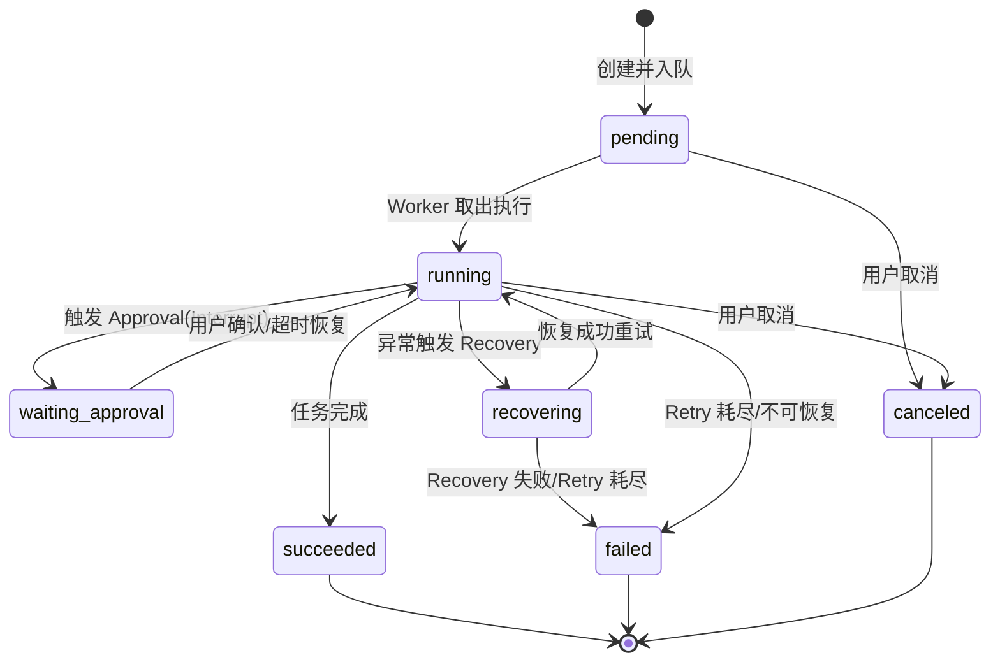
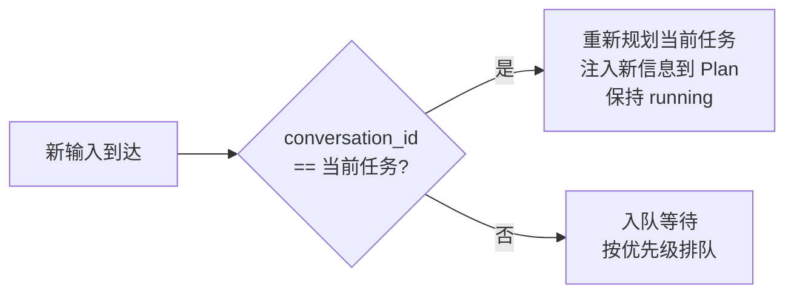
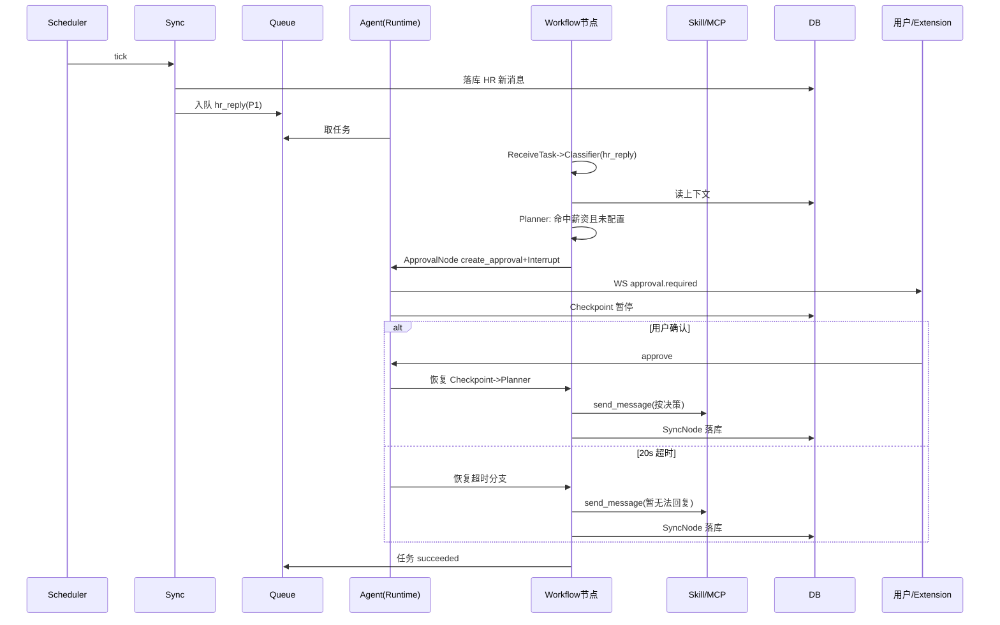

# Agent 状态机与 Workflow 设计 V2.0

## 文档信息

| 项 | 值 |
|---|---|
| 文档名称 | Agent 状态机与 Workflow 设计 |
| 版本 | V2.0 |
| 状态 | 设计基准 |
| 关联文档 | 02 系统架构 / 04 Agent Runtime / 06 LangGraph详细设计 / 08 Boss Skill / 14 Approval |
| 定位 | Agent 的**逻辑状态机、任务系统、Workflow 节点与边**设计；LangGraph 落地实现细节见 doc 06 |

---

## 1. 设计目标

定义 Agent 的执行模型、任务状态机、任务系统（单任务/重规划/队列/优先级/Thread/Conversation 绑定）、公共节点职责与边决策规则。使 Agent 行为可推理、可中断、可恢复，且严格遵循"一次只执行一个任务"与 ReAct 决策模式。

---

## 2. 背景

PRD（doc 01）要求 Agent 是**真 Agent**（ReAct，非固定流程机器人），但允许垂直领域硬编码（Boss URL、Conversation 规则、同步规则）。架构（doc 02）规定 Agent 运行于 L3，事件驱动，DB 为真实数据源。本文给出其内部状态机与 Workflow。

设计原则：

1. **事件驱动**：Agent 不是 while 常驻循环；事件产生 -> 启动 -> 执行 -> 保存状态 -> 结束。
2. **ReAct**：LLM 判断下一步 / 选 Skill / 选 Tool / 判断是否人工；Workflow 负责状态流转。
3. **单任务执行**：Agent 一次只跑一个任务；新输入按归属判定重规划或入队。
4. **可中断可恢复**：Approval 与异常均经 Checkpoint 暂停/恢复。

---

## 3. Agent 执行模型

```
事件产生(Event) -> 入队(Queue) -> Worker 取任务 -> Agent 启动
-> 加载 State/Checkpoint -> Workflow 执行(ReAct 循环)
-> 保存 Checkpoint -> 结束 / Interrupt 等待
```

事件来源：

| 事件 | 来源 | 产出 Task 类型 |
|---|---|---|
| 用户主动触发 | Extension | 主动求职 / 手动发消息 |
| Scheduler 周期 | Backend Scheduler | 后台寻岗扫描 / 监听同步 |
| HR 新消息 | Sync 检测 | HR 回复 |
| Approval 恢复 | 用户确认 / 超时 | Approval 恢复 |
| Recovery | 异常上抛 | 异常恢复 |

> Agent 不负责长期监听；监听由 Scheduler + Service Worker 驱动（见 doc 01 §11、doc 02 §4.2）。

---

## 4. 任务状态机（7 态）



| 状态 | 含义 | 允许转移 |
|---|---|---|
| `pending` | 已入队待执行 | -> running / canceled |
| `running` | 执行中（含 ReAct 循环、重规划） | -> waiting_approval / recovering / succeeded / failed / canceled |
| `waiting_approval` | Approval Interrupt 暂停 | -> running（恢复） |
| `recovering` | 异常恢复中（browser_recovery_agent 等） | -> running / failed |
| `succeeded` | 成功终态 | 终态 |
| `failed` | 失败终态（Retry 耗尽 / 不可恢复） | 终态 |
| `canceled` | 用户取消终态 | 终态 |

> "重规划"不单独成态：属于 `running` 内部的 Plan 注入与重新进入 Planner 节点，不改变任务状态。

---

## 5. 任务系统

### 5.1 单任务执行

Worker 一次只消费一个 Task，全程串行。新 Task 一律先入队，由 Queue 调度，禁止抢占式并行。

### 5.2 Thread 与 Conversation 绑定

- **Thread**：逻辑执行线，1:1 绑定一个 Conversation（全局任务如"后台寻岗扫描"归属 system thread）。
- 同一 Thread 内的 Task 共享上下文（Memory / 会话历史），串行处理以保证消息顺序。
- `task.thread_id = conversation.thread_id`（Conversation 创建时生成 thread_id）。

### 5.3 重规划判定

新输入到达时（已有 Task 处于 `running`）：



- **属于当前任务**（同 Thread/Conversation）：注入新信息，重新进入 Planner 节点重规划，任务保持 `running`。
- **不属于**：新 Task 入队，当前任务继续，不打断。

### 5.4 优先级（Queue 调度）

Redis Stream 消费者按优先级取任务（同优先级 FIFO）：

| 优先级 | Task 类型 | 理由 |
|---|---|---|
| P0 | approval_resume | 恢复被中断的任务，释放等待态 |
| P1 | hr_reply | HR 消息时效性强 |
| P2 | user_initiated | 用户主动触发 |
| P3 | background_scan | 后台寻岗/监听同步，可延后 |

### 5.5 Task 数据契约（逻辑）

| 字段 | 说明 |
|---|---|
| task_id | 主键 |
| type | 任务类型（见 §6.1 分类） |
| status | 7 态之一 |
| thread_id | 绑定 Thread |
| conversation_id | 绑定 Conversation（全局任务为空） |
| priority | P0..P3 |
| payload | 输入参数（JSONB） |
| result | 输出结果（JSONB） |
| retry_count | 已重试次数（上限 2） |
| created_at / updated_at | 时间戳 |

> 物理表结构见 doc 09；Queue 消息体与持久化见 doc 04。

---

## 6. Workflow 公共节点

> 节点的 LangGraph 实现细节（函数签名、Checkpoint 写入点、Interrupt API）见 doc 06。本文定义**职责与输入输出契约**。

### 6.1 ReceiveTaskNode（任务接收）

- **职责**：从 Queue 取 Task，加载 State 与 Checkpoint（如有），初始化/恢复执行上下文。
- **输入**：task_id。
- **输出**：State（含 task_type、thread_id、conversation_id、历史 messages）。
- **异常**：Checkpoint 损坏 -> 标记 failed，记日志。

### 6.2 TaskClassifierNode（任务分类）

- **职责**：判定任务类型与入口分支。
- **分类**：
  - `proactive_job`（主动求职：岗位入口）
  - `proactive_chat`（主动沟通：聊天入口）
  - `hr_reply`（HR 新消息回复）
  - `approval_resume`（Approval 恢复）
  - `sync`（同步任务）
  - `recovery`（异常恢复）
- **输入**：State。
- **输出**：State.task_type + 初始入口分支。
- **规则**：垂直领域硬编码--Boss URL/规则在此节点绑定。

### 6.3 PlannerNode（规划）

- **职责**：ReAct 核心决策。LLM 依据 DB 上下文 + 当前观察，判断下一步：调用某 Skill / 请求人工 / 同步 / 结束。
- **输入**：State（messages、plan、tool_results）。
- **输出**：next_action（skill_call / approval / sync / end）+ 更新 plan。
- **规则**：调用 LLM；遵循回复风格；命中敏感信息且未配置 -> 输出 approval。
- **异常**：LLM 失败 -> 转 ErrorRecoveryNode。

### 6.4 SkillRouterNode（Skill 路由）

- **职责**：将 Planner 选定的目标映射到具体 Boss Skill，准备 Skill 调用参数。
- **输入**：State.next_action（目标描述）。
- **输出**：skill_call（skill 名 + 入参）。
- **规则**：Skill 只描述目标；具体 MCP Tool 选择由 Agent 在 ToolExecutor 内决定（ReAct）。

### 6.5 ToolExecutorNode（工具执行）

- **职责**：执行 Skill -> 经 MCP Client 调用 Chrome MCP Server 工具；收集观察结果。
- **输入**：skill_call。
- **输出**：tool_result（observation）。
- **规则**：MCP stdio 调用；超时与错误捕获。
- **异常**：DOM 变化/工具失败 -> 转 ErrorRecoveryNode。

### 6.6 ApprovalNode（人工确认）

- **职责**：Runtime 层 Interrupt。`create_approval()` -> 暂停 -> 通知 -> 等待 -> 恢复 Checkpoint。20 秒超时自动回复。
- **输入**：State（敏感信息上下文）。
- **输出**：approval decision（approve/deny/timeout）。
- **归属**：Runtime，非 Skill。详细见 doc 14。

### 6.7 SyncNode（同步）

- **职责**：将执行结果与外部状态同步入 DB（消息落库、会话状态更新）；必要时拉取 Boss 最新。
- **输入**：State（待落库消息/状态变更）。
- **输出**：updated messages / conversation state。
- **规则**：DB 为真实数据源；去重靠 external_msg_id。详细见 doc 13。

### 6.8 ErrorRecoveryNode（异常恢复）

- **职责**：异常分类与恢复。含 `browser_recovery_agent`（页面变化/DOM 异常/页面恢复）。Retry 最多 2 次。
- **输入**：error_state。
- **输出**：retry（回到 ToolExecutor）/ fail（上抛终态）。
- **规则**：Recovery 自身失败上抛，不递归无限恢复。详细见 doc 15。

---

## 7. State 定义（逻辑）

LangGraph State（共享于所有节点，物理持久化见 doc 04/06）：

| 字段 | 类型 | 说明 |
|---|---|---|
| task_id | str | 当前任务 |
| task_type | enum | 任务分类 |
| thread_id | str | Thread |
| conversation_id | str\|null | 绑定会话 |
| messages | list | 会话历史（来自 DB） |
| plan | list[Step] | 当前规划步骤 |
| current_step | int | 当前步骤指针 |
| skill_calls | list | 已发起 Skill 调用记录 |
| tool_results | list | 观察结果（ReAct 观察） |
| approval_state | obj\|null | Approval 上下文与决策 |
| error_state | obj\|null | 异常上下文 |
| retry_count | int | 当前节点重试计数 |
| memory_refs | list | 关联 Memory 引用 |

---

## 8. Edge 与 Conditional Edge 决策表

| from | to | 条件 |
|---|---|---|
| ReceiveTask | TaskClassifier | always |
| TaskClassifier | Planner | always（分类后入规划） |
| Planner | SkillRouter | next_action = skill_call |
| Planner | ApprovalNode | next_action = approval（敏感/未配置） |
| Planner | SyncNode | next_action = sync |
| Planner | End | next_action = end（任务完成） |
| SkillRouter | ToolExecutor | always |
| ToolExecutor | Planner | tool_result 正常（ReAct 回环） |
| ToolExecutor | ErrorRecovery | 工具失败/DOM 异常 |
| ToolExecutor | SyncNode | 执行成功需落库 |
| SyncNode | Planner | 需继续决策 |
| SyncNode | End | 任务完成 |
| ApprovalNode | Planner | 恢复（approve/deny/timeout）后回规划 |
| ErrorRecovery | ToolExecutor | 恢复成功、Retry 未耗尽 |
| ErrorRecovery | End(failed) | Retry 耗尽 / 不可恢复 |

ReAct 主循环：`Planner -> SkillRouter -> ToolExecutor -> (observe) -> Planner`，直至 Planner 输出 end 或 approval 或异常。

---

## 9. 主动任务流

### 9.1 岗位入口（proactive_job）

```
ReceiveTask -> Classifier(proactive_job) -> Planner
-> SkillRouter(boss.search_jobs) -> ToolExecutor -> (候选岗位)
-> Planner -> SkillRouter(boss.get_job_detail + score) -> ToolExecutor -> (评分)
-> [评分<阈值] -> End(跳过) | [评分>=阈值]
-> Planner -> SkillRouter(boss.send_message 打招呼) -> ToolExecutor -> SyncNode(落库)
-> End
```

### 9.2 聊天入口（proactive_chat）

用户指定某 Conversation 主动沟通：

```
ReceiveTask -> Classifier(proactive_chat) -> Planner
-> SkillRouter(boss.send_message) -> ToolExecutor -> SyncNode -> End
```

---

## 10. HR 事件流（被动响应）

```
Scheduler tick -> Sync 检测新消息 -> 入库 -> 入队 hr_reply Task
-> ReceiveTask -> Classifier(hr_reply) -> Planner(读 DB 上下文)
-> [含敏感且未配置] -> ApprovalNode -> (恢复) -> Planner
-> SkillRouter(boss.send_message) -> ToolExecutor -> SyncNode -> End
```

---

## 11. Approval 恢复流

```
Planner 输出 approval -> ApprovalNode(create_approval + Interrupt + Checkpoint)
-> 任务状态 waiting_approval
-> [用户确认] / [20s 超时] -> 恢复 Checkpoint -> Planner(按 decision 继续)
```

超时分支：Planner 生成"用户暂时无法回复"话术 -> SkillRouter -> ToolExecutor -> SyncNode -> End。

---

## 12. Recovery 流

```
ToolExecutor 异常 -> ErrorRecoveryNode
-> [DOM 变化] -> browser_recovery_agent(页面恢复) -> [成功] -> ToolExecutor(Retry)
-> [Retry<2] 重试 | [Retry=2] -> End(failed)
-> [非 DOM 异常] -> 按 LLM/网络/超时分类 -> Retry 或 fail
```

---

## 13. 时序图（HR 回复含 Approval）



---

## 14. 接口（节点间契约）

| 契约 | 方向 | 形式 |
|---|---|---|
| State 传递 | 节点间 | LangGraph 共享 State（reducer 合并，见 doc 06） |
| Skill 调用 | SkillRouter/ToolExecutor -> Skill | Python 函数（doc 08） |
| Approval | Planner -> ApprovalNode -> Runtime | `create_approval()` + Interrupt（doc 14） |
| Sync | SyncNode -> SyncService -> Repository | Service 调用（doc 13） |
| 事件推送 | Runtime -> WS | agent.step / approval.required / task.updated（doc 10） |

---

## 15. 异常处理

| 异常 | 节点 | 处理 |
|---|---|---|
| Checkpoint 损坏 | ReceiveTask | 标记 failed，记日志 |
| LLM 失败 | Planner | 转 ErrorRecovery，Retry 2 次 |
| 工具失败/DOM 变化 | ToolExecutor | 转 ErrorRecovery -> browser_recovery_agent |
| Approval 超时 | ApprovalNode | 走超时分支自动回复 |
| Recovery 失败 | ErrorRecovery | 上抛，Task -> failed |
| 重规划冲突 | Planner | 按 Thread 串行；同 Thread 注入，异 Thread 入队 |

---

## 16. Retry 与 Recovery

- **Retry 上限**：2 次（节点级，retry_count 计数）。
- **DOM Recovery**：browser_recovery_agent 恢复页面后重试。
- **最终失败**：Task -> failed，前端显示错误，记日志。
- **Interrupt 恢复**：Approval 经 Checkpoint 恢复，不计入 Retry。

---

## 17. 扩展设计

- **多任务并行**：未来按 Thread 分槽，每 Thread 一个执行器，仍保证 Thread 内串行。
- **新任务类型**：新增 Classifier 分类 + 对应 Planner 提示词模板即可，节点不变。
- **新平台**：SkillRouter 路由到平台 Skill 集（lagou.* 等），Workflow 不变。
- **复杂规划**：Planner 可升级为分层规划（HTN），State 增 plan 层级字段。
