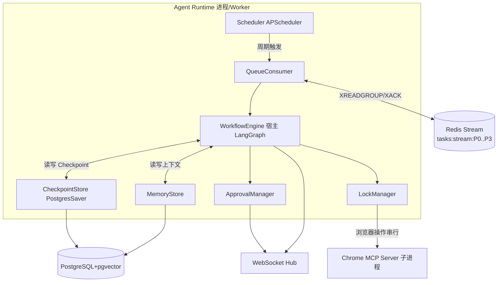
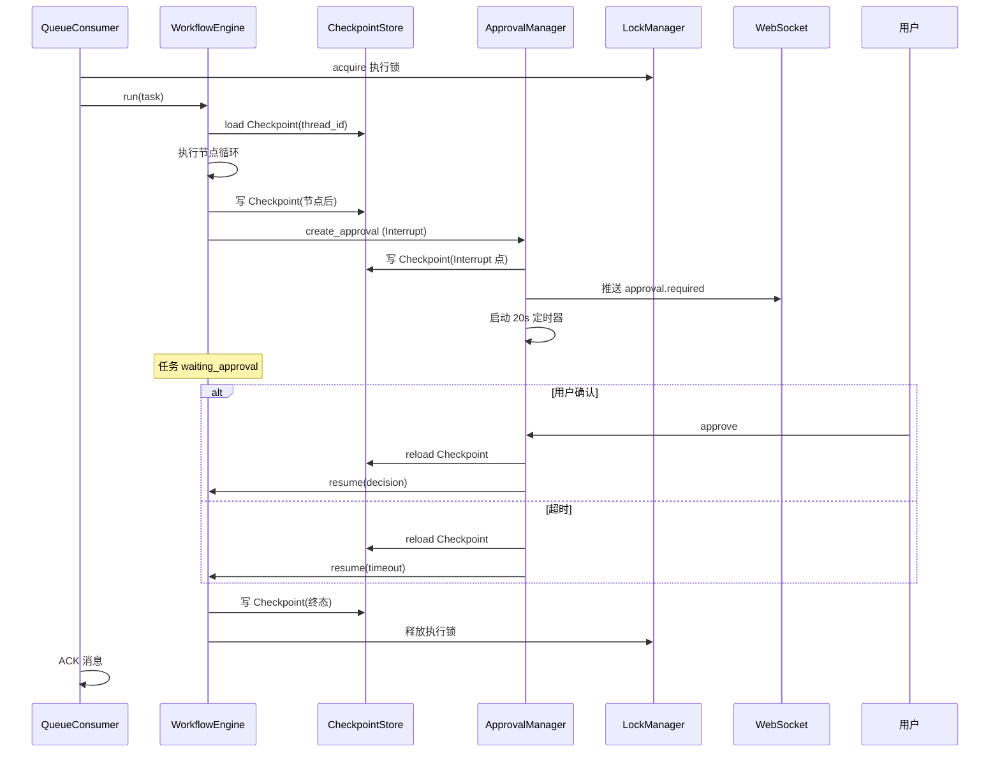

# Agent Runtime 设计 V2.0

## 文档信息

| 项 | 值 |
|---|---|
| 文档名称 | Agent Runtime 设计 |
| 版本 | V2.0 |
| 状态 | 设计基准 |
| 关联文档 | 02 系统架构 / 03 状态机与Workflow / 06 LangGraph详细设计 / 13 同步系统 / 14 Approval / 15 日志与异常恢复 |
| 定位 | Agent 运行时引擎：宿主 LangGraph Workflow，管理任务生命周期、Checkpoint、Interrupt、Memory、Queue 消费、Scheduler、并发控制 |

---

## 1. 设计目标

定义 Agent Runtime 的组件构成与职责：如何从 Queue 消费任务、宿主 LangGraph 执行、持久化 Checkpoint、处理 Interrupt（Approval）、维护 Memory、调度后台监听、控制并发与锁。使 Runtime 成为"任务一次只执行一个、可中断可恢复、并发受控"的可靠引擎。

> 本文是原"任务调度与并发控制"设计并入 Runtime 后的统一文档（任务系统逻辑语义见 doc 03 §5）。

---

## 2. 背景

doc 03 定义了状态机与 Workflow 节点的逻辑语义；doc 06 将给出 LangGraph 落地。Runtime 是二者之间的**引擎层**：它不关心节点内部逻辑，只负责"把任务跑起来、挂起、恢复、串行、不崩"。Prompt 约束：Agent 一次只执行一个任务、事件驱动、不负责长期监听（监听由 Scheduler 驱动）、Approval 属 Runtime、Checkpoint 可恢复。

---

## 3. Runtime 职责总览

| 职责 | 说明 |
|---|---|
| 任务生命周期 | pickup -> run -> suspend(Interrupt) -> resume -> terminal |
| Workflow 宿主 | 加载 LangGraph StateGraph，注入 State，驱动节点执行 |
| Checkpoint 管理 | 执行前后与 Interrupt 点持久化 State；崩溃可恢复 |
| Interrupt（Approval） | `create_approval()` 暂停、通知、超时自动恢复 |
| Memory 管理 | 长期上下文读写与语义检索 |
| Queue 消费 | 从 Redis Stream 取任务、ACK、死信、优先级 |
| Scheduler | 后台监听/寻岗周期调度；受用户启停控制 |
| 并发与锁 | 单任务执行、最大同时聊天数、Thread 串行、浏览器锁 |
| 事件推送 | 经 WS 推送 agent.step / approval.required / task.updated 等 |

---

## 4. Runtime 架构



---

## 5. 任务生命周期管理

```
pickup(Queue) -> acquire(lock) -> load Checkpoint -> run Workflow
  -> [Interrupt] suspend(写 Checkpoint, 状态 waiting_approval)
       -> [resume/timeout] reload Checkpoint -> run
  -> [terminal] succeeded/failed/canceled -> ACK/死信 -> 释放 lock
```

- **pickup**：QueueConsumer 按优先级从 Stream 取一条任务。
- **acquire**：获取全局执行锁（单任务保证）。
- **load**：若存在 Checkpoint（thread_id + task_id）则恢复，否则初始化 State。
- **run**：WorkflowEngine 驱动 LangGraph 节点循环。
- **suspend**：遇 ApprovalNode -> `create_approval()` -> 写 Checkpoint -> 释放执行锁（允许其它任务？见 §8） -> 等待。
- **resume**：Approval 决策到达 -> 重新获取锁 -> reload Checkpoint -> 继续。
- **terminal**：写最终 result -> ACK 消息 / 失败入死信 -> 释放锁。

> 单任务执行锁：`asyncio.Lock`（单 Worker 进程内）或 Redis 分布式锁（多 Worker）。V1 单 Worker 用进程内 Lock；扩容用 Redis 锁（doc 16）。

---

## 6. Queue 与消费（Redis Stream）

### 6.1 Stream 结构

按优先级分 Stream（Redis Stream 无原生优先级，分流是常见实现）：

| Stream | 优先级 | 内容 |
|---|---|---|
| `tasks:stream:P0` | approval_resume | 恢复被中断任务 |
| `tasks:stream:P1` | hr_reply | HR 新消息回复 |
| `tasks:stream:P2` | user_initiated | 用户主动触发 |
| `tasks:stream:P3` | background_scan | 后台寻岗/监听 |

消费者按 P0 -> P3 顺序轮询，高优先级非空则优先消费；同级 FIFO。

### 6.2 消费组与 ACK

- 消费组：`agent-workers`；消费者名：worker 实例 ID。
- `XREADGROUP GROUP agent-workers <consumer> >` 读取；处理成功 `XACK`。
- 失败：`retry_count++`（消息体内字段，上限 2），重入队；超过上限 -> 移入 `tasks:deadletter` 流。

### 6.3 崩溃恢复（stalled 消息）

- `XPENDING` 查超时未 ACK 的消息 -> `XCLAIM` 重新分配给存活消费者。
- 检测周期：默认 30s（可配置）。
- 防止 Worker 崩溃导致消息丢失。

### 6.4 消息体（逻辑）

```json
{
  "task_id": "uuid",
  "type": "hr_reply",
  "thread_id": "uuid",
  "conversation_id": "uuid",
  "priority": "P1",
  "payload": { ... },
  "retry_count": 0,
  "enqueued_at": "iso8601"
}
```

---

## 7. Scheduler（后台监听调度）

### 7.1 调度器

- 采用 APScheduler `AsyncIOScheduler`（运行于 Backend 进程）。
- Jobs：
  - `monitor_tick`：周期检测 Boss 聊天状态 -> 触发 Sync -> 发现新消息则入队 hr_reply。默认 60s（可配置，受"后台监听时间"Setting 约束）。
  - `scan_tick`：周期后台寻岗（若用户开启）。默认可配置。

### 7.2 启停与监听态（关键）

监听态：`idle / monitoring / paused / stopped`。

| 用户/系统动作 | 监听态变化 | 说明 |
|---|---|---|
| 用户开启监听 | idle/stopped -> monitoring | 启动 monitor_tick |
| 插件关闭（SW 在，WS 心跳在） | monitoring 保持 | **继续**（Prompt §9） |
| 浏览器关闭（WS 断且超时不重连） | monitoring -> paused | **停止**轮询；等待重连 |
| Extension 重连（且未主动关闭） | paused -> monitoring | 自动恢复 |
| 用户点"关闭程序" | any -> stopped | **彻底终止**；移除 jobs；需用户再次主动开启 |

WS 心跳判据：Service Worker 周期发心跳；backend 若 `T_heartbeat`（默认 120s）未收到且未重连 -> 判定浏览器关闭 -> paused。重连后若态为 stopped 则不自动恢复（需用户主动开启）。

> 这套机制落实 Prompt"插件关闭继续 / 浏览器关闭停止 / 主动关闭彻底停"三态语义。监听态持久化于 DB（Setting/agent 状态），防 backend 重启丢失。

### 7.3 不无限重试

Boss 未登录 / 页面不可达 -> Scheduler 通知用户（WS 事件 + Extension 通知），monitor_tick 跳过本轮，不无限重试。

---

## 8. 并发控制

### 8.1 单任务执行

- 全局执行锁：同一时刻仅一个 Task 处于 `running`。V1 进程内 `asyncio.Lock`；扩容用 Redis 分布式锁 `lock:agent:execute`（TTL + 续约）。
- Approval 暂停时释放执行锁，允许 P0 恢复任务或其它任务 pickup？-- **不允许多任务并行**：暂停仅释放锁以避免空占，但下一个任务 pickup 前检查"是否有等待中的 Approval"；P0 恢复优先。V1 简化：暂停不释放锁，任务排队等待，保证严格单任务。

### 8.2 最大同时聊天数量

- 约束对象：处于 `active` 态的 Conversation 数量（非并发任务数）。
- 检查点：`proactive_job` 创建新 Conversation 前，count active conversations；若 >= `max_concurrent_chats`（Setting）-> 不再开新聊天（跳过/入队等待）。
- 不影响已有会话的回复。

### 8.3 Thread 串行

- 同 Thread 的 Task 必须串行（保证消息顺序与上下文一致）。
- 实现：消费时按 thread_id 分组排队；同 thread 内 FIFO；不同 thread 间可交错（但仍受单任务执行锁约束 -> 实际仍串行）。

### 8.4 浏览器锁

- 浏览器是单实例共享资源，所有 MCP 工具调用必须串行。
- `LockManager.browser_lock`：`asyncio.Lock`，ToolExecutor 调用 MCP 前获取，调用后释放。
- 与执行锁关系：执行锁保证单任务；浏览器锁保证单浏览器操作（即使未来多任务也串行浏览器访问）。

### 8.5 死锁防范

- 锁获取顺序固定：执行锁 -> 浏览器锁（禁止反向）。
- 所有锁带超时（`asyncio.wait_for`），超时上抛而非死等。
- 禁止嵌套获取同种锁。

---

## 9. Checkpoint 机制

### 9.1 存储

- 采用 **LangGraph PostgresSaver（async）** 持久化 Checkpoint 至 PostgreSQL（与业务库同实例，独立 schema/表前缀）。
- Checkpoint key：`thread_id`（LangGraph 以 thread_id 标识检查点线）。
- 写入点：节点执行后、Interrupt 前、任务终态前。

### 9.2 恢复

- ReceiveTaskNode 加载 `thread_id` 对应最新 Checkpoint；无则初始化。
- Approval 恢复：reload 同一 `thread_id` Checkpoint，注入 approval decision，继续。

### 9.3 版本与清理

- LangGraph 自带版本（checkpoint_id 自增）。
- 清理策略：终态（succeeded/failed）后保留 N 个历史 Checkpoint（默认 5），超期清理；failed 保留更久便于排查。

> doc 09 的 `Checkpoint` 表指 LangGraph 管理的检查点表（PostgresSaver 自建）+ 业务侧轻量索引（task_id <-> thread_id 映射，便于按任务查检查点）。

---

## 10. Interrupt 与 Approval 恢复

### 10.1 create_approval() 流程

```
Planner 输出 approval -> ApprovalNode
-> create_approval(type, context, task_id, thread_id)
-> 写 approvals 表(status=pending, expires_at=now+20s)
-> LangGraph Interrupt(thread_id) 写 Checkpoint
-> 任务状态 waiting_approval
-> WS 推送 approval.required
-> 启动 20s 定时器
```

### 10.2 恢复

- 用户确认/拒绝：`POST /api/v1/approvals/{id}/approve|deny` -> ApprovalManager -> reload Checkpoint -> 注入 decision -> resume。
- 20s 超时：定时器触发 -> 自动注入 `timeout` decision -> resume 超时分支（生成"用户暂时无法回复"话术）。
- 恢复后任务状态 -> running。

### 10.3 并发与超时风险

- 同一任务同时只能有一个 pending Approval（创建前检查）。
- 超时定时器与用户响应可能竞争：用 Approval 状态机（pending -> approved/denied/timed_out）+ 乐观锁保证只生效一次。
- 详细状态机与字段见 doc 14。

---

## 11. Memory 管理

### 11.1 粒度

- 用户级 + 关联：Memory 记录归属 user_id，可关联 conversation_id / job_id（可选）。
- 类型：偏好事实、HR 约定、面试进展、历史决策等。

### 11.2 读写

- 读：任务启动时，按 user_id + 当前上下文检索相关 Memory（pgvector 语义 + 元数据过滤），注入 Planner 上下文。
- 写：任务终态前，Planner 提取需长期记忆的事实 -> 写 Memory 表（含 embedding）。

### 11.3 检索

- pgvector：Memory.embedding（bge-small-zh 512 维）语义相似度 Top-K。
- 元数据过滤：user_id、conversation_id、job_id、type。
- 详细表结构见 doc 09。

---

## 12. 与 LangGraph 的关系

| 层 | 职责 | 文档 |
|---|---|---|
| Runtime（本文） | 引擎：生命周期、Checkpoint、Interrupt、Queue、Scheduler、并发、Memory | doc 04 |
| Workflow 逻辑 | 状态机、节点职责、边决策 | doc 03 |
| LangGraph 实现 | StateGraph 构造、节点函数、reducer、Interrupt API、Retry 子图 | doc 06 |

Runtime **宿主** LangGraph：WorkflowEngine 封装 `CompiledGraph`，负责加载/保存 Checkpoint（经 PostgresSaver）、触发 Interrupt、注入 State；节点内部逻辑与图构造属 doc 06。

---

## 13. 数据流（Runtime 视角）

```
QueueConsumer 取任务 -> WorkflowEngine.run(thread_id, task)
-> load Checkpoint -> LangGraph 执行节点
   -> ToolExecutor: acquire browser_lock -> MCP 调用 -> release
   -> ApprovalNode: create_approval -> Interrupt -> [等待]
   -> SyncNode: 落库
-> 终态 -> 写 Checkpoint(终态) -> ACK -> 释放执行锁
```

---

## 14. 状态流（Runtime 视角）

任务态由 Runtime 维护并与 doc 03 一致：`pending -> running -> waiting_approval -> recovering -> succeeded/failed/canceled`。

监听态：`idle -> monitoring -> paused -> stopped`（§7.2）。

---

## 15. 时序图（任务执行含 Checkpoint/Interrupt）



---

## 16. 接口

| 接口 | 方向 | 形式 |
|---|---|---|
| `enqueue(task)` | Service -> Queue | `XADD tasks:stream:{P}` |
| `consume()` | QueueConsumer -> Stream | `XREADGROUP` |
| `ack(msg_id)` | QueueConsumer -> Stream | `XACK` |
| `run(thread_id, task)` | QueueConsumer -> WorkflowEngine | 进程内调用 |
| `create_approval(...)` | WorkflowEngine -> ApprovalManager | 进程内（doc 14） |
| `resume(approval_id, decision)` | API -> ApprovalManager -> WorkflowEngine | 经 Service |
| Checkpoint read/write | WorkflowEngine <-> PostgresSaver | LangGraph API |
| `acquire_browser_lock()` | ToolExecutor -> LockManager | `asyncio.Lock` |
| Scheduler add/remove job | Service -> Scheduler | APScheduler API |

---

## 17. 异常处理

| 异常 | 处理 |
|---|---|
| Worker 崩溃 | stalled 消息 XCLAIM 重新消费；Checkpoin 恢复 |
| Checkpoint 损坏 | 标记 failed；记日志；不强制恢复 |
| Lock 超时 | 上抛；任务 -> recovering/failed |
| MCP Server 崩溃 | MCP Client 重启；当前 Tool 调用失败 -> ErrorRecovery |
| Approval 定时器与响应竞争 | 状态机 + 乐观锁，只生效一次 |
| Stream 满/Redis 不可用 | 降级：内存队列暂存 + 告警；不丢任务（持久化优先） |
| Scheduler 异常 | 单 job 失败不影响其它；记日志；下一 tick 重试 |

所有异常结构化记日志（trace_id/task_id/node/error），见 doc 15。

---

## 18. Retry 与 Recovery

- **任务级 Retry**：Queue 消息 retry_count 上限 2；超限入死信。
- **节点级 Retry**：ErrorRecoveryNode 内 retry_count 上限 2（doc 03 §16）。
- **崩溃 Recovery**：Checkpoint + stalled 消息重投。
- **浏览器 Recovery**：browser_recovery_agent（doc 15）恢复页面后重试。
- **最终失败**：Task -> failed，前端报错，死信留存排查。

---

## 19. 扩展设计

- **多 Worker 扩容**：Redis 分布式锁 + Stream 消费者组多 consumer；按 thread 哈希分槽避免同 thread 并发。
- **优先级精细化**：引入 Redis Sorted Set 评分队列替代分 Stream，支持动态优先级。
- **Memory 升级**：分层记忆（短期会话 / 中期岗位 / 长期偏好），分别检索策略。
- **Scheduler 分布式**：多实例时用 Redis 锁保证 monitor_tick 单实例执行（防重复检测）。
