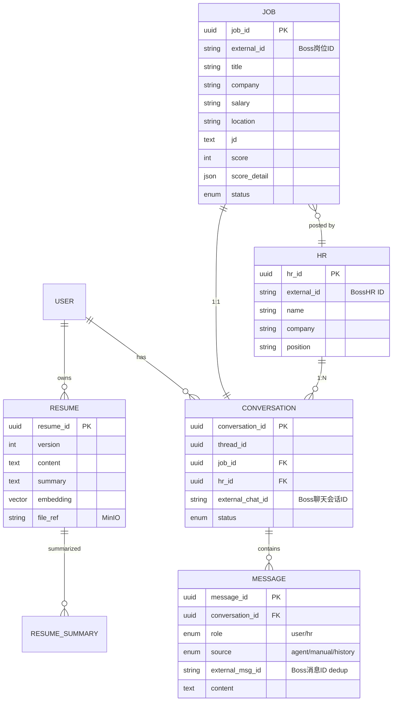
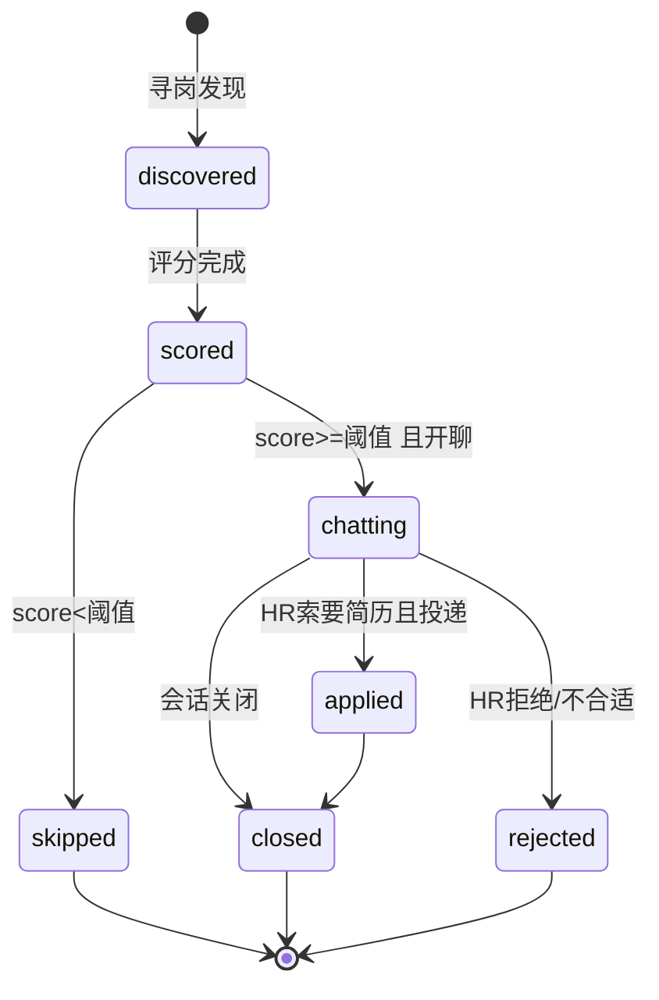
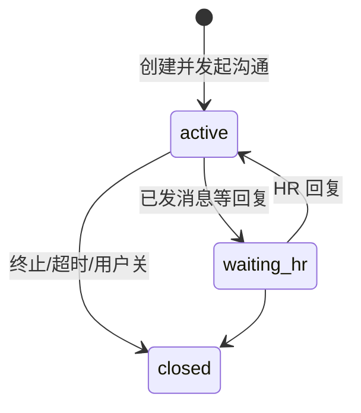
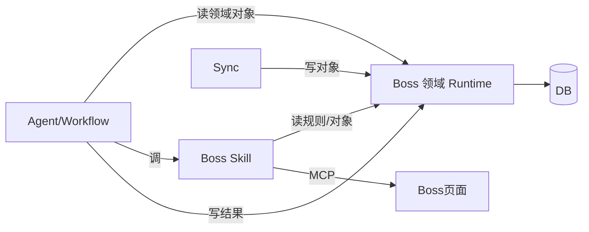

# Boss 领域 Runtime 设计 V2.0

## 文档信息

| 项 | 值 |
|---|---|
| 文档名称 | Boss 领域 Runtime 设计 |
| 版本 | V2.0 |
| 状态 | 设计基准 |
| 关联文档 | 02 系统架构 / 03 状态机 / 08 Boss Skill / 09 数据库 / 13 同步系统 / 14 Approval |
| 定位 | Boss直聘垂直领域模型：领域对象、领域规则、领域状态机、硬编码边界、领域服务；Skill（doc 08）在此模型上构建 |

---

## 1. 设计目标

定义 Boss直聘领域的**对象模型、规则、状态机与硬编码边界**，使 Agent 与 Skill 在统一领域语义上运作。作为垂直 Agent，允许部分领域逻辑硬编码（Boss URL、Conversation 规则、同步规则、投递规则），不交由 LLM 臆测。

---

## 2. 背景

Prompt §6 明确：垂直 Agent 允许硬编码 Boss 聊天 URL、岗位 URL、Conversation 规则、同步规则。Prompt §11 规定 Conversation = HR + 岗位、系统 UUID、不依赖 Boss ID。本文将这些约束固化为领域层，供 doc 08（Skill）与 doc 03（Workflow）引用。

设计原则：

1. 领域对象系统生成 UUID 为主键；Boss external_id 仅作同步映射与去重。
2. Conversation 是核心聚合根：1 岗位 + 1 HR = 1 Conversation。
3. 硬编码领域规则（URL/规则）集中管理，不散落在 Skill/Prompt。
4. 评分、投递、Approval 触发为领域规则，非 LLM 自主决定。

---

## 3. 领域对象模型



### 3.1 对象职责

| 对象 | 职责 | 主键 | 外部映射 |
|---|---|---|---|
| Job | 岗位元数据 + 评分 | job_id(UUID) | external_id(Boss 岗位) |
| HR | 招聘方 | hr_id(UUID) | external_id(Boss HR) |
| Conversation | 会话聚合根（1岗位+1HR） | conversation_id(UUID) | external_chat_id(Boss 聊天) |
| Message | 消息（三方来源） | message_id(UUID) | external_msg_id(Boss 消息) |
| Resume | 简历（多版本） | resume_id(UUID) | file_ref(MinIO) |
| ResumeSummary | 结构化摘要 + Embedding | 隶属 Resume | - |

> 物理表结构见 doc 09；此处为领域模型，字段语义以本文为准。

---

## 4. Conversation 规则（核心）

### 4.1 唯一性规则

- **1 岗位 = 1 Conversation**（HR + 岗位二元组唯一）。
- **同一 HR 不同岗位 = 不同 Conversation**。
- Conversation ID = **系统生成 UUID，不依赖 Boss ID**。Boss `external_chat_id` 仅作同步映射，不作主键、不作业务标识。

### 4.2 创建判定

新 Conversation 创建前：

1. 查 `(job_id, hr_id)` 是否已存在 Conversation -> 存在则复用，不新建。
2. 查 active Conversation 数量 -> 若 >= `max_concurrent_chats` -> 不开新会话（任务跳过/入队）。
3. 通过 -> 生成 conversation_id(UUID) + thread_id(UUID) -> 落库。

### 4.3 为什么不用 Boss ID 作主键

- Boss 聊天会话 ID 可能因页面/接口变化而不稳定。
- 系统 UUID 解耦外部平台变化，便于多平台扩展（V2+）。
- external_chat_id 作为同步锚点，丢失可重新映射，不影响业务数据。

---

## 5. Boss URL 与硬编码规则边界

集中管理的硬编码领域常量（垂直 Agent 边界，非 LLM 决定）：

| 常量 | 用途 |
|---|---|
| Boss 岗位列表 URL 模板 | 寻岗入口（FR-1） |
| Boss 职位详情 URL 模板 | 取 JD（FR-2 评分输入） |
| Boss 聊天列表 URL | 同步聊天列表（doc 13） |
| Boss 单会话聊天 URL 模板 | 进会话发消息（FR-4/5） |
| Boss 简历投递入口 | 投递（FR-6） |
| Conversation 规则 | §4 |
| 同步规则 | 增量/去重锚点（doc 13） |
| 评分权重 | LLM 60% + 关键词 40%（§7） |
| 投递前置 | HR 索要简历后（§8） |
| Approval 触发项 | 7 类敏感信息（doc 14） |

> 这些规则以配置/常量形式集中（如 `domain/boss/constants.py`），Skill 与 Agent 引用而非自定。URL 变化时只改一处。

---

## 6. 领域状态机

### 6.1 Job 状态



### 6.2 Conversation 状态



### 6.3 Message 来源（非状态，分类）

| source | 含义 |
|---|---|
| agent | Agent 生成并发送 |
| manual | 用户手动发送（Extension） |
| history | 同步自 Boss 的历史消息（含 HR 发与过往对话） |

> role（user/hr）表示发送方；source 表示写入来源。HR 发的消息 source 可能是 history（同步）。

### 6.4 Resume 状态

```
draft -> active -> archived（新版本上线后旧版本归档）
```

---

## 7. 评分领域规则

- **权重**：LLM 60% + 关键词匹配 40%。
- **关键词来源**：用户 Settings 求职规则（期望薪资/地点/加班/外包/异地/试用期）。
- **阈值**：默认 60 分，可配置；`score >= 阈值` -> Job -> chatting。
- **必输出**：score_detail = { llm_score, llm_reason, keyword_hits[], keyword_score, deductions[] }，便于审计。
- **失败**：LLM 失败 -> Retry 2 次 -> 仍失败则 Job 留 discovered、score=null、不进入 chatting。

---

## 8. 自动投递领域规则

```
Job(chatting) --HR 索要简历(LLM意图判定)--> 触发投递
```

- **前置硬约束**：必须 LLM 判定 HR 已索要简历，才允许投递 Skill 调用。
- **禁止**：发现岗位直接投递（领域层拦截：Job 状态非 chatting 或无"索要简历"意图证据 -> 拒绝投递）。
- **自动投递开关关**：HR 索要简历 -> 转 Approval（doc 14），不自动投。
- **无简历**：通知用户上传，不投。

---

## 9. 领域事件

| 事件 | 触发 | 消费方 |
|---|---|---|
| JobDiscovered | 寻岗发现岗位 | Workflow(评分) |
| JobScored | 评分完成 | Workflow(开聊判定) |
| ConversationCreated | 新建会话 | Workflow(打招呼) |
| MessageReceived | Sync 落库 HR 消息 | Scheduler -> 入队 hr_reply |
| MessageSent | Agent/用户发送成功 | Sync 落库 |
| ResumeRequested | LLM 判定 HR 索要简历 | Workflow(投递/Approval) |
| ApprovalTriggered | 敏感且未配置 | Runtime Interrupt（doc 14） |

---

## 10. 与 Agent / Skill / Sync 的协作



- **Agent/Workflow**：读领域对象作为上下文；写执行结果（评分、消息、状态变更）。
- **Skill**：引用领域规则（URL、投递前置、Conversation 规则）；不自定规则。
- **Sync**：经领域服务写入 Job/HR/Conversation/Message；去重靠 external_id/external_msg_id。
- **领域服务**：暴露给上述三方的契约（§12）。

---

## 11. 数据流（领域视角：寻岗到投递）

```
寻岗 -> JobDiscovered(external_id 去重) -> 评分(score_detail) -> JobScored
-> [>=阈值] ConversationCreated(job+hr) -> 打招呼 MessageSent(source=agent)
-> MessageReceived(HR回复) -> 回复 MessageSent
-> ResumeRequested(LLM判定) -> [开关开] 投递 -> Job(applied)
                            -> [开关关] ApprovalTriggered -> 确认后投递
```

---

## 12. 接口（领域服务契约）

> 物理表见 doc 09，HTTP 端点见 doc 10；此处为领域服务（Service 层）契约。

| 服务 | 方法 | 说明 |
|---|---|---|
| JobService | `discover(payload) -> Job` | 寻岗，external_id 去重 |
| JobService | `score(job_id) -> ScoreResult` | 评分，写 score_detail |
| ConversationService | `create_or_reuse(job_id, hr_id) -> Conversation` | §4.2 判定 |
| ConversationService | `count_active() -> int` | 最大同时聊天校验 |
| MessageService | `append(conversation_id, role, source, content, external_msg_id) -> Message` | 落库+去重 |
| MessageService | `list(conversation_id, limit, before) -> list[Message]` | 读上下文 |
| ResumeService | `upload(file) -> Resume` | 上传+摘要+Embedding |
| ResumeService | `merge(new, old) -> ResumeSummary` | 合并摘要，保旧内容 |
| DomainGuard | `can_apply(job_id, conversation_id) -> bool` | 投递前置硬约束校验 |
| DomainGuard | `needs_approval(content, settings) -> ApprovalType?` | 敏感信息触发判定 |

---

## 13. 异常处理

| 异常 | 处理 |
|---|---|
| external_id 重复 | 复用已有对象，不报错 |
| 评分 LLM 失败 | Retry 2 次；留 score=null |
| 投递前置不满足 | DomainGuard 拒绝；记日志；不发投递 Skill |
| Conversation 超最大数 | 跳过开聊；任务记 skipped |
| Resume 合并失败 | 保留旧摘要；新内容标记未合并；通知用户 |
| external_msg_id 冲突 | 去重跳过；以 DB 已有为准 |

---

## 14. Retry 与 Recovery

- 评分 LLM 失败：Retry 2 次（领域服务内或经 ErrorRecovery）。
- 投递失败：Retry 2 次；仍失败 Job 留 chatting、不置 applied、前端报错。
- 领域规则违反（如禁止发现即投）：**不 Retry**，直接拒绝并记录（规则违反不是瞬时故障）。
- DOM 变化导致对象解析失败：转 browser_recovery_agent（doc 15）恢复后重试解析。

---

## 15. 扩展设计

- **多平台抽象**：提炼 `PlatformDomain` 接口（Job/HR/Conversation/Message 通用），Boss 实现为 `BossDomain`，V2+ 新增 `LagouDomain` 等；Skill 按平台命名空间（boss.* / lagou.*）。
- **领域规则可配置化**：URL/阈值/权重从硬编码迁至配置（Settings），支持用户调优。
- **Resume 多版本策略**：支持按岗位类型维护多份简历，投递时按岗位匹配选取。
