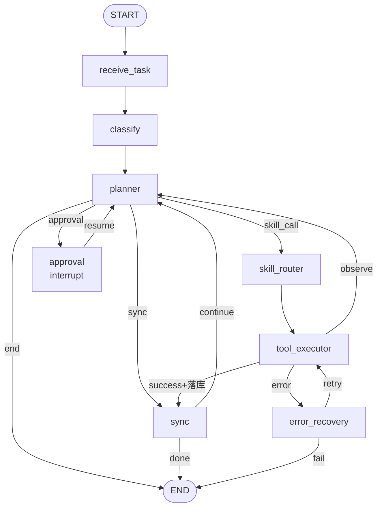
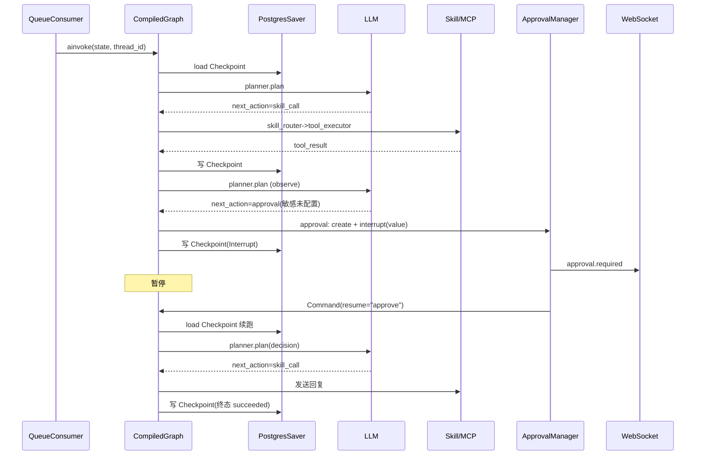

# LangGraph 工作流详细设计 V2.0

## 文档信息

| 项 | 值 |
|---|---|
| 文档名称 | LangGraph 工作流详细设计（LLD） |
| 版本 | V2.0 |
| 状态 | 设计基准 |
| 关联文档 | 03 状态机与Workflow（逻辑）/ 04 Agent Runtime（引擎）/ 08 Boss Skill / 14 Approval / 15 异常恢复 |
| 定位 | LangGraph **落地实现**：StateGraph 构造、State schema/reducer、节点函数规约、条件边路由、Checkpoint 持久化、Interrupt/Resume、Retry/Recovery 子图、三入口运行 |

---

## 1. 设计目标

将 doc 03 的逻辑状态机与节点职责，落地为可运行的 LangGraph `StateGraph`：定义 State 与 reducer、节点函数签名与关键逻辑、条件边路由函数、Checkpoint 持久化（AsyncPostgresSaver）、Approval 的 Interrupt/Resume、Retry 策略与 Recovery 子图、主动/被动/Approval 恢复三入口的运行方式。

---

## 2. 背景

- doc 03 定义节点职责与边决策表（逻辑层）。
- doc 04 定义 Runtime 引擎（生命周期/锁/Queue/Scheduler）。
- 本文给出 LangGraph 代码级构造，是二者之间的"图实现"。

实现约束：

1. StateGraph（非固定流程）；ReAct 主循环 `Planner -> SkillRouter -> ToolExecutor -> Planner`。
2. 所有执行过程可 Checkpoint；Approval 经 Interrupt 暂停、Command(resume) 恢复。
3. Retry 最多 2 次；DOM 变化走 browser_recovery_agent。
4. 节点函数为 async；IO 走 async/await（禁阻塞）。

> 以下 import 路径随 LangGraph 版本（doc 16 冻结）；API 形态以 langgraph ≥ 0.2 为基准。

---

## 3. StateGraph 全貌



ReAct 主循环：`planner -> skill_router -> tool_executor -> planner`，观察驱动再规划，直至 `end`/`approval`/异常。

---

## 4. State Schema 与 Reducer

```python
from typing import Annotated, Optional, TypedDict

class AgentState(TypedDict):
    task_id: str
    task_type: str                       # proactive_job|proactive_chat|hr_reply|approval_resume|sync|recovery
    thread_id: str                       # Checkpoint 线
    conversation_id: Optional[str]
    messages: Annotated[list[dict], "append_dedup"]      # 会话历史(来自DB)，按 message_id 去重
    plan: Annotated[list[dict], "plan_reducer"]          # 重规划时整体替换
    current_step: int                    # last-write-wins
    skill_calls: Annotated[list[dict], "append"]         # 累积 Skill 调用记录
    tool_results: Annotated[list[dict], "append"]        # 观察结果累积
    approval_state: Optional[dict]       # {type, context, decision?}
    error_state: Optional[dict]          # {node, error, retry_count, kind}
    retry_count: int                     # 节点级重试计数
    memory_refs: Annotated[list[str], "append"]
    next_action: Optional[str]           # planner 输出：skill_call|approval|sync|end
    terminal: Optional[str]              # succeeded|failed|canceled
```

Reducer 语义：

| 字段 | reducer | 语义 |
|---|---|---|
| messages | append_dedup | 追加并按 message_id 去重 |
| plan | plan_reducer | 重规划整体替换；增量规划追加 |
| skill_calls / tool_results / memory_refs | append | 累积，不变更历史 |
| current_step / retry_count / next_action / terminal / approval_state / error_state | last-write-wins | 后写覆盖 |

> messages 用自定义 `append_dedup` 而非 `add_messages`：来源含 manual/history，去重键为 external_msg_id 映射后的 message_id。

---

## 5. Node 实现规约

> 节点签名 `async def node(state: AgentState) -> dict`（返回部分 State 更新，LangGraph 合并）。注入 `runtime` 依赖经 `RunnableConfig` 的 `configurable` 或闭包工厂。

### 5.1 receive_task

```python
async def receive_task(state, *, runtime) -> dict:
    # 从 Queue 消息体或 config 取 task_id；加载 Checkpoint（thread_id）
    task = await runtime.load_task(state["task_id"])
    msgs = await MessageService.list(task.conversation_id)
    return {"task_type": task.type, "thread_id": task.thread_id,
            "conversation_id": task.conversation_id, "messages": msgs}
```

### 5.2 classify

```python
async def classify(state) -> dict:
    # 硬编码领域分支（垂直 Agent）；不调 LLM
    return {"task_type": classify_type(state)}  # 绑定 Boss URL/规则入口
```

### 5.3 planner（ReAct 核心）

```python
async def planner(state, *, runtime) -> dict:
    ctx = build_context(state)               # DB 历史 + memory + 当前观察
    decision = await runtime.llm.plan(ctx)    # 返回 next_action + plan 更新
    if decision.needs_approval and not configured(decision.sensitive_field):
        return {"next_action": "approval", "approval_state": {...}}
    return {"next_action": decision.action, "plan": decision.plan}
```

- 调 LLM；命中敏感且未配置 -> next_action=approval。
- 失败 -> 抛 `LLMError`，由 RetryPolicy/Edge 进 error_recovery。

### 5.4 skill_router

```python
async def skill_router(state) -> dict:
    skill_call = map_goal_to_skill(state["next_action"])  # 目标->Skill+入参
    return {"skill_calls": [skill_call]}
```

### 5.5 tool_executor

```python
async def tool_executor(state, *, runtime) -> dict:
    async with runtime.locks.browser:        # 浏览器锁，串行 MCP 调用
        result = await SkillExecutor.run(state["skill_calls"][-1])
    return {"tool_results": [result], "retry_count": 0}
```

- 失败/DOM 异常 -> 设置 error_state，由条件边进 error_recovery。

### 5.6 approval（Interrupt）

```python
from langgraph.types import interrupt

async def approval(state, *, runtime) -> dict:
    approval_id = await runtime.approvals.create(...)
    # 暂停：等待 Command(resume=decision)
    decision = interrupt({"approval_id": approval_id, "context": state["approval_state"]})
    return {"approval_state": {**state["approval_state"], "decision": decision}}
```

### 5.7 sync

```python
async def sync(state, *, runtime) -> dict:
    await SyncService.persist(state)         # 落库消息/状态变更（doc 13）
    return {}
```

### 5.8 error_recovery

```python
async def error_recovery(state, *, runtime) -> dict:
    kind = state["error_state"]["kind"]
    if kind == "dom_change":
        await browser_recovery_agent.recover(...)   # doc 15
    return {"retry_count": state["retry_count"] + 1}
```

---

## 6. Edge 与 Conditional Edge 路由

```python
def route_after_planner(state) -> str:
    return state["next_action"]            # skill_call|approval|sync|end

def route_after_tool(state) -> str:
    if state.get("error_state"): return "error_recovery"
    if state["tool_results"][-1].needs_persist: return "sync"
    return "planner"

def route_after_sync(state) -> str:
    return "planner" if state.get("next_action") != "end" else "end"

def route_after_recovery(state) -> str:
    if state["retry_count"] > 2 or state["error_state"]["unrecoverable"]:
        return "end"                       # -> failed
    return "tool_executor"
```

> 路由函数为纯函数（读 State 决定下一节点），与 doc 03 决策表一一对应。

---

## 7. 图编译

```python
from langgraph.graph import StateGraph, START, END

g = StateGraph(AgentState)
g.add_node("receive_task", receive_task_factory(runtime))
g.add_node("classify", classify)
g.add_node("planner", planner_factory(runtime), retry=RetryPolicy(attempts=2))
g.add_node("skill_router", skill_router)
g.add_node("tool_executor", tool_executor_factory(runtime))
g.add_node("approval", approval_factory(runtime))
g.add_node("sync", sync_factory(runtime))
g.add_node("error_recovery", error_recovery_factory(runtime))

g.add_edge(START, "receive_task")
g.add_edge("receive_task", "classify")
g.add_edge("classify", "planner")
g.add_conditional_edges("planner", route_after_planner,
    {"skill_call":"skill_router","approval":"approval","sync":"sync","end":END})
g.add_edge("skill_router", "tool_executor")
g.add_conditional_edges("tool_executor", route_after_tool,
    {"planner":"planner","error_recovery":"error_recovery","sync":"sync"})
g.add_conditional_edges("sync", route_after_sync, {"planner":"planner","end":END})
g.add_edge("approval", "planner")                      # resume 后回规划
g.add_conditional_edges("error_recovery", route_after_recovery,
    {"tool_executor":"tool_executor","end":END})

compiled = g.compile(checkpointer=postgres_saver)      # AsyncPostgresSaver
```

> `retry=RetryPolicy(attempts=2)` 作用于 LLM 等瞬时故障节点；DOM/工具失败经条件边走 error_recovery 子图（非 RetryPolicy），二者分工见 §9。

---

## 8. Checkpoint 策略

- **存储**：`AsyncPostgresSaver`（async，langgraph-checkpoint-postgres），与业务库同 PostgreSQL 实例，独立表前缀（LangGraph 自建 `checkpoints`/`checkpoint_writes`/`checkpoint_blobs`）。
- **线程标识**：`thread_id`（config.configurable.thread_id），与 doc 03 Thread 一致。
- **写入点**：每个节点执行后自动写（LangGraph 默认）；Interrupt 前再写一次保证可恢复。
- **恢复**：`receive_task` 经 `thread_id` 自动加载最新 Checkpoint；Approval resume 同 `thread_id` 续跑。
- **业务索引**：自建轻量映射表 `task_checkpoint_index(task_id, thread_id, checkpoint_id)`，便于按任务查检查点（doc 09）。
- **清理**：终态后保留最近 5 个 Checkpoint；failed 保留更多。

---

## 9. Interrupt 与 Approval

### 9.1 暂停

`approval` 节点调用 `interrupt(value)` -> LangGraph 写 Checkpoint -> 图执行暂停 -> Runtime 经 WS 推送 `approval.required` -> 启动 20s 定时器（doc 04 §10）。

### 9.2 恢复

```python
from langgraph.types import Command

# 用户确认 / 超时
await compiled.ainvoke(
    Command(resume="approve"),                       # 或 "deny" / "timeout"
    config={"configurable": {"thread_id": tid}},
)
```

- `Command(resume=...)` 将 decision 注入 `approval` 节点的 `interrupt()` 返回值，图从该点续跑 -> `planner`。
- 超时由 ApprovalManager 触发同样的 `Command(resume="timeout")`，走超时分支。
- 竞争防护：Approval 状态机（pending->approved/denied/timed_out）+ 乐观锁，只生效一次（doc 14）。

---

## 10. Retry 策略

两层 Retry，分工明确：

| 层 | 机制 | 适用 | 上限 |
|---|---|---|---|
| 瞬时 Retry | `RetryPolicy(attempts=2)`（图编译时绑定节点） | LLM 超时/网络抖动/限流 | 2 |
| 恢复 Retry | error_recovery 子图 + `retry_count` | DOM 变化/工具失败/页面异常 | 2 |

- 瞬时 Retry 对调用方透明（同节点重试）；恢复 Retry 经条件边回 `tool_executor` 重试。
- 二者计数独立；恢复 Retry 耗尽 -> `terminal=failed`。
- RetryPolicy 的 `retry_on` 限定可重试异常类型，避免对业务规则违反（如 DomainGuard 拒绝）重试。

---

## 11. Recovery 子图与 browser_recovery_agent 接入

```
tool_executor --error--> error_recovery
   -> 分类: dom_change | llm | network | timeout | rule_violation
   -> dom_change: browser_recovery_agent.recover() (doc 15)
        -> 成功: route_after_recovery -> tool_executor (retry)
        -> 失败: terminal=failed
   -> llm/network/timeout: retry_count++ -> tool_executor 或 planner
   -> rule_violation: 不重试 -> terminal=failed
```

- `browser_recovery_agent` 是独立 Agent（doc 15），负责页面变化/DOM 异常/元素失效的恢复；本图经 `error_recovery` 节点调用。
- Recovery 自身失败上抛，不递归无限恢复。

---

## 12. 三入口运行

三入口共用同一 compiled graph，区别在"新起 vs 续跑"：

| 入口 | 触发 | 运行方式 |
|---|---|---|
| 主动任务 | 用户/scan_tick | `compiled.ainvoke(initial_state, config={thread_id})` 新起 |
| HR 被动 | Scheduler 检测新消息 | 同上（hr_reply 任务，新 thread 或续同 conversation thread） |
| Approval 恢复 | 用户确认/20s 超时 | `compiled.ainvoke(Command(resume=decision), config={thread_id})` 续跑 |

流式推送：用 `compiled.astream(..., stream_mode="updates")` 捕获节点更新 -> 经 WS 推 `agent.step`（doc 10）。

---

## 13. 时序图（ReAct 循环 + Approval Interrupt）



---

## 14. 接口

| 接口 | 方向 | 形式 |
|---|---|---|
| `compiled.ainvoke(state/config, config)` | Runtime -> Graph | 启动/续跑 |
| `compiled.astream(...)` | Runtime -> Graph | 流式节点更新 |
| `Command(resume=decision)` | Runtime -> Graph | Approval 恢复 |
| `interrupt(value)` | Graph(approval) -> Runtime | 暂停+传上下文 |
| `runtime.locks.browser` | Graph(tool_executor) -> LockManager | 浏览器串行 |
| `runtime.approvals.create` | Graph(approval) -> ApprovalManager | 创建 Approval |
| `MessageService.list` / `SyncService.persist` | Graph -> Service | 读写 DB |

---

## 15. 异常处理

| 异常 | 处理 |
|---|---|
| LLM 超时/限流 | RetryPolicy 重试 2 次 |
| 工具失败/DOM 变化 | 条件边 -> error_recovery -> browser_recovery_agent |
| Checkpoint 损坏 | receive_task 标记 failed；不强制恢复 |
| Interrupt 期间 backend 重启 | Checkpoint 已持久化；重启后 resume 同 thread_id |
| 非法 State（缺字段） | 节点校验 -> error_state -> failed |
| Resume decision 非法 | approval 节点校验 -> 当作 deny/重规划 |

---

## 16. Retry 与 Recovery

- 瞬时 RetryPolicy（attempts=2）+ 恢复子图 retry_count（≤2）双层。
- 恢复失败上抛 -> terminal=failed -> 前端报错（doc 15）。
- Approval Interrupt 不计 Retry；Resume 续跑。
- 规则违反（DomainGuard）不 Retry，直接 failed。

---

## 17. 扩展设计

- **子图化**：将 `planner->skill_router->tool_executor` 封装为 ReAct 子图，便于复用与单测。
- **多 LLM 提供商**：planner 经 LangChain model 抽象，按 Settings.provider 切换。
- **并行工具**：未来多浏览器标签时，tool_executor 支持并行 Skill 调用（仍受浏览器锁约束需重构）。
- **图可视化**：`compiled.get_graph().draw_mermaid()` 自动生成图，便于文档同步。
- **Trace 集成**：LangGraph 回调接 LangSmith/OTel，与 doc 15 trace_id 对齐。
