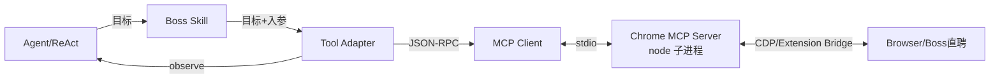
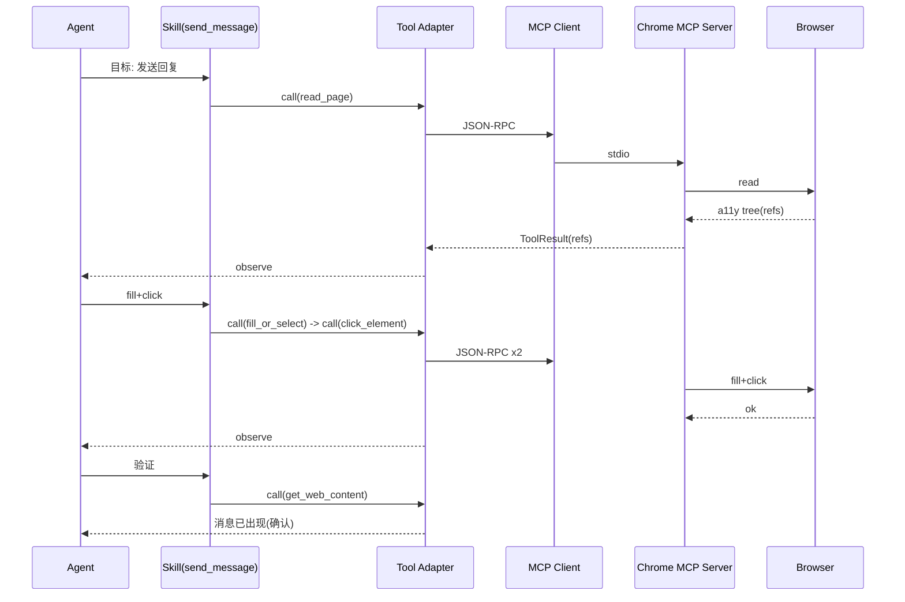

# MCP 与 Tool 体系设计 V2.0

## 文档信息

| 项 | 值 |
|---|---|
| 文档名称 | MCP 与 Tool 体系设计 |
| 版本 | V2.0 |
| 状态 | 设计基准 |
| 关联文档 | 02 系统架构 / 04 Agent Runtime / 06 LangGraph / 08 Boss Skill / 15 异常恢复 |
| 定位 | MCP 集成架构、Chrome MCP Server 生命周期、18 个 MCP Tool 分类语义、Tool Adapter、Skill->Tool 映射规则、安全/超时/降级 |

---

## 1. 设计目标

定义 Agent 经 Skill 调用 MCP 的完整链路：Chrome MCP Server 的生命周期管理、18 个 MCP Tool 的分类与语义、Tool Adapter 如何把 Skill 的"目标"编排为具体 Tool 调用、调用安全与超时、不可用降级。落实 Prompt 约束：Skill 不写 DOM/XPath/CSS、不自建 Browser Client、MCP 仅 stdio。

---

## 2. 背景

Prompt §4 规定 18 个固定 MCP 工具，Skill 只描述目标，具体调哪个 Tool 由 Agent（ReAct）决定。doc 02 §4.4 定义 L4 浏览器能力层。本文给出该层的内部设计与调用规约。

设计原则：

1. **不自建 Browser Client**：浏览器操作一律经 Chrome MCP Server。
2. **MCP 仅 stdio**：MCP Client 管理 Server 子进程生命周期。
3. **Skill 不含选择器**：不写 XPath/CSS/DOM 解析；以 `chrome_read_page` 运行时获取元素 ref，再 `chrome_click_element(ref=...)`，抗 DOM 变化。
4. **Agent 决定 Tool**：Skill 给目标，ReAct 循环决定调用序列。
5. **零信任**：校验 URL 域、文件类型、MCP 返回内容。

---

## 3. MCP 集成架构



- **Skill**：业务目标封装（doc 08），不直接调 MCP。
- **Tool Adapter**：位于 Runtime 内，把 Skill 目标翻译为 MCP Tool 调用序列；封装超时/重试/安全校验。
- **MCP Client**：管理 Server 子进程；经 stdio 收发 JSON-RPC。
- **Chrome MCP Server**：18 个 Tool 的实现方，经 CDP/Extension Bridge 操作浏览器。

> Agent 不直接调 `chrome_*`；必经 Skill -> Adapter -> Client。doc 03 的 `tool_executor` 节点即调用 Adapter。

---

## 4. Chrome MCP Server 生命周期管理

### 4.1 启动与复用

- MCP Client 在 Worker 启动时（或首次任务前）以子进程拉起 Chrome MCP Server：`node /path/to/server.js`，stdio 通道。
- **复用策略**：Server 跨任务保活（进程池单例），避免每任务冷启动开销。
- 配置（冻结）：

```json
{ "mcpServers": { "chrome-mcp": { "command": "node", "args": ["/path/to/server.js"] } } }
```

### 4.2 健康检查与崩溃恢复

- 周期 ping（如每 30s）；失败判定 Server 崩溃。
- 崩溃 -> MCP Client 终止旧子进程 -> 重新拉起 -> 当前 Tool 调用返回错误 -> 经 error_recovery 重试。
- 单次调用超时（默认 30s）-> kill 子进程 -> 重启 -> 重试。

### 4.3 回收

- Worker 关闭时优雅终止子进程（SIGTERM -> 超时 SIGKILL）。
- 长时间空闲（如 >10min 无任务）可选回收，下次按需拉起（V1 可常驻）。

---

## 5. 18 个 MCP Tool 分类与语义

| 类别 | Tool | 语义 | Boss 场景 |
|---|---|---|---|
| 导航/标签 | `chrome_navigate` | 导航/刷新/前进后退 | 进岗位列表/详情/聊天页 |
| 导航/标签 | `chrome_switch_tab` | 切换标签 | 多会话切换 |
| 导航/标签 | `get_windows_and_tabs` | 列窗口标签 | 状态检测/定位 Boss 标签 |
| 导航/标签 | `chrome_close_tabs` | 关闭标签 | 清理 |
| 内容读取 | `chrome_get_web_content` | 取页面文本/HTML | 读 JD/聊天记录 |
| 内容读取 | `chrome_read_page` | 取可见元素无障碍树(ref) | 运行时定位元素（抗 DOM 变化核心） |
| 内容读取 | `chrome_console` | 取控制台日志 | 诊断页面异常 |
| 交互执行 | `chrome_click_element` | 点击（ref/selector/坐标） | 发送按钮/翻页/进会话 |
| 交互执行 | `chrome_fill_or_select` | 填充/选择 | 输入消息框 |
| 交互执行 | `chrome_keyboard` | 键盘输入 | 输入/快捷键 |
| 交互执行 | `chrome_handle_dialog` | 处理 alert/confirm/prompt | 关闭弹窗 |
| 交互执行 | `chrome_computer` | 鼠标键盘综合+截图 | 兜底操作/截图取证 |
| 交互执行 | `chrome_request_element_selection` | 人工辅助选元素 | 元素失效时人工兜底 |
| 注入 | `chrome_javascript` | 执行 JS | 诊断/取隐藏数据（谨慎） |
| 截图 | `chrome_screenshot` | 截图 | Recovery 取证/调试 |
| 网络 | `chrome_network_capture` | 抓包 | 接口诊断（可选） |
| 网络 | `chrome_network_request` | 带 Cookie 发请求 | 兜底接口调用（谨慎） |
| 上传 | `chrome_upload_file` | 上传文件 | 投递简历 |

### 5.1 抗 DOM 变化的关键：read_page + ref

- Skill **不硬编码** CSS/XPath。
- 运行时：`chrome_read_page` 返回无障碍树含 `ref` -> Agent 选目标 ref -> `chrome_click_element(ref=...)` / `chrome_fill_or_select(ref=...)`。
- DOM 变化时 ref 失效 -> 调用失败 -> error_recovery -> `browser_recovery_agent` 重新 `read_page` 获取新 ref -> 重试。
- 兜底：`chrome_request_element_selection` 请求用户手动选元素（人工介入）。

---

## 6. Tool Adapter

### 6.1 职责

- 把 Skill 目标翻译为 MCP Tool 调用序列（ReAct 决定具体序列）。
- 封装：超时、重试、安全校验、observe 标准化。
- 对 Skill 屏蔽 stdio/JSON-RPC 细节。

### 6.2 调用契约

```python
async def call_tool(name: str, args: dict, *, runtime) -> ToolResult:
    validate(name, args)                  # 安全校验（域/类型）
    async with runtime.locks.browser:     # 浏览器锁（doc 04）
        return await runtime.mcp.call(name, args, timeout=30)
```

- 返回 `ToolResult{ok, data, error, screenshot?}`，标准化供 ReAct 观察。
- 失败 -> 抛 `ToolError` 或返回 error -> 经条件边进 error_recovery。

### 6.3 ReAct 编排示例（发送消息）

```
1. chrome_read_page -> 获取输入框 ref 与发送按钮 ref
2. chrome_fill_or_select(ref=input, value="你好...") -> ok
3. chrome_click_element(ref=send) -> ok
4. chrome_get_web_content -> 确认消息已出现在聊天区（observe 验证）
```

> 序列由 Agent 在 ReAct 循环中依页面观察决定，非 Skill 硬编码。Skill 只声明目标"发送 HR 回复消息"。

---

## 7. Skill -> Tool 映射规则

| Skill 目标 | 常用 Tool 序列（Agent 决定，非固定） |
|---|---|
| 寻岗 | navigate(列表URL) -> get_web_content/read_page -> click(翻页/详情) |
| 取 JD 评分 | navigate(详情URL) -> get_web_content |
| 同步聊天列表 | navigate(聊天URL) -> get_web_content/read_page |
| 同步消息 | read_page/get_web_content |
| 发送消息 | read_page -> fill_or_select -> click_element -> get_web_content(验证) |
| 投递简历 | read_page -> click_element(投递入口) -> upload_file -> click_element(确认) |
| 恢复页面（recovery） | screenshot -> read_page -> console -> 重新定位 ref |

> 此表为**参考映射**，实际由 ReAct 依观察动态决定；禁止在 Skill 内固定 selector。

---

## 8. 调用安全（零信任）

| 风险 | 防护 |
|---|---|
| Agent 导航到非 Boss 域 | `validate` 校验 URL 白名单（zhipin.com），拒绝非 Boss 域 navigate |
| 简历文件类型 | upload 前校验 MIME/扩展名（pdf/doc/docx） |
| 参数注入 | Tool 参数经 Pydantic 校验；JS 注入(`chrome_javascript`)受限白名单 |
| 敏感数据泄漏 | 截图/网络抓包数据含敏感时不入日志明文；脱敏后记 |
| 返回内容不可信 | MCP 返回的页面文本经校验/解析后再入库；不直接当指令执行 |
| 误操作（发送/投递） | 经 DomainGuard + Approval（敏感）前置；Tool Adapter 不绕过 |
| `chrome_javascript`/`network_request` 滥用 | 标记为高危 Tool，调用需 Skill 级授权 + 记审计日志 |

---

## 9. 超时与重试

| 维度 | 策略 |
|---|---|
| 单 Tool 调用超时 | 默认 30s（可配置）；超时 -> kill+重启 Server -> 重试 |
| 瞬时失败 | RetryPolicy(attempts=2)（网络/Server 抖动） |
| DOM 变化失败 | error_recovery -> browser_recovery_agent 重新 read_page -> 重试 |
| 重启后仍失败 | retry_count 耗尽 -> terminal=failed |

---

## 10. 不可用降级

| 故障 | 降级 |
|---|---|
| Chrome MCP Server 拉起失败 | 停止任务，前端报错"浏览器能力不可用"；不静默 |
| Server 崩溃 | 自动重启 1 次；再崩 -> 停止任务 |
| 浏览器/Boss 未登录 | 通知用户登录；不无限重试 |
| 单 Tool 不可用 | Agent 换等效 Tool（如 click 失败试 computer 坐标点击）或转 recovery |
| 元素定位失败 | `chrome_request_element_selection` 人工兜底；拒绝则 failed |

> 降级原则：不静默失败、不无限重试、必记日志、必通知用户。

---

## 11. 数据流

```
Agent(ReAct) -> Skill(目标) -> Adapter(call_tool) -> 安全校验
-> 浏览器锁 -> MCP Client(stdio) -> Chrome MCP Server -> Browser
-> 返回 ToolResult -> Adapter 标准化 -> Agent observe -> 再规划
```

---

## 12. 时序图（Skill 发消息经 MCP）



---

## 13. 接口

| 接口 | 方向 | 形式 |
|---|---|---|
| `Skill -> Adapter.call_tool(name, args)` | Skill -> Adapter | Python 函数 |
| `Adapter -> MCP Client.call(name, args, timeout)` | Adapter -> Client | JSON-RPC over stdio |
| `MCP Client <-> Server` | Client <-> Server | stdio JSON-RPC |
| `Adapter -> Agent` | Adapter -> Agent | ToolResult（observe） |
| `MCP Client lifecycle(start/stop/restart)` | Runtime -> Client | 进程管理 |

---

## 14. 异常处理

| 异常 | 处理 |
|---|---|
| Server 子进程崩溃 | 重启 1 次；再崩停止任务 |
| stdio 通道断开 | 重启 Server；重试当前调用 |
| Tool 超时 | kill+重启；重试 |
| URL 非白名单 | 拒绝；记审计 |
| 文件类型非法 | 拒绝；通知用户 |
| ref 失效（DOM 变化） | error_recovery -> 重新 read_page |
| JS/网络工具高危调用 | 授权校验失败拒绝；记审计 |
| Server 返回异常内容 | 校验后丢弃；记日志 |

---

## 15. Retry 与 Recovery

- 瞬时：RetryPolicy(attempts=2)（Server 抖动/网络）。
- DOM 变化：browser_recovery_agent 重新定位 ref 后重试（最多 2）。
- Server 不可用：重启 1 次重试；再失败 -> terminal=failed。
- 规则违反（非白名单域/非法文件）：不重试，直接拒绝 + 审计。

---

## 16. 扩展设计

- **多 MCP Server**：未来挂载非浏览器 MCP（邮件/日历/文件），Client 扩展为多 Server 注册中心，Adapter 按 Skill 路由到对应 Server。
- **Tool 版本化**：MCP Server 升级时 Tool schema 变化，Adapter 做版本兼容。
- **选择器自愈**：`browser_recovery_agent` 增强--失败时自动 `screenshot` + LLM 视觉定位元素，减少人工 `request_element_selection`。
- **性能**：read_page 结果缓存（同会话短时），减少重复读取。
