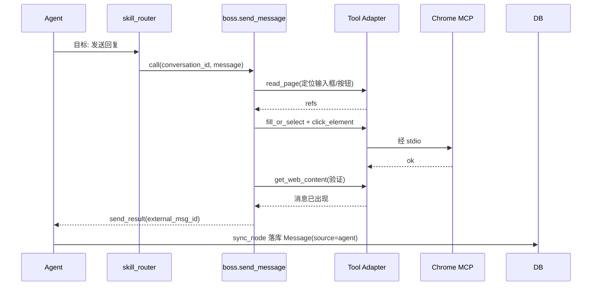

# Boss Skill 详细设计 V2.0

## 文档信息

| 项 | 值 |
|---|---|
| 文档名称 | Boss Skill 详细设计 |
| 版本 | V2.0 |
| 状态 | 设计基准 |
| 关联文档 | 02 系统架构 / 05 Boss领域Runtime / 07 MCP与Tool / 13 同步系统 / 14 Approval / 15 异常恢复 |
| 定位 | Goal-Oriented Skill 规范与 Boss 领域 Skill 清单：每个 Skill 的目标/输入/输出/Prompt/Tool 需求/Recovery |

---

## 1. 设计目标

定义 Boss 领域全部 Skill 的契约。Skill 采用 **Goal-Oriented** 设计：只描述目标、输入、输出、Prompt、Tool 需求、Recovery 策略；**不含 DOM/XPath/CSS 实现**；具体调哪个 MCP Tool 由 Agent（ReAct）决定（doc 07）。使 Skill 可被 Workflow（doc 03/06）编排、可独立测试、可多平台扩展。

---

## 2. 背景

Prompt §5 规定 Skill 负责目标定义而非浏览器实现。doc 05 定义领域对象与规则，doc 07 定义 MCP Tool 体系。本文是二者之间的**业务能力层**：每个 Skill 对应一个可复用的求职动作，封装领域规则与 Prompt，委托 MCP 完成浏览器操作。

设计原则：

1. Skill 只描述**目标**，不写选择器/DOM 解析。
2. Skill 声明 **Tool 需求**（需要哪类浏览器能力），不指定具体调用序列。
3. Skill 封装**领域规则**（前置/后置 DomainGuard，doc 05）。
4. Skill 含 **Recovery 策略**，但恢复执行由 error_recovery/browser_recovery_agent（doc 15）落地。
5. Skill 可独立单测（mock MCP）。

---

## 3. Goal-Oriented Skill 规范（模板）

每个 Skill 按以下模板定义：

```
Skill: boss.<name>
目标: 一句话业务目标
输入: {字段: 类型}  （Pydantic 校验）
输出: {字段: 类型}
Prompt: 指导 Agent 达成目标的提示词（不含 selector）
Tool 需求: 需要的浏览器能力类别（非具体 Tool）
前置: DomainGuard 约束
后置: 成功后的领域状态变更
Recovery: 失败时策略（指向 doc 15）
异常: 可预见的失败与处理
```

---

## 4. Skill 清单总表

| Skill | 目标 | 主要 Tool 需求 |
|---|---|---|
| boss.search_jobs | 按方向/URL 检索岗位 | 导航/内容读取 |
| boss.get_job_detail | 取岗位 JD | 导航/内容读取 |
| boss.score_job | 岗位评分（LLM60%+关键词40%） | （LLM，无浏览器） |
| boss.open_conversation | 对岗位开聊，建立/复用会话 | 导航/交互 |
| boss.send_message | 发送消息（打招呼/回复） | 内容读取/交互 |
| boss.get_messages | 读会话消息 | 内容读取 |
| boss.sync_conversations | 同步聊天列表 | 导航/内容读取 |
| boss.sync_messages | 同步会话消息 | 内容读取 |
| boss.detect_resume_request | 判定 HR 是否索要简历 | （LLM，无浏览器） |
| boss.apply_resume | 投递简历 | 交互/上传 |
| boss.verify_action | 验证操作结果（发送/投递成功） | 内容读取/截图 |
| boss.monitor_status | 检测 Boss 聊天状态/新消息 | 导航/内容读取 |
| boss.recover_page | 页面恢复（包装 browser_recovery_agent） | 截图/内容读取/JS |

> 评分与意图判定（score_job/detect_resume_request）属 LLM 推理型 Skill，无浏览器操作，但仍走 Skill 契约以便编排与审计。

---

## 5. 寻岗与评分 Skill

### 5.1 boss.search_jobs

```
目标: 按用户方向关键词或 Boss 列表 URL 检索候选岗位
输入: { keyword: str|None, list_url: str|None, limit: int=20 }
输出: { jobs: [{external_id, title, company, salary, location, source_url}] }
Prompt: 导航到 Boss 岗位列表，逐条提取岗位卡片关键信息；翻页直至达 limit 或无更多；仅 zhipin.com 域。
Tool 需求: 导航(chrome_navigate)、内容读取(get_web_content/read_page)、交互(翻页 click)
前置: 用户已配置求职方向或提供 URL
后置: 落库 Job(discovered, external_id 去重)；产出 JobDiscovered 事件
Recovery: 列表结构变化 -> recover_page 重新定位卡片
异常: 无候选 -> 返回空列表+通知；未登录 -> 通知用户
```

### 5.2 boss.get_job_detail

```
目标: 取指定岗位的完整 JD
输入: { job_id: str }
输出: { jd: str, requirements: [str], hr_external_id: str }
Prompt: 导航到岗位详情页，提取职位描述与要求；识别发布 HR。
Tool 需求: 导航、内容读取
前置: Job 已存在
后置: 更新 Job.jd；关联 HR
Recovery: 详情页结构变化 -> recover_page
异常: 岗位已下线 -> 标记 closed
```

### 5.3 boss.score_job

```
目标: 对岗位评分（LLM 60% + 关键词 40%），输出详细依据
输入: { job_id: str }
输出: { score: int, llm_score: int, keyword_score: int, llm_reason: str, keyword_hits: [str], deductions: [str] }
Prompt: 依据用户求职规则(薪资/地点/加班/外包/异地/试用期)与 JD，LLM 给出匹配度评语与扣分项；关键词按规则命中计分。权重 LLM60%+关键词40%。
Tool 需求: 无（LLM 推理）
前置: Job.jd 已取；用户 Settings 已配置
后置: 更新 Job.score/score_detail；>=阈值 -> JobScored 事件
Recovery: LLM 失败 -> Retry 2 次；仍失败 score=null
异常: Settings 缺失 -> 走 Approval 或跳过评分
```

---

## 6. 会话与消息 Skill

### 6.1 boss.open_conversation

```
目标: 对达标岗位开聊，建立或复用 Conversation
输入: { job_id: str }
输出: { conversation_id: str, thread_id: str, created: bool }
Prompt: 进入岗位聊天页；若已有同(job,hr)会话则复用，否则新建。
Tool 需求: 导航、交互(点击"立即沟通")
前置: Job.score>=阈值；active 会话数 < max_concurrent_chats（DomainGuard）
后置: 创建/复用 Conversation(active)；产出 ConversationCreated
Recovery: "沟通"入口变化 -> recover_page
异常: 达上限 -> 跳过；HR 不可沟通 -> 标记
```

### 6.2 boss.send_message

```
目标: 在会话中发送一条消息（打招呼/回复）
输入: { conversation_id: str, message: str }
输出: { send_result: bool, external_msg_id: str|None, sent_at: str }
Prompt: 进入会话页，输入消息内容并发送；发送后验证消息已出现在聊天区。
Tool 需求: 内容读取(read_page 取输入框/按钮 ref)、交互(fill_or_select/click_element)、验证(get_web_content)
前置: Conversation 存在且 active；消息内容符合回复风格；敏感内容需 Approval 已通过
后置: 落库 Message(role=user, source=agent, external_msg_id)；Conversation -> waiting_hr；产出 MessageSent
Recovery: 输入框/发送按钮 ref 失效 -> recover_page 重新 read_page
异常: 发送失败 -> Retry 2 次；仍失败停止任务
```

> 此即 Prompt §5 示例 Skill：输入 conversation_id+message，输出 send_result，需浏览器发送能力，具体 Tool 由 Agent 决定。

### 6.3 boss.get_messages

```
目标: 读取指定会话当前页面消息（供 Agent 上下文/同步）
输入: { conversation_id: str, limit: int=50 }
输出: { messages: [{role, content, external_msg_id, ts}] }
Prompt: 进入会话页，提取可见消息列表。
Tool 需求: 导航、内容读取
前置: Conversation 存在
后置: 不直接落库（落库由 sync_messages 负责）
Recovery: 消息区结构变化 -> recover_page
异常: 会话不存在 -> 错误
```

---

## 7. 同步 Skill

> 同步 Skill 由 Sync 系统（doc 13）调用；DB 为真实数据源，去重靠 external_msg_id。

### 7.1 boss.sync_conversations

```
目标: 同步 Boss 聊天列表（Conversation Sync）
输入: { full: bool=False }  # full=首次全量，否则增量
输出: { synced: int, new: [conversation], updated: int }
Prompt: 导航 Boss 聊天列表页，提取会话项(external_chat_id/HR/岗位)；与 DB 比对，新增或更新。
Tool 需求: 导航、内容读取
前置: 用户已登录 Boss
后置: 落库/更新 Conversation；记录 sync_record
Recovery: 列表结构变化 -> recover_page
异常: 未登录 -> 通知用户，不重试
```

### 7.2 boss.sync_messages

```
目标: 同步指定会话的消息（Message Sync）
输入: { conversation_id: str, full: bool=False }
输出: { synced: int, new_messages: [message] }
Prompt: 进入会话页，提取消息(external_msg_id 去重)；与 DB 比对，新增缺失消息（含 HR 发与历史）。
Tool 需求: 导航、内容读取
前置: Conversation 存在
后置: 落库 Message(source=history 或 hr)；产出 MessageReceived（HR 新消息触发 hr_reply 任务）
Recovery: 消息区变化 -> recover_page
异常: external_msg_id 冲突 -> 跳过已存在
```

---

## 8. 投递 Skill

### 8.1 boss.detect_resume_request

```
目标: 判定 HR 是否索要简历
输入: { conversation_id: str, recent_messages: [message] }
输出: { requested: bool, confidence: float, evidence: str }
Prompt: 分析近期 HR 消息，判定是否含"索要简历"意图；给出证据与置信度。
Tool 需求: 无（LLM 推理）
前置: 有近期 HR 消息
后置: requested=true -> 产出 ResumeRequested
Recovery: LLM 失败 -> Retry 2 次
异常: 置信度低 -> 转 Approval 由用户确认是否投递
```

### 8.2 boss.apply_resume

```
目标: 投递简历
输入: { conversation_id: str, resume_id: str }
输出: { applied: bool, applied_at: str }
Prompt: 进入会话/投递入口，上传简历文件并确认投递；投递后验证成功。
Tool 需求: 交互(click 投递入口)、上传(upload_file)、验证(get_web_content/screenshot)
前置: DomainGuard.can_apply=true（HR 已索要简历）；自动投递开关开 或 Approval 已通过；Resume 存在
后置: 落库投递记录；Job -> applied
Recovery: 投递入口/上传控件变化 -> recover_page
异常: 无简历 -> 通知用户上传；投递失败 -> Retry 2 次
```

> 禁止发现即投：DomainGuard 在前置拦截，无"HR 索要简历"证据则拒绝。

---

## 9. 验证与监听 Skill

### 9.1 boss.verify_action

```
目标: 验证上一动作结果（消息发送/简历投递成功）
输入: { action: str, conversation_id: str }
输出: { verified: bool, evidence: str }
Prompt: 读取页面确认动作生效（消息出现/投递成功提示）；可截图留证。
Tool 需求: 内容读取、截图
前置: 刚完成发送/投递
后置: verified=false -> 触发 Recovery 或标记失败
Recovery: 验证失败 -> recover_page 后重验
异常: 无法验证 -> 标记不确定，记日志
```

### 9.2 boss.monitor_status

```
目标: 检测 Boss 聊天状态与是否有新消息（Scheduler 周期调用）
输入: { check_conversations: [conversation_id]|None }
输出: { online: bool, conversations_with_new: [conversation_id] }
Prompt: 检测 Boss 是否登录/可达；扫描会话列表是否有未读标记。
Tool 需求: 导航、内容读取
前置: 监听态=monitoring
后置: 有新消息 -> 触发 sync_messages -> 入队 hr_reply
Recovery: 页面不可达 -> 通知用户，跳过本轮
异常: 未登录 -> 监听态保持，通知用户；不无限重试
```

---

## 10. 恢复 Skill

### 10.1 boss.recover_page

```
目标: 页面恢复（包装 browser_recovery_agent，doc 15）
输入: { context: {last_url, failed_action, error_kind} }
输出: { recovered: bool, new_refs: dict|None }
Prompt: 截图+read_page+console 诊断页面异常；重新定位失效元素 ref；必要时导航回正确页。
Tool 需求: 截图、内容读取、JS(诊断)、导航
前置: 工具调用失败/DOM 变化
后置: recovered=true -> 调用方重试；false -> 上抛失败
Recovery: 自身失败上抛，不递归
异常: 不可恢复 -> terminal=failed
```

> 详细恢复逻辑与 browser_recovery_agent 实现见 doc 15。

---

## 11. Skill 不含 DOM 实现的约束示例

**反例（禁止）**--Skill 内写选择器：

```
# ❌ 错误：Skill 不应包含
input_sel = "div.chat-input[contenteditable]"
btn_sel = "button.send-btn"
await chrome_fill_or_select(selector=input_sel, value=message)
await chrome_click_element(selector=btn_sel)
```

**正例（要求）**--Skill 只描述目标，Agent 运行时定位：

```
# ✅ Skill 声明：发送消息；Agent 经 read_page 取 ref 后 fill+click
Skill: boss.send_message
目标: 在会话中发送消息
Tool 需求: 内容读取(定位输入框与发送按钮)、交互(填充+点击)、验证
# 具体 ref 由 Agent 在运行时通过 chrome_read_page 获取，DOM 变化时经 recover_page 重取
```

> 此约束保证 Boss 页面改版时只需 Agent 重新读页定位，不改 Skill 代码。

---

## 12. 数据流

```
Workflow(planner) -> 选 Skill 目标 -> skill_router 映射
-> tool_executor 调 Skill -> Skill 经 Adapter 调 MCP(doc 07) -> Browser
-> ToolResult -> Agent observe -> 验证/再规划
-> sync_node 落库(doc 13) -> 领域状态变更(doc 05)
```

---

## 13. 时序图（send_message Skill 执行）



---

## 14. 接口（Skill 调用契约）

```python
class SkillCall(BaseModel):
    name: str            # boss.send_message
    args: dict           # Pydantic 校验
class SkillResult(BaseModel):
    ok: bool
    data: dict
    error: str | None
```

| 接口 | 方向 | 形式 |
|---|---|---|
| `SkillRouter -> Skill.__call__(args)` | Router -> Skill | Python async 函数 |
| `Skill -> Adapter.call_tool(...)` | Skill -> Adapter | doc 07 |
| `Skill -> DomainGuard` | Skill -> 领域层 | 前置/后置校验（doc 05） |
| `Skill -> DomainService` | Skill -> 领域服务 | 落库/状态变更（doc 05） |

---

## 15. 异常处理

| 异常 | 处理 |
|---|---|
| ref 失效/DOM 变化 | recover_page 重取后重试 |
| 发送/投递失败 | Retry 2 次；仍失败停止任务 |
| LLM 失败（评分/意图） | Retry 2 次；score=null 或转 Approval |
| 未登录 | 通知用户；不重试 |
| DomainGuard 拒绝 | 不重试；记录；前端提示 |
| 置信度低（意图判定） | 转 Approval 人工确认 |
| 无简历 | 通知用户上传；不投递 |

---

## 16. Retry 与 Recovery

- 浏览器操作失败：经 error_recovery -> recover_page（最多 2 次）。
- LLM 失败：RetryPolicy(attempts=2)。
- 规则违反：不重试。
- 最终失败：terminal=failed，前端报错，记日志。

---

## 17. 扩展设计

- **多平台 Skill**：新增 `lagou.search_jobs` 等，接口同构，Tool 需求相同，Prompt 适配平台页面语义。
- **Skill 组合**：高阶 Skill（如 `boss.full_apply_flow`）编排多个原子 Skill，供复杂任务复用。
- **Skill 市场/配置化**：Prompt 与阈值迁至配置，用户可调回复风格与评分权重。
- **单测**：每个 Skill mock MCP Adapter 单测，验证 Prompt 生成、前置后置、Recovery 触发。
