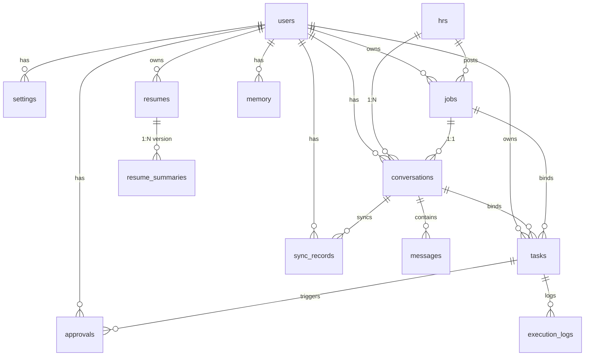
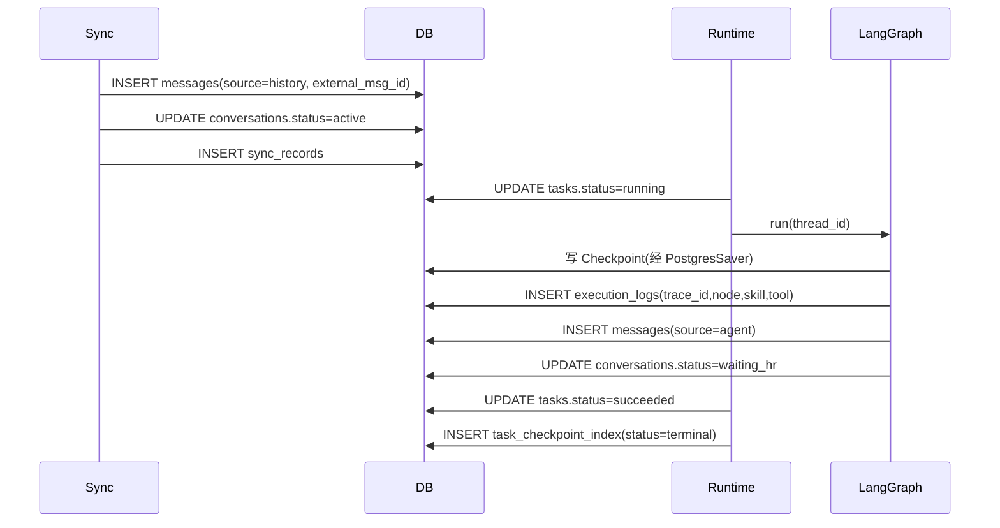

# 数据库设计 V2.0

## 文档信息

| 项 | 值 |
|---|---|
| 文档名称 | 数据库 Schema 设计（LLD） |
| 版本 | V2.0 |
| 状态 | 设计基准 |
| 关联文档 | 05 Boss领域Runtime / 03 状态机 / 04 Agent Runtime / 13 同步系统 / 14 Approval / 15 日志 |
| 技术 | PostgreSQL + pgvector |
| 定位 | 目标态完整 schema（Prompt §17 的 12 表 + HR 规范化 + Checkpoint 索引），并标注与 Phase 0 已落地 9 表的差异与迁移路径 |

---

## 1. 设计目标

给出可落地的 PostgreSQL schema：字段、类型、约束、索引、关系与设计动机。覆盖 Prompt §17 列出的 12 张表（User/Setting/Task/Conversation/Message/Job/Resume/ResumeSummary/Memory/Approval/Log/Checkpoint），并补 HR 规范化（doc 05）与 LangGraph Checkpoint 索引。所有状态枚举与 doc 03/05/14 对齐。

---

## 2. 背景

Phase 0 已落地 9 表（`alembic/versions/0001_initial_schema.py`）。Prompt §17 要求 12 表目标态，新增 Setting/ResumeSummary/Memory/Checkpoint。本文为**目标态设计**，§9 给出与 Phase 0 的差异与迁移路径。

设计原则：

1. BigInt 自增 `id` 为 DB 主键（FK 效率）；业务标识用 UUID 列（如 `conversations.uuid`）。
2. Conversation ID = 系统生成 UUID（`conversations.uuid`），**不依赖 Boss ID**；`external_id`/`external_chat_id` 仅作同步映射。
3. 状态枚举全小写，与 doc 03/05/14 状态机一致。
4. pgvector 512 维（bge-small-zh）用于 Resume 与 Memory。
5. Checkpoint 由 LangGraph AsyncPostgresSaver 管理，业务侧加轻量索引表。
6. 零信任：密钥加密列、敏感脱敏、Check 约束兜底。

---

## 3. 表清单总览（与 Phase 0 对账）

| # | 目标表 | Phase 0 | 变更 |
|---|---|---|---|
| 1 | users | ✅ users | 剥离 settings 至 settings 表；保留 llm_* 加密列 |
| 2 | settings | ❌（内嵌 users.settings JSONB） | 新增独立表 |
| 3 | hrs | ❌（denorm 于 conversations.hr_name） | 新增（doc 05 HR 规范化） |
| 4 | jobs | ✅ jobs | 加 hr_id FK；status 枚举对齐 doc 05 |
| 5 | conversations | ✅ conversations | 加 job_id/hr_id FK、thread_id、status、external_chat_id |
| 6 | tasks | ✅ tasks | 加 thread_id、priority；status 7 态对齐 doc 03；max_retries=2 |
| 7 | messages | ✅ messages | 基本不变 |
| 8 | resumes | ✅ resumes | 加 version；summary 拆至 resume_summaries |
| 9 | resume_summaries | ❌ | 新增 |
| 10 | memory | ❌ | 新增（长期上下文 + Embedding） |
| 11 | approvals | ✅ approvals | status 对齐 doc 14（timed_out）；type 7 类 |
| 12 | sync_records | ✅ sync_records | 不变 |
| 13 | execution_logs | ✅ execution_logs | 加 trace_id、skill |
| 14 | task_checkpoint_index | ❌ | 新增（LangGraph Checkpoint 业务索引） |

> Prompt §17 的 12 表全覆盖；hrs 为 doc 05 一致性补充；task_checkpoint_index 为 Checkpoint 业务索引（Checkpoint 表本身由 LangGraph 管理，见 §8）。

---

## 4. ER 图



---

## 5. 逐表 DDL

> 以下为目标态 SQL（PostgreSQL）。Phase 0 已有列标注【已有】，新增标注【新】。

### 5.1 users

```sql
CREATE TABLE users (
    id                   BIGSERIAL PRIMARY KEY,
    email                VARCHAR(255) NOT NULL,                 -- 【已有】
    nickname             VARCHAR(100),
    password_hash        VARCHAR(255),                          -- 鉴权（V1 单用户可空）
    llm_provider         VARCHAR(50),                           -- 【已有】冗余便于快速读取
    llm_base_url         VARCHAR(500),                          -- 【新】
    llm_api_key_encrypted VARCHAR(500),                         -- 【已有】加密存储
    llm_model            VARCHAR(100),                          -- 【新】
    is_active            BOOLEAN NOT NULL DEFAULT true,
    last_login_at        TIMESTAMPTZ,
    bio                  TEXT,
    created_at           TIMESTAMPTZ NOT NULL DEFAULT now(),
    updated_at           TIMESTAMPTZ NOT NULL DEFAULT now(),
    CONSTRAINT uq_users_email UNIQUE (email)
);
CREATE UNIQUE INDEX ix_users_email ON users(email);
```

- 动机：email 唯一索引兼顾登录查询与唯一约束。llm_* 既冗余于 users（快速读）也镜像至 settings（统一配置入口），以 settings 为权威。

### 5.2 settings（新）

```sql
CREATE TABLE settings (
    id         BIGSERIAL PRIMARY KEY,
    user_id    BIGINT NOT NULL REFERENCES users(id) ON DELETE CASCADE,
    category   VARCHAR(30) NOT NULL,   -- llm | job_rule | agent | reply_style
    key        VARCHAR(100) NOT NULL,  -- 期望薪资/是否接受加班/自动回复开关...
    value      JSONB NOT NULL,         -- 类型化值
    updated_at TIMESTAMPTZ NOT NULL DEFAULT now(),
    CONSTRAINT uq_settings_user_cat_key UNIQUE (user_id, category, key),
    CONSTRAINT ck_settings_category CHECK (category IN ('llm','job_rule','agent','reply_style'))
);
CREATE INDEX ix_settings_user ON settings(user_id);
```

- 动机：独立 settings 表替代 Phase 0 的 `users.settings JSONB`，支持分组校验、按字段版本化、便于 API 分域 PUT（doc 10）。
- 迁移：Phase 0 `users.settings` JSONB 数据拆分迁入；`users.settings` 列保留为兼容缓存或逐步废弃。

### 5.3 hrs（新）

```sql
CREATE TABLE hrs (
    id          BIGSERIAL PRIMARY KEY,
    user_id     BIGINT NOT NULL REFERENCES users(id) ON DELETE CASCADE,
    platform    VARCHAR(30) NOT NULL DEFAULT 'boss',
    external_id VARCHAR(100) NOT NULL,   -- Boss HR ID
    name        VARCHAR(100),
    company     VARCHAR(200),
    position    VARCHAR(200),
    created_at  TIMESTAMPTZ NOT NULL DEFAULT now(),
    updated_at  TIMESTAMPTZ NOT NULL DEFAULT now(),
    CONSTRAINT uq_hrs_user_platform_ext UNIQUE (user_id, platform, external_id)
);
CREATE INDEX ix_hrs_user ON hrs(user_id);
```

- 动机：doc 05 HR 为一等实体（同 HR 不同岗位=不同 Conversation 需 HR 去重）。Phase 0 仅 denorm `hr_name` 于 conversations，此处规范化。
- 迁移：从现有 conversations.hr_name 反推填充，无 external_id 的留空后续同步补齐。

### 5.4 jobs

```sql
CREATE TABLE jobs (
    id           BIGSERIAL PRIMARY KEY,
    user_id      BIGINT REFERENCES users(id) ON DELETE CASCADE,
    hr_id        BIGINT REFERENCES hrs(id),                 -- 【新】
    platform     VARCHAR(30) NOT NULL DEFAULT 'boss',
    external_id  VARCHAR(100) NOT NULL,                     -- Boss 岗位 ID
    title        VARCHAR(300),
    company      VARCHAR(200),
    salary       VARCHAR(100),
    location     VARCHAR(200),
    description  TEXT,                                       -- JD
    requirements JSONB,
    score        FLOAT,
    score_detail JSONB,                                      -- {llm_score,keyword_score,llm_reason,keyword_hits,deductions}
    status       VARCHAR(30) NOT NULL DEFAULT 'discovered',
    source_url   VARCHAR(500),                               -- 【新】
    extra        JSONB NOT NULL DEFAULT '{}'::jsonb,
    created_at   TIMESTAMPTZ NOT NULL DEFAULT now(),
    updated_at   TIMESTAMPTZ NOT NULL DEFAULT now(),
    CONSTRAINT uq_jobs_platform_external UNIQUE (platform, external_id),
    CONSTRAINT ck_jobs_status CHECK (status IN
        ('discovered','scored','chatting','applied','rejected','closed','skipped'))
);
CREATE INDEX ix_jobs_user_status ON jobs(user_id, status);
CREATE INDEX ix_jobs_user_score ON jobs(user_id, score);
```

- 动机：status 对齐 doc 05（discovered->scored->chatting->applied/rejected/closed/skipped）。`(user_id,status)` 支撑"活跃会话数"统计；`(user_id,score)` 支撑阈值筛选。
- 迁移：Phase 0 `analyzed` -> `scored`；新增 `chatting/closed/skipped`。

### 5.5 conversations

```sql
CREATE TABLE conversations (
    id              BIGSERIAL PRIMARY KEY,
    user_id         BIGINT NOT NULL REFERENCES users(id) ON DELETE CASCADE,
    platform        VARCHAR(30) NOT NULL DEFAULT 'boss',
    external_chat_id VARCHAR(100),                          -- 【新】Boss 聊天会话 ID（同步锚点）
    external_id     VARCHAR(100),                           -- 【已有，兼容】
    uuid            UUID NOT NULL DEFAULT gen_random_uuid(),-- 业务 Conversation ID（系统 UUID）
    thread_id       UUID NOT NULL DEFAULT gen_random_uuid(),-- 【新】= uuid，LangGraph Checkpoint 线
    job_id          BIGINT REFERENCES jobs(id),             -- 【新】1:1
    hr_id           BIGINT REFERENCES hrs(id),              -- 【新】N:1
    hr_name         VARCHAR(100),                           -- 【已有】denorm 冗余
    job_title       VARCHAR(200),                           -- 【已有】denorm 冗余
    status          VARCHAR(30) NOT NULL DEFAULT 'active',  -- 【新】
    last_synced_at  TIMESTAMPTZ,
    extra           JSONB NOT NULL DEFAULT '{}'::jsonb,
    created_at      TIMESTAMPTZ NOT NULL DEFAULT now(),
    updated_at      TIMESTAMPTZ NOT NULL DEFAULT now(),
    CONSTRAINT uq_conv_uuid UNIQUE (uuid),
    CONSTRAINT uq_conv_job UNIQUE (job_id),                 -- 1 岗位 1 会话
    CONSTRAINT ck_conv_status CHECK (status IN ('active','waiting_hr','closed')),
    CONSTRAINT ck_conv_platform CHECK (platform IN ('boss','lagou','51job'))
);
CREATE INDEX ix_conv_user_status ON conversations(user_id, status);
CREATE INDEX ix_conv_thread ON conversations(thread_id);
```

- 动机：`uuid` 为业务 Conversation ID（不依赖 Boss）；`thread_id` 默认等于 uuid（1:1），作 LangGraph Checkpoint key；`(job_id)` 唯一约束落地"1 岗位 1 会话"；`(user_id,status)` 支撑 `max_concurrent_chats` 统计。
- 迁移：Phase 0 已有 uuid/external_id；补 job_id/hr_id/thread_id/status/external_chat_id；`external_id` 语义让位 `external_chat_id`。

### 5.6 tasks

```sql
CREATE TABLE tasks (
    id              BIGSERIAL PRIMARY KEY,
    user_id         BIGINT NOT NULL REFERENCES users(id) ON DELETE CASCADE,
    type            VARCHAR(50) NOT NULL,                    -- proactive_job|proactive_chat|hr_reply|approval_resume|sync|recovery
    status          VARCHAR(30) NOT NULL DEFAULT 'pending',
    thread_id       UUID,                                    -- 【新】绑定 Thread（= conversation.uuid）
    conversation_id BIGINT REFERENCES conversations(id),
    job_id          BIGINT REFERENCES jobs(id),
    priority        VARCHAR(5) NOT NULL DEFAULT 'P2',        -- 【新】P0..P3
    payload         JSONB,
    result          JSONB,
    error           TEXT,
    retry_count     INTEGER NOT NULL DEFAULT 0,
    max_retries     INTEGER NOT NULL DEFAULT 2,              -- 【改】Phase 0=3 -> 2（Prompt）
    scheduled_at    TIMESTAMPTZ,
    started_at      TIMESTAMPTZ,
    completed_at    TIMESTAMPTZ,
    created_at      TIMESTAMPTZ NOT NULL DEFAULT now(),
    updated_at      TIMESTAMPTZ NOT NULL DEFAULT now(),
    CONSTRAINT ck_tasks_status CHECK (status IN
        ('pending','running','waiting_approval','recovering','succeeded','failed','canceled')),
    CONSTRAINT ck_tasks_priority CHECK (priority IN ('P0','P1','P2','P3'))
);
CREATE INDEX ix_tasks_status ON tasks(status);
CREATE INDEX ix_tasks_user_status ON tasks(user_id, status);
CREATE INDEX ix_tasks_thread ON tasks(thread_id);
CREATE INDEX ix_tasks_priority_sched ON tasks(priority, scheduled_at);
```

- 动机：status 对齐 doc 03 七态（小写，去 `WAITING_HR`，加 `recovering`）；`max_retries=2` 对齐 Prompt；`thread_id`/`priority` 支撑 doc 04 调度。
- 迁移：枚举大小写转换 + 值映射（COMPLETED->succeeded, CANCELLED->canceled, 去 WAITING_HR）；max_retries 默认改 2。

### 5.7 messages

```sql
CREATE TABLE messages (
    id              BIGSERIAL PRIMARY KEY,
    conversation_id BIGINT NOT NULL REFERENCES conversations(id) ON DELETE CASCADE,
    user_id         BIGINT NOT NULL REFERENCES users(id),
    role            VARCHAR(20) NOT NULL,    -- user | hr | agent | system
    content         TEXT NOT NULL,
    source          VARCHAR(20) NOT NULL,    -- agent | manual | history
    external_msg_id VARCHAR(100),            -- Boss 消息 ID，去重锚点
    sent_at         TIMESTAMPTZ,
    created_at      TIMESTAMPTZ NOT NULL DEFAULT now(),
    updated_at      TIMESTAMPTZ NOT NULL DEFAULT now(),
    CONSTRAINT ck_messages_role CHECK (role IN ('user','agent','hr','system')),
    CONSTRAINT ck_messages_source CHECK (source IN ('manual','agent','history'))
);
CREATE INDEX ix_messages_conv_sent ON messages(conversation_id, sent_at);
CREATE INDEX ix_messages_external_msg ON messages(external_msg_id);
```

- 动机：`role` 区分发送方，`source` 区分写入来源（doc 05）；`(conversation_id, sent_at)` 支撑上下文读取；`external_msg_id` 去重。与 Phase 0 一致，无需迁移。

### 5.8 resumes

```sql
CREATE TABLE resumes (
    id         BIGSERIAL PRIMARY KEY,
    user_id    BIGINT NOT NULL REFERENCES users(id) ON DELETE CASCADE,
    name       VARCHAR(100),
    version    INTEGER NOT NULL DEFAULT 1,                  -- 【新】
    file_key   VARCHAR(255),                                -- MinIO key
    file_url   VARCHAR(500),
    content    TEXT,                                        -- 原文
    is_default BOOLEAN NOT NULL DEFAULT false,
    status     VARCHAR(20) NOT NULL DEFAULT 'active',       -- 【新】draft|active|archived
    created_at TIMESTAMPTZ NOT NULL DEFAULT now(),
    updated_at TIMESTAMPTZ NOT NULL DEFAULT now(),
    CONSTRAINT ck_resumes_status CHECK (status IN ('draft','active','archived'))
);
CREATE INDEX ix_resumes_user ON resumes(user_id);
```

- 动机：version 支持多版本（doc 05 Resume 状态机）；Embedding 拆至 resume_summaries。迁移：Phase 0 `embedding` 列迁至 resume_summaries。

### 5.9 resume_summaries（新）

```sql
CREATE TABLE resume_summaries (
    id         BIGSERIAL PRIMARY KEY,
    resume_id  BIGINT NOT NULL REFERENCES resumes(id) ON DELETE CASCADE,
    version    INTEGER NOT NULL DEFAULT 1,
    summary    TEXT NOT NULL,                               -- 结构化摘要
    embedding  vector(512) NOT NULL,                        -- bge-small-zh
    created_at TIMESTAMPTZ NOT NULL DEFAULT now(),
    CONSTRAINT uq_resume_summary UNIQUE (resume_id, version)
);
CREATE INDEX ix_resume_summaries_resume ON resume_summaries(resume_id);
-- ivfflat 向量索引（简历量小，可选 HNSW）
CREATE INDEX ix_resume_summaries_embedding ON resume_summaries USING ivfflat (embedding vector_cosine_ops) WITH (lists = 100);
```

- 动机：摘要 + Embedding 独立，支持"新增简历合并摘要、保旧内容"（doc 01 §6.9）。合并时写新 version，旧 version 保留。
- 迁移：Phase 0 `resumes.embedding` 迁入 resume_summaries(version=1)。

### 5.10 memory（新）

```sql
CREATE TABLE memory (
    id              BIGSERIAL PRIMARY KEY,
    user_id         BIGINT NOT NULL REFERENCES users(id) ON DELETE CASCADE,
    conversation_id BIGINT REFERENCES conversations(id),    -- 可选关联
    job_id          BIGINT REFERENCES jobs(id),             -- 可选关联
    type            VARCHAR(30) NOT NULL,                   -- preference|hr_pact|interview|decision|...
    content         TEXT NOT NULL,
    embedding       vector(512) NOT NULL,
    created_at      TIMESTAMPTZ NOT NULL DEFAULT now(),
    CONSTRAINT ck_memory_type CHECK (type IN
        ('preference','hr_pact','interview','decision','fact'))
);
CREATE INDEX ix_memory_user ON memory(user_id);
CREATE INDEX ix_memory_user_conv ON memory(user_id, conversation_id);
CREATE INDEX ix_memory_embedding ON memory USING ivfflat (embedding vector_cosine_ops) WITH (lists = 100);
```

- 动机：长期求职上下文（doc 04 §11），用户级 + 关联 conversation/job。pgvector 语义检索 Top-K 注入 Planner。

### 5.11 approvals

```sql
CREATE TABLE approvals (
    id            BIGSERIAL PRIMARY KEY,
    task_id       BIGINT NOT NULL REFERENCES tasks(id) ON DELETE CASCADE,
    user_id       BIGINT NOT NULL REFERENCES users(id),
    type          VARCHAR(50) NOT NULL,     -- salary|location|start_date|overtime|outsourcing|offsite|probation_salary
    payload       JSONB NOT NULL DEFAULT '{}'::jsonb,
    status        VARCHAR(20) NOT NULL DEFAULT 'pending',
    decision      VARCHAR(20),              -- approve | deny | timeout
    decided_at    TIMESTAMPTZ,
    expires_at    TIMESTAMPTZ NOT NULL,     -- created_at + 20s
    reminder_count INTEGER NOT NULL DEFAULT 0,
    created_at    TIMESTAMPTZ NOT NULL DEFAULT now(),
    updated_at    TIMESTAMPTZ NOT NULL DEFAULT now(),
    CONSTRAINT ck_approvals_status CHECK (status IN ('pending','approved','denied','timed_out')),
    CONSTRAINT ck_approvals_type CHECK (type IN
        ('salary','location','start_date','overtime','outsourcing','offsite','probation_salary'))
);
CREATE INDEX ix_approvals_task ON approvals(task_id);
CREATE INDEX ix_approvals_user_status ON approvals(user_id, status);
CREATE INDEX ix_approvals_expires ON approvals(expires_at) WHERE status = 'pending';
```

- 动机：status 对齐 doc 14（pending->approved/denied/timed_out）；`expires_at` 部分索引加速超时扫描；type 7 类对齐 Prompt §14。
- 迁移：Phase 0 `APPROVED/REJECTED/EXPIRED` -> `approved/denied/timed_out`；加 `decision` 列。

### 5.12 sync_records

```sql
CREATE TABLE sync_records (
    id              BIGSERIAL PRIMARY KEY,
    user_id         BIGINT NOT NULL REFERENCES users(id),
    conversation_id BIGINT REFERENCES conversations(id),
    mode            VARCHAR(20) NOT NULL,   -- initial | manual | incremental
    status          VARCHAR(20) NOT NULL DEFAULT 'running',
    messages_synced INTEGER NOT NULL DEFAULT 0,
    error           TEXT,
    started_at      TIMESTAMPTZ,
    completed_at    TIMESTAMPTZ,
    created_at      TIMESTAMPTZ NOT NULL DEFAULT now(),
    updated_at      TIMESTAMPTZ NOT NULL DEFAULT now(),
    CONSTRAINT ck_sync_mode CHECK (mode IN ('initial','manual','incremental')),
    CONSTRAINT ck_sync_status CHECK (status IN ('running','completed','failed'))
);
CREATE INDEX ix_sync_records_user ON sync_records(user_id);
```

- 与 Phase 0 一致，无迁移。双同步器（doc 13）复用此表，mode 区分。

### 5.13 execution_logs

```sql
CREATE TABLE execution_logs (
    id         BIGSERIAL PRIMARY KEY,
    task_id    BIGINT NOT NULL REFERENCES tasks(id) ON DELETE CASCADE,
    trace_id   VARCHAR(64) NOT NULL,                -- 【新】链路追踪
    node       VARCHAR(100),                        -- LangGraph 节点
    skill      VARCHAR(100),                        -- 【新】Skill 名
    tool       VARCHAR(100),                        -- MCP Tool 名
    input      JSONB,
    output     JSONB,
    error      TEXT,
    latency_ms INTEGER,
    created_at TIMESTAMPTZ NOT NULL DEFAULT now()
);
CREATE INDEX ix_logs_task_created ON execution_logs(task_id, created_at);
CREATE INDEX ix_logs_trace ON execution_logs(trace_id);
```

- 动机：加 `trace_id`（doc 15 可观测）、`skill`（区分 Skill 与 Tool）。迁移：Phase 0 补 trace_id（回填随机/空）、skill 列。

### 5.14 task_checkpoint_index（新）

```sql
CREATE TABLE task_checkpoint_index (
    id            BIGSERIAL PRIMARY KEY,
    task_id       BIGINT NOT NULL REFERENCES tasks(id) ON DELETE CASCADE,
    thread_id     UUID NOT NULL,                     -- LangGraph thread_id
    checkpoint_id VARCHAR(100),                      -- LangGraph checkpoint_id
    status        VARCHAR(20) NOT NULL,              -- active | terminal
    created_at    TIMESTAMPTZ NOT NULL DEFAULT now()
);
CREATE INDEX ix_chk_task ON task_checkpoint_index(task_id);
CREATE INDEX ix_chk_thread ON task_checkpoint_index(thread_id);
```

- 动机：LangGraph Checkpoint 表由 AsyncPostgresSaver 自建管理（见 §8）；本表为业务侧轻量索引，便于按 task_id 查 Checkpoint、清理策略。

---

## 6. pgvector 用法

- 扩展：`CREATE EXTENSION IF NOT EXISTS vector;`（Phase 0 已建）。
- 模型：bge-small-zh，512 维（与 Phase 0 一致）。
- 索引：`ivfflat`（lists=100，小数据量够用；量大可换 HNSW）。
- 检索：`ORDER BY embedding <=> :query_embedding LIMIT k`（余弦距离）。
- 用途：resume_summaries（简历语义匹配）、memory（长期上下文检索）。

---

## 7. 状态枚举对齐（与各 doc 一致）

| 表 | 枚举 | 值 | 来源 |
|---|---|---|---|
| jobs.status | | discovered/scored/chatting/applied/rejected/closed/skipped | doc 05 |
| conversations.status | | active/waiting_hr/closed | doc 05 |
| tasks.status | | pending/running/waiting_approval/recovering/succeeded/failed/canceled | doc 03 |
| tasks.priority | | P0/P1/P2/P3 | doc 04 |
| approvals.status | | pending/approved/denied/timed_out | doc 14 |
| approvals.type | | salary/location/start_date/overtime/outsourcing/offsite/probation_salary | Prompt §14 |
| messages.role | | user/agent/hr/system | doc 05 |
| messages.source | | manual/agent/history | doc 05 |
| resumes.status | | draft/active/archived | doc 05 |

---

## 8. LangGraph Checkpoint 表

- 由 `AsyncPostgresSaver` 自动创建并管理：`checkpoints`、`checkpoint_writes`、`checkpoint_blobs`（表名/前缀随 LangGraph 版本）。
- 业务侧不直接操作这些表；经 `task_checkpoint_index` 做 task<->thread 映射。
- 清理：终态后保留最近 5 个 Checkpoint；failed 保留更久（doc 04 §9.3）。
- **不**在本文自定义 Checkpoint 表结构，避免与 LangGraph 版本耦合。

---

## 9. 与 Phase 0 9 表的差异与迁移路径

| 变更类型 | 内容 | 迁移 |
|---|---|---|
| 新增表 | settings / hrs / resume_summaries / memory / task_checkpoint_index | 新建迁移 `0002_target_schema.sql` |
| 列扩展 | jobs(hr_id,source_url) / conversations(job_id,hr_id,thread_id,status,external_chat_id) / tasks(thread_id,priority) / resumes(version,status) / execution_logs(trace_id,skill) / approvals(decision) | ALTER TABLE ADD COLUMN |
| 枚举迁移 | jobs.status(analyzed->scored,+chatting/closed/skipped) / tasks.status(大小写+值映射) / approvals.status(+timed_out) | UPDATE + 重建 CHECK 约束 |
| 默认值 | tasks.max_retries 3->2 | ALTER COLUMN SET DEFAULT |
| 数据迁移 | users.settings JSONB -> settings 表；resumes.embedding -> resume_summaries；conversations.hr_name -> hrs | 脚本回填 |

迁移原则：向后兼容，新增列可空/有默认；枚举先扩后缩；数据回填脚本单独验证；每步可回滚。

---

## 10. 数据流（落库点）

```
寻岗 -> jobs(discovered) -> 评分 -> jobs(scored,score_detail)
-> 开聊 -> conversations(active,uuid) + hrs -> 打招呼 -> messages(source=agent)
-> 同步 HR 消息 -> messages(source=history/hr) -> 回复 -> messages(source=agent)
-> 索要简历 -> approvals/memory -> 投递 -> jobs(applied)
-> 全程 -> execution_logs(trace_id) + task_checkpoint_index
```

---

## 11. 状态流（落库点）

- Task 状态转移由 Runtime 写 `tasks.status`（doc 03/04）。
- Job/Conversation 状态由领域服务写（doc 05）。
- Approval 状态由 ApprovalManager 写（doc 14）。
- 所有转移记 `execution_logs`。

---

## 12. 时序图（HR 回复落库）



---

## 13. 接口

| 接口 | 方向 | 形式 |
|---|---|---|
| Repository CRUD | Service -> DB | SQLAlchemy async（doc 02 分层） |
| `MessageService.append` | Skill/Sync -> DB | 去重靠 external_msg_id |
| `ConversationService.create_or_reuse` | Workflow -> DB | `(job_id)` 唯一约束保证 1:1 |
| `Memory.search(embedding, k)` | Planner -> DB | pgvector `<=>` Top-K |
| `ResumeSummary.merge` | ResumeService -> DB | 新 version，保旧 |
| Checkpoint read/write | LangGraph <-> PostgresSaver | LangGraph API |

---

## 14. 异常处理

| 异常 | 处理 |
|---|---|
| 唯一约束冲突（external_id/external_msg_id） | 视为去重，复用/跳过，不报错 |
| 外键冲突 | 校验上游对象存在；否则上抛 |
| vector 维度不匹配 | 入库前校验 512 维；不匹配拒绝 |
| 枚举非法值 | Check 约束拒绝；Service 层先校验 |
| 事务失败 | 回滚；记日志；上抛 |
| Checkpoint 表与业务不一致 | 以 task_checkpoint_index 校准；不一致记日志 |

---

## 15. Retry 与 Recovery

- DB 层不 Retry 业务规则违反；仅对连接/死锁 Retry（asyncpg 自动重连 + 事务重试）。
- 死锁：PostgreSQL 检测 -> 事务回滚 -> Service 层有限重试（指数退避）。
- 数据修复：迁移脚本与回填脚本单独测试；失败可回滚到上一迁移。

---

## 16. 索引与性能分析

- 热点查询：`messages(conversation_id, sent_at)` 上下文读取；`tasks(status)` 调度；`conversations(user_id,status)` 并发数统计。
- 避免滥用：JSONB 字段不建常规索引；确需查询的 JSONB key 用表达式索引。
- N+1 防范：列表查询用 `selectinload`/`joinedload` 预加载关联。
- 向量索引：数据量 < 1万时 ivfflat 足够；增长后评估 HNSW。
- 分页：`messages` 按 `sent_at` 游标分页，避免 OFFSET 深翻。

---

## 17. 扩展设计

- **多平台**：`platform` 列已就绪；新增平台只需扩 CHECK 约束 + Skill 集。
- **多用户**：所有业务表已带 `user_id`；加索引与 RLS（行级安全）即可隔离。
- **分区**：`messages`/`execution_logs` 量大时按时间分区。
- **向量升级**：换更大模型（如 bge-large）时新增维度列或新表，渐进迁移。
