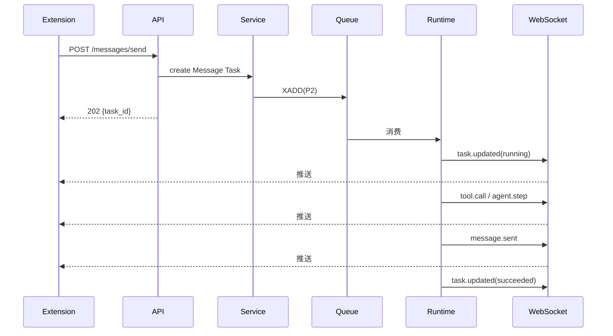

# API 接口设计 V2.0

## 文档信息

| 项 | 值 |
|---|---|
| 文档名称 | API 接口设计（LLD） |
| 版本 | V2.0 |
| 状态 | 设计基准 |
| 关联文档 | 02 系统架构 / 09 数据库 / 11 Chrome Extension / 12 前端UI / 13 同步 / 14 Approval |
| 技术栈 | FastAPI + Pydantic + WebSocket |
| 定位 | REST + WebSocket 全量端点契约，与 V1.2 §9 对齐并补全；前端（doc 12）与扩展（doc 11）据此通信 |

---

## 1. 设计目标

定义 Backend 对外的全部 HTTP 端点与 WebSocket 事件协议：路径、方法、请求/响应 schema、错误码、鉴权、分页、心跳。使前端与扩展可据此实现通信层，Service 层可据此落地路由（doc 02 分层：Route 不写业务逻辑）。

---

## 2. 背景

V1.2 §9 给出端点需求清单；doc 09 给出数据模型。本文补全 schema 与 WS 协议，并对齐 doc 03/04/13/14 的行为契约。所有端点前缀 `/api/v1`；DTO 用 Pydantic；不泄露 ORM Model。

公共约定：

- `Content-Type: application/json`（上传除外）。
- 所有响应含 `trace_id`（注入 execution_logs，doc 15）。
- 时间字段：ISO 8601 带时区。
- 分页：游标分页（`before`/`limit`），避免深翻 OFFSET。

---

## 3. API 总览

### 3.1 REST

| 域 | 方法 | 路径 |
|---|---|---|
| Agent | GET | `/api/v1/agent/status` |
| Agent | POST | `/api/v1/agent/start` |
| Agent | POST | `/api/v1/agent/stop` |
| Task | POST | `/api/v1/tasks` |
| Task | GET | `/api/v1/tasks` |
| Task | GET | `/api/v1/tasks/{id}` |
| Task | POST | `/api/v1/tasks/{id}/cancel` |
| Conversation | GET | `/api/v1/conversations` |
| Conversation | GET | `/api/v1/conversations/{id}` |
| Conversation | GET | `/api/v1/conversations/{id}/messages` |
| Message | POST | `/api/v1/messages/send` |
| Sync | POST | `/api/v1/sync/initial` |
| Sync | POST | `/api/v1/sync/conversations` |
| Sync | POST | `/api/v1/sync/messages` |
| Settings | GET | `/api/v1/settings` |
| Settings | PUT | `/api/v1/settings/llm` |
| Settings | PUT | `/api/v1/settings/job-rule` |
| Settings | PUT | `/api/v1/settings/agent` |
| Settings | PUT | `/api/v1/settings/reply-style` |
| Approval | GET | `/api/v1/approvals/pending` |
| Approval | GET | `/api/v1/approvals/{id}` |
| Approval | POST | `/api/v1/approvals/{id}/approve` |
| Approval | POST | `/api/v1/approvals/{id}/deny` |
| Resume | POST | `/api/v1/resumes`（multipart） |
| Resume | GET | `/api/v1/resumes` |
| Resume | GET | `/api/v1/resumes/{id}` |
| Resume | POST | `/api/v1/resumes/{id}/activate` |
| Resume | DELETE | `/api/v1/resumes/{id}` |

### 3.2 WebSocket

| 路径 | 用途 |
|---|---|
| `/ws/sessions/{session_id}` | 实时事件推送（Agent 步骤/工具/任务/消息/Approval/日志） |

---

## 4. 鉴权与公共约定

### 4.1 鉴权

- V1 单用户：扩展经 `Authorization: Bearer <token>` 携带令牌（首次配对签发，存扩展本地）。
- 多用户（V2+）：JWT（access + refresh）。
- WS 连接：`?token=<token>` query 参数鉴权；失败关闭。

### 4.2 统一响应

```python
class ApiResponse(BaseModel):
    code: int = 0          # 0 成功；非0 业务错误码
    message: str = "ok"
    data: Any | None = None
    trace_id: str
```

### 4.3 错误响应

HTTP 状态码 + 业务 code：

```json
{ "code": 4001, "message": "Boss not logged in", "trace_id": "..." }
```

### 4.4 分页

```python
class Page(BaseModel):
    items: list
    next_cursor: str | None
    limit: int
```

---

## 5. Agent 端点

### GET /api/v1/agent/status

```python
class AgentStatus(BaseModel):
    agent_state: str          # idle|planning|executing|waiting_human|recovering|done
    monitoring_state: str     # idle|monitoring|paused|stopped
    current_task_id: int | None
    active_conversations: int
    max_concurrent_chats: int
```

### POST /api/v1/agent/start

启动 Agent 并开启监听（monitoring -> monitoring 态）。

```python
class StartReq(BaseModel):
    enable_monitor: bool = True
# 200: AgentStatus
```

### POST /api/v1/agent/stop

"关闭程序"--彻底终止：移除 Scheduler jobs，monitoring -> stopped；需用户再次主动 start。

---

## 6. Task 端点

### POST /api/v1/tasks

```python
class TaskCreateReq(BaseModel):
    type: str           # proactive_job|proactive_chat|hr_reply|sync|recovery
    conversation_id: int | None
    job_id: int | None
    priority: str = "P2"
    payload: dict
# 201: { task_id, status: "pending" }
```

- 主动求职：`type=proactive_job, payload={keyword|list_url}`。
- 手动发消息走 `/messages/send`，内部产 Task。

### GET /api/v1/tasks

query：`status`、`conversation_id`、`limit`、`before`。返回 `Page[Task]`。

### GET /api/v1/tasks/{id}

返回 `Task`（含 status、current_node、progress、result、error、retry_count）。

### POST /api/v1/tasks/{id}/cancel

任务 -> `canceled`。

---

## 7. Conversation 端点

### GET /api/v1/conversations

query：`status`、`limit`、`before`。返回会话列表（含 hr_name、job_title、last_message_preview、status）。

### GET /api/v1/conversations/{id}

会话详情。

### GET /api/v1/conversations/{id}/messages

query：`limit=50`、`before`（游标，sent_at）。返回 `Page[Message]`，按 sent_at 升序。

```python
class Message(BaseModel):
    id: int
    conversation_id: int
    role: str           # user|agent|hr|system
    source: str         # manual|agent|history
    content: str
    sent_at: str | None
```

---

## 8. Message 端点

### POST /api/v1/messages/send

用户手动发送（source=manual）。

```python
class SendReq(BaseModel):
    conversation_id: int
    content: str
# 200: { message_id, external_msg_id, sent_at }
```

- 内部产 `proactive_chat` 或 `hr_reply` Task；经 Skill/MCP 发送后落库。
- 校验：conversation 存在且非 closed；内容长度限制。

---

## 9. Sync 端点

### POST /api/v1/sync/initial

首次同步触发（PRD §11 弹窗提醒后用户点击）。

```python
class InitialSyncReq(BaseModel):
    full: bool = True
# 202: { sync_record_id }  异步执行，进度经 WS sync.progress
```

### POST /api/v1/sync/conversations

Conversation Sync（聊天列表同步）。

```python
class ConvSyncReq(BaseModel):
    full: bool = False
# 200: { synced, new, updated }
```

### POST /api/v1/sync/messages

Message Sync（会话消息同步）。

```python
class MsgSyncReq(BaseModel):
    conversation_id: int
    full: bool = False
# 200: { synced, new_messages }
```

> 同步权属用户；DB 为真实数据源；去重靠 external_msg_id（doc 13）。

---

## 10. Settings 端点

### GET /api/v1/settings

返回全部分组配置（llm/job_rule/agent/reply_style）。`llm.api_key` 返回掩码。

### PUT /api/v1/settings/llm

```python
class LlmSettings(BaseModel):
    provider: str
    base_url: str
    api_key: str          # 写入加密存储
    model: str
```

### PUT /api/v1/settings/job-rule

```python
class JobRuleSettings(BaseModel):
    expected_salary: str | None
    location: str | None
    accept_overtime: bool | None
    accept_outsourcing: bool | None
    accept_offsite: bool | None
    accept_probation_salary: bool | None
```

> 未配置项（None）即为 Approval 触发条件（doc 14）。

### PUT /api/v1/settings/agent

```python
class AgentSettings(BaseModel):
    auto_reply: bool
    auto_apply: bool
    max_concurrent_chats: int
    monitor_window: str    # 监听时间窗
    score_threshold: int = 60
```

### PUT /api/v1/settings/reply-style

```python
class ReplyStyleSettings(BaseModel):
    tone: str = "正式"
    style: str = "礼貌、不过度客套、回答直接、突出匹配度、避免空洞套话"
    custom: str | None = None
```

---

## 11. Approval 端点

### GET /api/v1/approvals/pending

返回 `list[Approval]`（status=pending）。

```python
class Approval(BaseModel):
    id: int
    task_id: int
    type: str            # salary|location|start_date|overtime|outsourcing|offsite|probation_salary
    payload: dict        # 敏感上下文
    status: str          # pending
    expires_at: str      # created_at + 20s
```

### GET /api/v1/approvals/{id}

单条详情。

### POST /api/v1/approvals/{id}/approve

```python
class ApproveReq(BaseModel):
    decision_payload: dict | None = None   # 可选补充信息
# 200: { status: "approved" }  -> 触发 Command(resume="approve")
```

### POST /api/v1/approvals/{id}/deny

```python
# 200: { status: "denied" }  -> Command(resume="deny")
```

> 超时由后端定时器自动 `Command(resume="timeout")`，不经端点；端点仅处理用户主动操作（doc 14）。

---

## 12. Resume 端点

### POST /api/v1/resumes

`multipart/form-data`：`file`（pdf/doc/docx）。后端存 MinIO、抽文本、生成摘要 + Embedding（doc 01 §6.9）。

```python
# 201: { resume_id, version, summary_preview }
```

校验：文件类型、大小上限。

### GET /api/v1/resumes

返回简历列表（id、name、version、status、is_default）。

### GET /api/v1/resumes/{id}

详情（含 summary，不含 embedding）。

### POST /api/v1/resumes/{id}/activate

设为 active/default；旧 active -> archived。

### DELETE /api/v1/resumes/{id}

软删除或归档。

---

## 13. WebSocket 协议

### 13.1 连接

- 路径：`/ws/sessions/{session_id}?token=<token>`
- 心跳：客户端每 30s 发 `{"type":"ping"}`，服务端回 `{"type":"pong"}`；60s 无心跳断开。
- 重连：客户端指数退避重连；重连后服务端补推期间缓存的 pending 事件（按 event_id）。

### 13.2 事件消息格式

```json
{
  "type": "agent.step",
  "event_id": "uuid",
  "ts": "iso8601",
  "trace_id": "...",
  "data": { ... }
}
```

### 13.3 事件清单

| type | data | 触发 |
|---|---|---|
| `agent.step` | {task_id, node, state} | 节点执行后 |
| `tool.call` | {task_id, skill, tool, input, ok} | Skill/Tool 调用 |
| `task.updated` | {task_id, status, progress} | 任务状态变更 |
| `message.received` | {conversation_id, message} | Sync 落库 HR 消息 |
| `message.sent` | {conversation_id, message} | Agent/用户发送成功 |
| `approval.required` | {approval_id, task_id, type, expires_at} | create_approval |
| `task.failed` | {task_id, error} | 任务终态 failed |
| `sync.progress` | {sync_record_id, mode, synced} | 同步进度 |
| `monitor.state` | {monitoring_state} | 监听态变化 |
| `log.appended` | {task_id, level, node, msg} | 关键日志（可选订阅） |

### 13.4 客户端订阅

- 连接时可发 `{"type":"subscribe","filters":{"task_id":..}}` 限定事件范围。
- 默认推送该 session 全部事件。

---

## 14. 错误码表

| code | HTTP | 含义 |
|---|---|---|
| 0 | 200 | 成功 |
| 1001 | 400 | 参数校验失败 |
| 1002 | 404 | 资源不存在 |
| 1003 | 409 | 状态冲突（如 closed 会话发送） |
| 1004 | 429 | 超并发（达 max_concurrent_chats） |
| 2001 | 401 | 未鉴权 |
| 2002 | 403 | 无权限 |
| 3001 | 400 | Boss 未登录 |
| 3002 | 400 | DomainGuard 拒绝（如发现即投） |
| 3003 | 400 | Approval 已决（不可重复） |
| 3004 | 400 | MCP 不可用 |
| 4001 | 400 | LLM 调用失败 |
| 5001 | 500 | 内部错误 |
| 5002 | 503 | 依赖不可用（DB/Redis/MinIO） |

---

## 15. 数据流

```
Extension -> REST(动作/查询) -> API -> Service -> Repository -> DB
Extension <-> WS(事件) <- Backend Hub <- Runtime/LangGraph/Sync
```

---

## 16. 时序图（手动发消息 + WS 推送）



---

## 17. 接口（契约边界）

| 契约 | 方向 | 形式 |
|---|---|---|
| Extension -> Backend | REST | `/api/v1/*` + Bearer token |
| Extension <- Backend | WS | `/ws/sessions/{id}` 事件 |
| API -> Service | 进程内 | 依赖注入（doc 02） |
| Service -> Repository | 进程内 | SQLAlchemy async |
| Approval -> Runtime | 内部 | `Command(resume)` 经 Service 触发（doc 14） |

---

## 18. 异常处理

| 异常 | 处理 |
|---|---|
| 参数校验失败 | 422 + code 1001 |
| 资源不存在 | 404 + code 1002 |
| 状态冲突 | 409 + code 1003 |
| 未鉴权 | 401 + code 2001 |
| Boss 未登录 | 400 + code 3001 + WS 通知 |
| DomainGuard 拒绝 | 400 + code 3002 |
| MCP 不可用 | 400 + code 3004 + WS task.failed |
| 依赖不可用 | 503 + code 5002 |
| 未捕获异常 | 500 + code 5001 + trace_id 记日志 |

---

## 19. Retry 与 Recovery

- API 层不自动 Retry 业务失败；返回错误码由前端处理。
- 幂等：`POST /messages/send`、`/sync/*` 支持客户端 `Idempotency-Key` 头防重复。
- WS 断线：客户端重连 + 事件补推（event_id）；服务端缓存近期事件。
- 5xx：前端有限重试（指数退避）；4xx 不重试。

---

## 20. 扩展设计

- **多用户**：JWT + 租户隔离；端点加 `user_id` 上下文。
- **版本化**：`/api/v2` 平滑迁移；旧版本废弃窗口。
- **限流**：按 user/session 限流（Redis 计数），防滥用。
- **GraphQL**：未来复杂查询（如多维度会话筛选）可引入 GraphQL 网关，REST 保留。
- **WS 分片**：事件量大时按 task_id/conversation_id 分通道。
