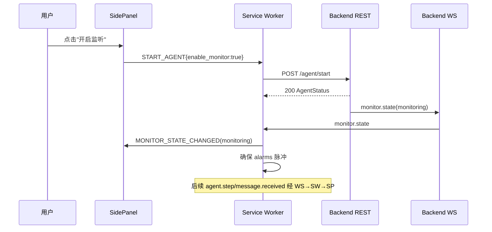
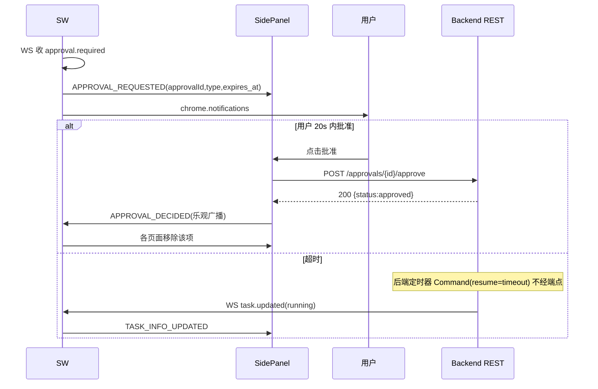
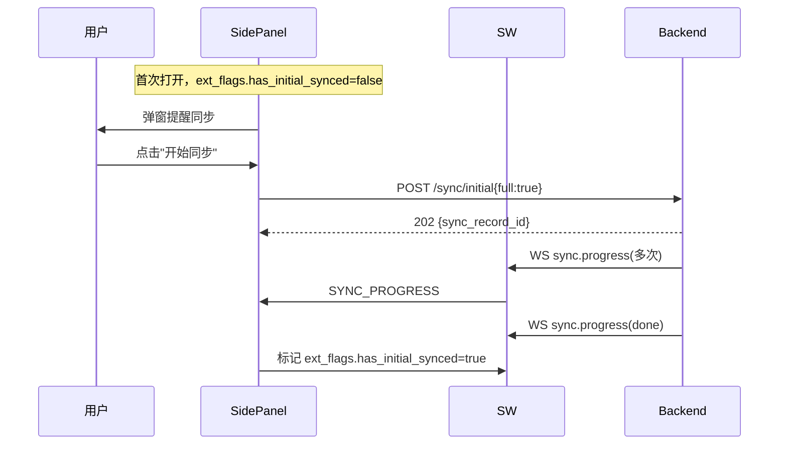
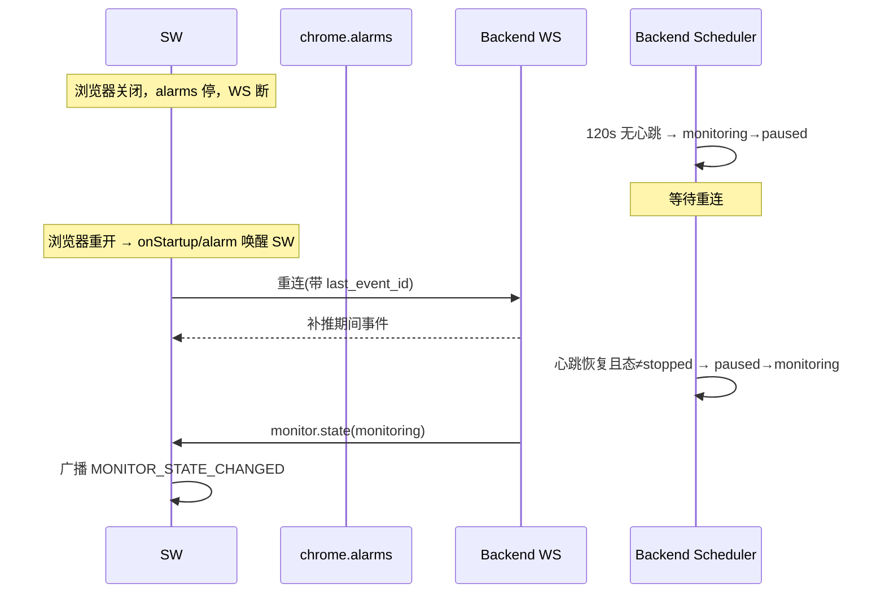

# Chrome Extension 设计 V2.0

## 文档信息

| 项 | 值 |
|---|---|
| 文档名称 | Chrome Extension 设计（LLD） |
| 版本 | V2.0 |
| 状态 | 设计基准 |
| 关联文档 | 02 系统架构 / 04 Agent Runtime / 10 API接口 / 13 同步系统 / 14 Approval系统 / 15 日志与异常恢复 |
| 技术栈 | Chrome Extension MV3 + Vue3 + TypeScript + Vite + Pinia + @crxjs/vite-plugin |
| 定位 | 扩展层（L1）完整设计：Manifest / Service Worker / 三视图 / 消息路由 / 存储 / 通信；与 Phase 1 已落地代码对账并给出迁移路径 |

---

## 1. 设计目标

定义 Chrome Extension 的物理结构、模块职责、内部消息总线、与后端的通信契约、MV3 生命周期下的 WebSocket 保活与监听启停机制。使开发人员可据此把 Phase 1 骨架演进为完整 L1 层，且严格遵守架构红线：**扩展不操作 DOM、不实现浏览器控制、不做业务逻辑**。

---

## 2. 背景

doc 02 把扩展定位为 L1 用户环境层，职责 = 用户交互 / 浏览器生命周期 / WS 保活 / 通知 / 监听启停。doc 04 §7.2 定义监听四态机 `idle/monitoring/paused/stopped` 由后端 Scheduler 维护，依赖扩展侧心跳判据区分"插件关闭（继续）/ 浏览器关闭（paused）/ 主动关闭（stopped）"。doc 10 定义扩展与后端的 REST + WS 全量契约。

**Prompt 架构约束（本文遵守）：**

1. 扩展不写 DOM 解析 / XPath / CSS Selector / 直接 Chrome API 控制浏览器；浏览器操作一律经 L4 MCP（Skill 描述目标，Agent 决定调哪个 MCP 工具）。
2. DB 是真实数据源；扩展不实时读 DOM 作为业务数据。
3. 后台监听由 Extension SW + 后端 Scheduler 驱动，不依赖 Boss 页面常驻。
4. 监听三语义：插件关 → 继续；浏览器关 → 停止；用户主动"关闭程序" → 彻底终止。

**Phase 1 已落地（`feature/phase1-extension` 分支，pnpm build 通过）：**

| 已实现 | 说明 |
|---|---|
| MV3 manifest | permissions: activeTab/scripting/storage/sidePanel/tabs；host: zhipin/lagou/51job；SW 入口 `src/background/index.ts` |
| 构建链 | Vite 5 + @crxjs/vite-plugin + Vue 3.4 + Pinia 2.1 + TS 5.4 |
| Service Worker 骨架 | onInstalled 初始化默认设置；storage.onChanged 广播 SettingsUpdated；onMessage 路由 ApprovalDecided/SettingsUpdated |
| 消息类型 | `RuntimeMessage<T>` 判别联合（AGENT_STATUS_UPDATED/TASK_INFO_UPDATED/APPROVAL_REQUESTED/APPROVAL_DECIDED/SETTINGS_UPDATED/CHAT_CONVERSATIONS_EXTRACTED） |
| 存储 | chrome.storage.local，键 `app_settings`；loadSettings/saveSettings/onSettingsChanged |
| Pinia stores | agent.ts（state/taskId/pendingApprovals）、settings.ts（本地配置 + 显式保存） |
| SidePanel | 2 Tab（运行状态 + 设置）；状态卡 + 待审批列表（批准/拒绝按钮） |
| SettingsPanel | 显式保存；LLM 配置 / 自动化开关 / 并发步进 / 回复风格单选 / 恢复默认 |
| Popup | 最小化状态展示 |
| Content Script | 占位（仅 log，无逻辑） |

**与 V2.0 设计的关键差异（迁移项，详见 §14）：**

1. **Settings 本地化 → 后端化**：Phase 1 settings 仅存 chrome.storage.local；V2.0 settings 为后端实体（doc 10 §10，4 分组 PUT）。扩展须改为后端客户端，本地仅存扩展自身配置（后端 URL / session token / 首次同步标志）。
2. **AgentState 枚举混淆 → 三态分离**：Phase 1 `AgentState`（idle/running/waiting_approval/waiting_hr/completed/failed）混淆了 agent 运行态与任务态；V2.0 须拆为 `agent_state`（doc 02 §10）/ `monitoring_state`（doc 04 §7.2）/ `task.status`（doc 03）三字段。
3. **ApprovalType 缺 offsite**：Phase 1 缺异地（offsite）；V2.0 为 7 类（doc 10 §11）。
4. **WS / alarms / heartbeat 未实现**：核心保活机制待建（本文 §4.2/§7）。
5. **Content Script 占位 + host 过宽**：`<all_urls>` 收窄为 zhipin.com（V1）。

---

## 3. 架构

```mermaid
flowchart TB
    subgraph EXT[Chrome Extension MV3]
        SW[Service Worker<br/>事件枢纽]
        WS[WSClient<br/>唯一 WS 持有者]
        API[ApiClient<br/>共享 REST 客户端]
        POP[Popup 视图]
        SP[SidePanel 视图<br/>状态/Timeline/Chat/Approval/日志]
        SET[Settings 视图<br/>SidePanel Tab]
        CS[Content Script<br/>辅助: 登录态/URL 上下文]
        ST[Storage 层<br/>chrome.storage.local]
        BUS[内部消息总线<br/>RuntimeMessage 判别联合]
    end
    BE[(Backend FastAPI<br/>REST + WS)]

    POP <-->|RuntimeMessage| BUS
    SP <-->|RuntimeMessage| BUS
    SET <-->|RuntimeMessage| BUS
    BUS <-->|chrome.runtime/tabs| SW
    SW <-->|WS 事件| WS
    WS <-->|/ws/sessions/{id}| BE
    POP -->|REST| API
    SP -->|REST| API
    SET -->|REST| API
    SW -->|REST 仅 SW 自用| API
    API <-->|/api/v1/* + Bearer| BE
    SW <-->|读写| ST
    CS <-.->|注入 zhipin.com| PAGE[Boss 页面]
    CS -->|登录态上报| SW
    SW -->|chrome.alarms 脉冲| SW
    SW -->|chrome.notifications| USER[用户通知]
```

**两层通信模型：**

- **外层（扩展 ↔ 后端）**：WSClient（SW 独占，单连接）+ ApiClient（共享 lib，页面与 SW 均可用）。契约见 doc 10。
- **内层（扩展内跨上下文）**：`RuntimeMessage<T>` 判别联合，经 `chrome.runtime.sendMessage` / `chrome.tabs.sendMessage` 传递。SW 为枢纽：WS 事件 → SW → 翻译为内部消息 → 广播各页面；页面动作多为直接 REST（经 ApiClient），仅需 SW 协调的少量动作走内部消息。

**设计取舍：为什么 WS 在 SW、REST 在页面共享？**

- WS 必须单连接且跨页面复用，页面（popup/sidepanel）生命周期短且可并发多个，无法各自持 WS；SW 是唯一长生命周期枢纽。
- REST 为短请求，页面直接调 ApiClient 更健壮（页面在请求期间存活，不受 SW 被回收影响）；token 从 Storage 读，集中管理。
- 避免所有 REST 绕行 SW 带来的"SW 被杀导致请求丢失"风险。

---

## 4. 模块职责

### 4.1 Manifest（MV3）

```jsonc
{
  "manifest_version": 3,
  "name": "AI Job Agent",
  "version": "0.2.0",
  "permissions": [
    "activeTab", "scripting", "storage", "sidePanel", "tabs",
    "alarms",        // 监听脉冲保活（Phase 1 缺）
    "notifications"  // HR 消息 / Approval 通知（Phase 1 缺）
  ],
  "host_permissions": [
    "*://*.zhipin.com/*"      // V1 仅 Boss；lagou/51job 留作多平台扩展，V1 注释
  ],
  "background": { "service_worker": "src/background/index.ts", "type": "module" },
  "action": { "default_popup": "src/popup/index.html" },
  "side_panel": { "default_path": "src/sidepanel/index.html" },
  "content_scripts": [{
    "matches": ["*://*.zhipin.com/*"],   // 收窄（Phase 1 为 <all_urls>）
    "js": ["src/content/index.ts"],
    "run_at": "document_idle"
  }]
}
```

- `alarms`：SW 脉冲保活（§7.1），MV3 下限周期 30s。
- `notifications`：HR 新消息 / Approval 到达 / 任务失败 / Boss 未登录提醒。
- `host_permissions` 仅 zhipin.com：浏览器操作本不经扩展（走 MCP），host 权限仅服务 content script 登录态辅助检测。
- 不设 `web_accessible_resources`（V1 无页面注入 UI 需求）；不设自定义 CSP（沿用 MV3 默认）。

### 4.2 Service Worker（核心）

SW 是 L1 的枢纽，**事件驱动、无状态**（状态全部落 chrome.storage.local，SW 随时可能被 Chrome 回收）。职责：

| 职责 | 机制 |
|---|---|
| 生命周期 | `onInstalled`（初始化扩展配置 + 默认值）/ `onStartup`（浏览器启动恢复 WS）/ `action.onClicked`（打开 SidePanel，失败回退 Popup） |
| WS 持有与保活 | 唯一 WSClient 实例；SidePanel 开时 Port keepalive 维持 SW 存活；SidePanel 关时 chrome.alarms 30s 脉冲唤醒 SW 重连 + 心跳（§7） |
| 心跳 | 每次 alarm 唤醒 / 每 30s 发 WS ping；后端 120s 无心跳且未重连 → paused（doc 04 §7.2） |
| 事件分发 | WS 收事件 → 翻译为 `RuntimeMessage` → `chrome.runtime.sendMessage` + 遍历 tabs `chrome.tabs.sendMessage` 广播 |
| 监听启停 | 收到页面 START_AGENT/STOP_AGENT 内部消息 → 调 ApiClient `POST /agent/start`/`/agent/stop` → 广播 MONITOR_STATE_CHANGED |
| 通知 | approval.required / message.received / task.failed / Boss 未登录 → `chrome.notifications.create` |
| 内部消息路由 | `chrome.runtime.onMessage` 处理页面→SW 的协调类消息（§9.1） |
| 配置变更广播 | 扩展自身配置（非业务 settings）storage.onChanged → 广播 |

**WSClient（SW 内）：**

- 连接：`wss://<backend>/ws/sessions/{session_id}?token=<token>`。
- 心跳：每 30s 发 `{"type":"ping"}`，收 `{"type":"pong"}`；60s 无 pong 视为断线。
- 重连：指数退避（1s/2s/4s/8s/15s 封顶），重连带 `?last_event_id=<id>` 让后端补推期间缓存事件（doc 10 §13.1）。
- 状态机：`disconnected → connecting → connected → reconnecting`，状态变化广播给页面（供 UI 显示连接指示）。
- SW 被回收时 WS 自然断开；alarm 唤醒后由 `onStartup`/alarm 处理器重建 WSClient。

**ApiClient（共享 lib，`src/lib/api.ts`）：**

- `fetch` 封装；baseURL + token 从 Storage 读；注入 `Authorization: Bearer <token>`。
- 统一解析 `ApiResponse{code,message,data,trace_id}`；非 0 code 抛 `ApiError(code, message, trace_id)`。
- 幂等：`POST /messages/send`、`/sync/*` 支持客户端 `Idempotency-Key` 头（doc 10 §19）。
- 5xx 指数退避有限重试；4xx 不重试；超时 30s。
- 页面与 SW 均导入使用。

### 4.3 Popup（快速控制）

- 紧凑状态条：`agent_state` + `monitoring_state` + 连接指示 + 当前任务一句话。
- 快捷按钮：开启/关闭监听、打开 SidePanel、（有 pending Approval 时）高亮入口。
- 只读为主；复杂操作引导至 SidePanel。
- Phase 1 仅状态展示，V2.0 补快捷动作。

### 4.4 SidePanel（核心控制台）

主面板，Tab 布局：

| Tab | 内容 | 数据来源 |
|---|---|---|
| 运行状态 | agent_state 卡 / monitoring_state 卡 / 当前任务 / 连接指示 | WS 事件 + GET /agent/status |
| Timeline | 节点步骤流（agent.step / tool.call 按时序） | WS 事件 |
| Chat | 会话列表 + 消息流（按 conversation）；可手发消息（POST /messages/send） | GET /conversations + WS message.received/sent |
| Approval | 待审批列表（type/payload/expires_at 倒计时）+ 批准/拒绝 | WS approval.required + GET /approvals/pending |
| 日志 | 关键日志流（log.appended，可按 task 过滤） | WS log.appended |
| 设置 | 内嵌 SettingsPanel | GET/PUT /settings/* |

- 监听控制条（顶部常驻）：开启监听 / 关闭程序 按钮 + monitoring_state 标识。
- 打开时通过 `chrome.runtime.connect` 建立长连接 Port，使 SW 保持存活、WS 连续（§7.1）。

### 4.5 Settings 视图（SidePanel Tab）

业务 settings 为**后端实体**（doc 10 §10），扩展为其客户端：

| 分组 | 字段 | 后端端点 |
|---|---|---|
| LLM | provider / base_url / api_key / model | PUT /settings/llm（api_key 写入后端加密存储，前端掩码回显） |
| 求职规则 | expected_salary / location / accept_overtime / accept_outsourcing / accept_offsite / accept_probation_salary | PUT /settings/job-rule（None 字段即 Approval 触发条件，doc 14） |
| Agent 策略 | auto_reply / auto_apply / max_concurrent_chats / monitor_window / score_threshold | PUT /settings/agent |
| 回复风格 | tone / style / custom | PUT /settings/reply-style |

- 显式保存（沿用 Phase 1 交互）：dirty 指示 / 保存中 / 已保存 toast。
- 保存 = 分组 PUT 后端；成功后广播 SETTINGS_UPDATED（内部消息）通知其它打开的页面 refetch。
- **Phase 1 的本地 settings 字段（llmProvider/apiKey/autoReply/autoApply/concurrency/replyStyle）迁移为后端 4 分组**（§14）。
- 扩展自身配置（后端 baseURL / session token / has_initial_synced）独立存 Storage，不出现在此视图的 business settings 中（后端 baseURL 可放在"高级"区）。

### 4.6 Content Script（辅助，非数据源）

- **职责收窄**：仅做 UX 辅助——检测 Boss 登录态、上报当前 zhipin.com URL 上下文给 SW。
- **禁止**：DOM 数据抽取（聊天/岗位数据一律经 Sync + MCP，doc 13）、页面自动点击、注入业务 UI。
- 登录态上报：SW 据此在 Popup/SidePanel 显示"Boss 已登录/未登录"提示；**权威登录检测仍由后端经 MCP 完成**（doc 04 §7.3），content script 仅为前端即时提示。
- matches 收窄为 `*://*.zhipin.com/*`（Phase 1 为 `<all_urls>`）。

### 4.7 Storage 层

`chrome.storage.local`，仅存**扩展自身状态**（业务数据在后端 DB）：

| 键 | 内容 | 说明 |
|---|---|---|
| `ext_config` | { backend_base_url, session_token, session_id } | 后端连接与鉴权；token 首次配对签发（doc 10 §4.1） |
| `ext_runtime` | { ws_state, last_event_id, monitoring_state_cache, agent_state_cache } | SW 被回收后恢复 WS / 事件补推 / UI 兜底显示 |
| `ext_flags` | { has_initial_synced, onboarding_done } | 首次同步弹窗控制（Prompt §10） |
| `app_settings` | （Phase 1 遗留） | 迁移至后端后，此键降级为本地缓存或废弃（§14） |

- API：`loadConfig/saveConfig/loadRuntime/saveRuntime/loadFlags`，类型安全（`STORAGE_KEYS` 常量 + TS 接口）。
- 加 schema 版本字段 `_v`，便于后续迁移（Phase 1 无版本，V2.0 补）。

### 4.8 通信层

见 §3 两层模型与 §4.2 WSClient/ApiClient。内部消息总线定义见 §9.1。

---

## 5. 数据流

### 5.1 主动动作（用户 → 后端）

```
用户在 SidePanel 点击"开启监听"
→ SidePanel 发内部消息 START_AGENT{enable_monitor:true} 给 SW
→ SW 调 ApiClient POST /agent/start
→ 后端 monitoring 态 → WS 推 monitor.state{monitoring_state:monitoring}
→ SW 翻译为 MONITOR_STATE_CHANGED 广播 → 各页面更新
→ SW 启动/确认 alarms 脉冲保活
```

> 多数读查询（GET status/conversations/messages/approvals/settings）页面直接经 ApiClient，不经 SW。

### 5.2 被动事件（后端 → 用户）

```
后端 Runtime 产生事件（agent.step / message.received / approval.required ...）
→ WS 推送 → SW WSClient 接收
→ SW 翻译为对应 RuntimeMessage
→ chrome.runtime.sendMessage + 遍历 tabs.sendMessage 广播
→ 各打开的页面（Popup/SidePanel）更新 Pinia store → UI
→ 若为 approval.required / message.received / task.failed → chrome.notifications 通知用户
```

### 5.3 监听保活心跳（脉冲）

```
SidePanel 关闭 → SW 失去 Port keepalive → ~30s 后 Chrome 回收 SW → WS 断
→ chrome.alarms 每 30s 触发（浏览器开则触发）
→ alarm 唤醒 SW → 重建 WSClient（带 last_event_id 补推）→ 发 ping 心跳
→ 后端收到心跳 → 维持 monitoring（"插件关闭继续"语义）
→ 浏览器关闭 → alarms 不再触发 → 120s 无心跳 → 后端 monitoring→paused（"浏览器关闭停止"语义）
```

---

## 6. 状态流

### 6.1 扩展展示的三态（分离，修正 Phase 1 混淆）

| 字段 | 取值 | 来源 |
|---|---|---|
| `agent_state` | idle / planning / executing / waiting_human / recovering / done | WS agent.step + GET /agent/status（doc 02 §10） |
| `monitoring_state` | idle / monitoring / paused / stopped | WS monitor.state + GET /agent/status（doc 04 §7.2） |
| `task.status` | pending / running / waiting_approval / recovering / succeeded / failed / canceled | WS task.updated + GET /tasks/{id}（doc 03） |

Pinia `agent` store 须持有三个独立字段，而非 Phase 1 的单一 `AgentState`。

### 6.2 SW 连接状态机

`disconnected → connecting → connected → (断线) → reconnecting → connected`。状态持久化至 `ext_runtime.ws_state`，SW 重启后恢复；UI 显示连接指示（绿/黄/灰）。

### 6.3 监听四态在扩展侧的反映

| 后端 monitoring_state | 扩展 UI | 扩展动作 |
|---|---|---|
| idle | 灰"未开启" | 显示"开启监听"按钮 |
| monitoring | 绿"监听中" | 显示"关闭程序"按钮；alarms 脉冲保活 |
| paused | 黄"已暂停（浏览器未连接）" | 显示"恢复"提示；等待重连自动恢复 |
| stopped | 红"已停止" | 显示"重新启动"按钮（需用户主动） |

---

## 7. 生命周期

### 7.1 Service Worker 生命周期（MV3 核心）

MV3 SW 空闲约 30s 被 Chrome 回收。保活策略分层：

| 场景 | 机制 | WS 状态 |
|---|---|---|
| SidePanel 开 | `chrome.runtime.connect` 建 Port，SW 保持存活 | 连续连接，30s ping |
| SidePanel 关，浏览器开 | chrome.alarms 30s 脉冲唤醒 SW 重连 + 心跳 | 脉冲式连接（每 30s 唤醒一次，事件有 ≤30s 延迟，后端按 event_id 补推） |
| 浏览器关 | alarms 不触发，SW 不存在 | 断开 >120s → 后端 paused |

- `onInstalled`：写默认 ext_config/ext_flags，打开 onboarding。
- `onStartup`：浏览器启动 → 恢复 WS（若 monitoring_state ≠ stopped）。
- alarm 处理器：`ensureWsConnected()` + `sendHeartbeat()` + 处理待发消息。
- **取舍**：脉冲模式下事件延迟 ≤30s，对求职场景可接受；SidePanel 开时近实时。未来可用 `chrome.offscreen` 持有 WS 进一步平滑（§12）。

### 7.2 WebSocket 生命周期

```
connect(session_id, token, last_event_id)
→ onopen: 发 subscribe + 起心跳定时器(30s)
→ onmessage: 分发事件 → 翻译广播；更新 last_event_id
→ onclose/onerror: 进 reconnecting → 指数退避重连(带 last_event_id)
→ dispose: 关闭、清理定时器
```

- `last_event_id` 持久化至 `ext_runtime`，SW 重启后重连补推。
- 后端侧缓存近期事件供补推（doc 10 §13.1）。

### 7.3 页面生命周期

- Popup：点图标开、失焦关；开时订阅 SW 广播。
- SidePanel：开时建 Port（保活 SW）+ 订阅广播 + 拉取初始数据（status/conversations/approvals）；关时断 Port（SW 转脉冲模式）。
- 跨页一致性：页面激活（visibilitychange/onfocus）时 refetch 关键状态，避免错过脉冲间事件。

---

## 8. 时序图

### 8.1 开启监听 + WS 事件推送



### 8.2 Approval 交互（20s 超时）



### 8.3 首次同步（Prompt §10）



### 8.4 浏览器关闭 → paused → 重连恢复



---

## 9. 接口

### 9.1 内部消息总线（`RuntimeMessage<T>` 判别联合）

扩展内跨上下文 IPC，`type` 判别。SW → 页面（广播）；页面 → SW（协调类）。

**SW → 页面（事件广播）：**

| type | payload | 对应后端 WS 事件 |
|---|---|---|
| `AGENT_STATUS_UPDATED` | {agent_state, task_id?, node?, detail?} | agent.step |
| `TASK_INFO_UPDATED` | {task_id, status, progress, current_node?, error?} | task.updated / task.failed |
| `APPROVAL_REQUESTED` | {approval_id, task_id, type, payload, expires_at} | approval.required |
| `MESSAGE_RECEIVED` | {conversation_id, message} | message.received |
| `MESSAGE_SENT` | {conversation_id, message} | message.sent |
| `MONITOR_STATE_CHANGED` | {monitoring_state} | monitor.state |
| `SYNC_PROGRESS` | {sync_record_id, mode, synced} | sync.progress |
| `TOOL_CALLED` | {task_id, skill, tool, input, ok} | tool.call |
| `LOG_APPENDED` | {task_id, level, node, msg} | log.appended |
| `WS_STATE_CHANGED` | {ws_state} | SW 连接状态机变化 |

**页面 → SW（协调类，其余动作直接 REST）：**

| type | payload | SW 行为 |
|---|---|---|
| `START_AGENT` | {enable_monitor} | POST /agent/start + 广播 |
| `STOP_AGENT` | {} | POST /agent/stop + 广播 |
| `APPROVAL_DECIDED` | {approval_id, decision} | 乐观广播给其它页面（权威动作由页面直接 POST /approvals/{id}/approve\|deny） |
| `SETTINGS_UPDATED` | {group} | 广播通知其它页面 refetch |
| `REQUEST_WS_RECONNECT` | {} | SW 立即重连 WS |
| `REQUEST_AGENT_STATUS` | {} | SW 返回缓存态（或触发 GET /agent/status） |

> Phase 1 的 `CHAT_CONVERSATIONS_EXTRACTED`（content script 抽取）**废弃**——聊天数据经 Sync + MCP，不经 content script（架构红线）。

### 9.2 对后端契约

完全引用 doc 10：REST `/api/v1/*` + Bearer token；WS `/ws/sessions/{session_id}?token=`；事件集与心跳见 doc 10 §13。本文不重定义。

### 9.3 Storage schema

见 §4.7。键：`ext_config` / `ext_runtime` / `ext_flags`（+ Phase 1 遗留 `app_settings` 待迁移）。每个值含 `_v` 版本字段。

---

## 10. 异常处理

| 异常 | 处理 |
|---|---|
| SW 被回收 | 状态已落 Storage；alarm/onStartup 唤醒后重建 WSClient，带 last_event_id 补推 |
| WS 断线 | 指数退避重连；UI 显示 reconnecting；事件不丢（后端缓存 + event_id 补推） |
| WS 重连失败超阈值 | 标记 ws_state=disconnected；UI 提示"无法连接后端"；保留 alarm 继续尝试 |
| 后端 5xx | ApiClient 指数退避有限重试；UI 显示重试中 |
| 后端 4xx | 不重试；按 code 提示（3001 Boss 未登录 → 通知用户；3002 DomainGuard 拒绝 → 提示） |
| 后端不可达（503/5002） | UI 降级"服务不可用"；扩展自身不崩 |
| Boss 未登录 | 后端经 WS 通知（doc 04 §7.3）→ SW chrome.notifications；不无限重试 |
| Approval 超时与用户响应竞争 | 由后端状态机+乐观锁保证只生效一次（doc 14）；扩展侧 Approval 一旦本地标记 resolved 即忽略后续点击 |
| chrome.storage 写失败 | 重试 1 次；失败记日志 + UI 提示"配置未保存" |
| 消息广播无接收页 | 正常（无页面打开时 SW 仅更新自身缓存 + 通知） |

所有异常结构化记日志（time/action/trace_id/error），扩展侧日志可经 `log.appended` 上送后端（doc 15）。

---

## 11. Retry 与 Recovery

- **WS 重连**：指数退避 1/2/4/8/15s 封顶，无限重试直至连接或用户停止；每次带 last_event_id。
- **REST 5xx**：最多 3 次指数退避；4xx 不重试。
- **SW 崩溃 Recovery**：状态在 Storage，唤醒即恢复；WS 重连续传 event_id；任务态以后端 DB 为准（不本地恢复业务态）。
- **事件去重**：按 `event_id` 去重（后端补推可能重复）。
- **脉冲间事件延迟**：≤30s；SidePanel 开时近实时；不可接受时未来用 offscreen 持有 WS（§12）。
- **不无限重试业务失败**：Boss 未登录 / DomainGuard 拒绝 / Approval 已决 等，通知用户即止。

---

## 12. 扩展设计

- **多平台**：host_permissions 增 lagou/51job；content script matches 扩展；浏览器操作层（MCP/Skill）新增平台 Skill，扩展 UI 基本不动。
- **offscreen 持续 WS**：用 `chrome.offscreen` 创建离屏文档持有 WS，消除脉冲模式 30s 延迟与 SW 回收导致的断连；V2+ 优化项。
- **多用户**：ext_config 存多账户 token；Session 切换；后端加 JWT 租户隔离（doc 10 §20）。
- **移动/其它浏览器**：MV3 为桌面 Chrome 限定；移动端需另设计。
- **扩展自动更新**：version 升级时 onInstalled reason=update 触发 storage 迁移（按 `_v`）。

---

## 13. 边界与约束（扩展层红线）

1. 扩展不操作 DOM / 不写 XPath/CSS Selector / 不直接控制浏览器；浏览器操作经 L4 MCP。
2. 扩展不作为业务数据源；DB 为真实数据源（doc 02 §9.3）。
3. 业务 settings 在后端；扩展本地仅存自身配置。
4. WS 仅 SW 持有；REST 经共享 ApiClient。
5. content script 仅辅助（登录态/URL），不做数据抽取。
6. 监听启停三语义严格按 doc 04 §7.2；"关闭程序"= stopped 需用户主动恢复。
7. 密钥（api_key/token）不进日志明文；token 存 chrome.storage.local（非业务库）。

---

## 14. 与 Phase 1 代码的对账与迁移路径

| Phase 1 现状 | V2.0 目标 | 迁移动作 |
|---|---|---|
| settings 本地化（`app_settings`） | 后端 4 分组 settings | 新建 ApiClient；SettingsPanel 改为 GET/PUT /settings/*；`app_settings` 键降级为缓存或废弃 |
| `AgentState` 单枚举混淆 | agent_state / monitoring_state / task.status 三字段 | 拆分 Pinia agent store；消息 payload 按三态 |
| ApprovalType 缺 offsite | 7 类 | 补 offsite |
| WS/alarms/heartbeat 未实现 | SW WSClient + alarms 脉冲 + 30s ping | 实现 WSClient；manifest 加 alarms/notifications；alarm 处理器 |
| 内部消息不完整 | §9.1 完整 RuntimeMessage 集 | 扩展 messages.ts；废弃 CHAT_CONVERSATIONS_EXTRACTED |
| content script `<all_urls>` 占位 | zhipin.com 登录态辅助 | 收窄 matches；实现登录态上报 |
| Popup 最小化 | 快捷控制 | 补开启/关闭监听 + 入口 |
| Storage 无版本/混用 | ext_config/ext_runtime/ext_flags + `_v` | 重构 storage.ts；迁移 app_settings |
| 无后端 URL/token 配置 | ext_config + 首次配对 | onboarding 流程 + 高级配置区 |

> 迁移属 Phase 2（Backend API 接入）范畴；本文为目标态设计基准。实现时须先按 doc 09 §9 完成 9→14 表迁移、按 doc 10 落地后端端点，扩展侧再据此对接。

---

## 15. 设计要点与风险

**【核心逻辑】**
- SW 作为唯一 WS 持有者与事件枢纽，解决"多页面共享单 WS"与"WS 跨页面生命周期"问题。
- MV3 SW 30s 回收难题用三层解：SidePanel Port 保活（开）/ alarms 脉冲（关）/ 后端 120s 心跳超时（浏览器关）。脉冲模式接受 ≤30s 事件延迟换取"插件关闭继续"语义的正确实现。
- 两层通信：WS 集中（SW）、REST 分布（ApiClient 共享），兼顾健壮性与简洁性。

**【关键技术点】**
- **MV3 SW 生命周期**：事件驱动、无状态、空闲回收；State 必须落 chrome.storage，靠 alarms/onStartup 唤醒重建。这是与 MV2 persistent background page 的根本差异。
- **chrome.alarms 脉冲**：MV3 下限周期 30s；浏览器开则触发、关则停——正是区分"插件关闭"与"浏览器关闭"的判据。
- **event_id 补推**：SW 被回收期间事件由后端缓存，重连带 last_event_id 补推，实现"不丢事件"。
- **Port keepalive**：SidePanel 经 `chrome.runtime.connect` 使 SW 存活，开启时近实时。
- **判别联合 RuntimeMessage**：`type` 判别 + 泛型 payload，类型安全且可扩展。

**【潜在风险】**
- **脉冲模式延迟**：≤30s 事件延迟对 Approval（20s 超时）有风险——若 SidePanel 关闭时收到 approval.required，用户可能因脉冲延迟错过 20s 窗口。**缓解**：approval.required 触发 `chrome.notifications`（用户可点通知打开 SidePanel 切换为实时）；后端 20s 超时本身有兜底话术（doc 14）。
- **alarms 周期下限**：若未来 Chrome 提高 alarms 最小周期，脉冲间隔变大、心跳可能超 120s。**缓解**：后端 T_heartbeat 可配置；必要时切 offscreen 持续 WS。
- **多页面并发 REST**：多页面同时调 ApiClient 可能产生重复请求。**缓解**：幂等键（doc 10 §19）+ 关键动作经 SW 协调。
- **SW 重启竞态**：alarm 唤醒重建 WSClient 期间事件可能短暂丢失窗口。**缓解**：event_id 补推 + 后端缓存。
- **token 安全**：session token 存 chrome.storage.local（明文区），受 Chrome 进程隔离保护；不进日志、不进业务库。多用户场景需升级 JWT + refresh（doc 10 §20）。
