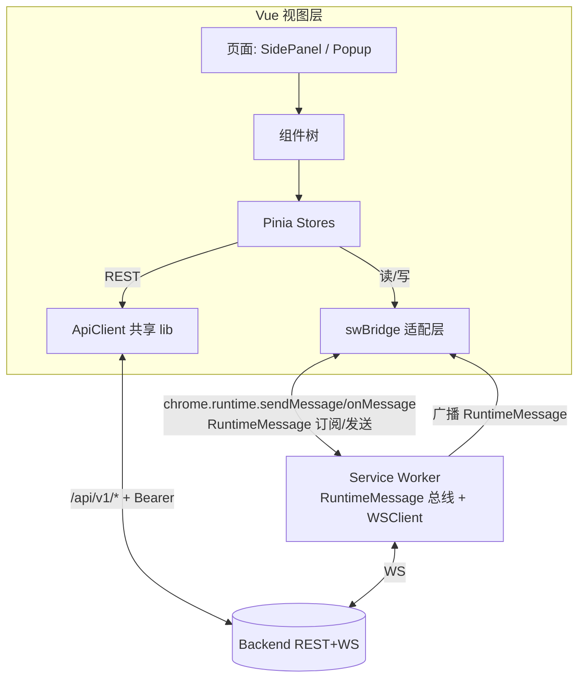
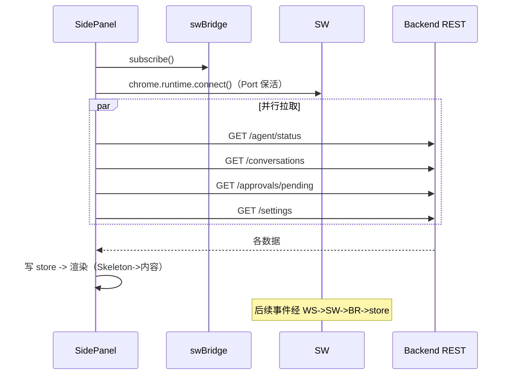
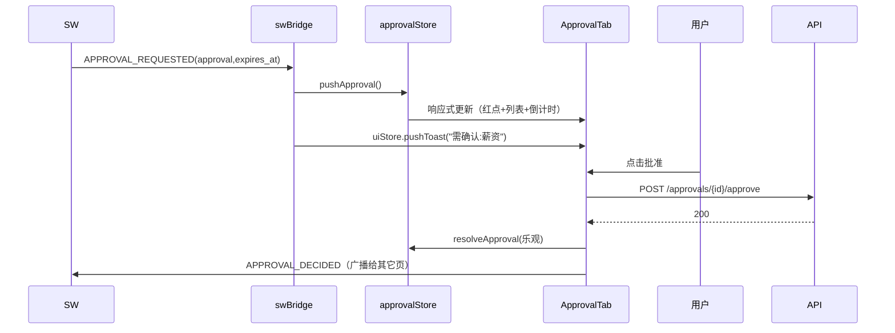
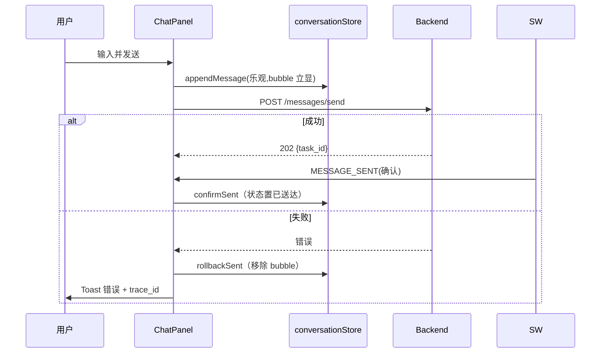
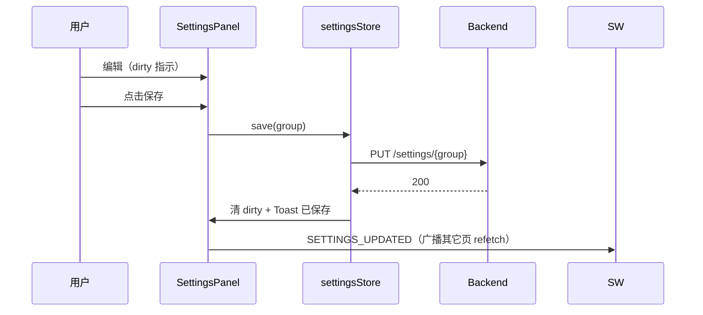

# 前端 UI 设计 V2.0

## 文档信息

| 项 | 值 |
|---|---|
| 文档名称 | 前端 UI 设计（LLD） |
| 版本 | V2.0 |
| 状态 | 设计基准 |
| 关联文档 | 02 系统架构 / 10 API接口 / 11 Chrome Extension / 13 同步系统 / 14 Approval系统 |
| 技术栈 | Vue3 + TypeScript + Vite + Pinia + @crxjs/vite-plugin |
| 定位 | 扩展 Vue 视图层完整设计：UI 规范 / 页面布局 / 组件树 / Pinia store / 数据流 / 状态反馈；承接并 supersede V1.0 视觉文档；与 doc 11（扩展架构/通信/消息总线）互补，不重定义 |

---

## 1. 设计目标

定义 Chrome Extension Vue 前端的视觉规范、页面布局、组件树、状态管理、数据流与状态反馈机制。使开发人员可据此把 Phase 1 视图骨架（2 Tab SidePanel + 本地 settings）演进为完整 AI 工作台 UI，且严守边界：**视图层不持 WebSocket、不操作 DOM 业务数据、不做业务逻辑**。

---

## 2. 背景

doc 11 定义扩展物理结构、SW 通信契约（WSClient/ApiClient）、内部消息总线（`RuntimeMessage`）、MV3 生命周期、三态分离（agent_state/monitoring_state/task.status）。本文聚焦这些之上的 **Vue 视图层**。

**Prompt §19 约束：** Vue3 + TS + Vite + Pinia；设计页面布局 / 组件 / 状态管理 / API 通信 / WebSocket / UI 规范。

**承接 V1.0 视觉文档（本文 supersede）：**

| V1.0 规范 | 承接 | 修正 |
|---|---|---|
| Dark Mode 主题、配色（主色 #6366F1 等）、字体（Inter/PingFang） | 采纳，formalize 为设计 token | -- |
| SidePanel 长堆叠布局（Header/状态/任务/聊天/Approval/Timeline/输入） | -- | 改为 **Tab 布局**（400px 窄面板高信息密度，Tab 切换优于长滚动；Phase 1/doc 11 已定） |
| Settings 独立 900px 页 | -- | 改为 **SidePanel Tab**（Phase 1/doc 11 已定）；独立 options 页留作扩展 |
| 状态枚举 Idle/Running/Monitoring/Waiting Approval/Error（混淆） | -- | 拆为 **三态分离**（agent_state/monitoring_state/task.status，doc 11 §6.1） |
| Approval 6 类 | -- | 补 **offsite** 成 7 类（doc 10 §11） |
| 组件名 AgentStatus/TaskCard/ChatPanel/ApprovalModal/Timeline/SettingsForm/StatusBadge | 采纳并扩展 | 补全组件树 |
| 设计原则：用户永远知道 Agent 在做什么 / 可接管 / 可确认 / 失败可解释 / 信息优先于装饰 | 采纳为 UI 设计总纲 | -- |
| Loading 禁普通转圈、用 Agent 状态文案 | 采纳 | 补骨架屏规范 |

**Phase 1 已落地：** SidePanel 2 Tab（运行状态 + 设置）、SettingsPanel 显式保存、Popup 最小化、Pinia agent/settings store（本地）。迁移见 §18。

---

## 3. 架构

Vue 视图层位于 doc 11 扩展架构之上，分四子层：



**四子层职责：**

| 子层 | 职责 | 边界 |
|---|---|---|
| 页面 | 页面壳（Header/TabNav/路由）、入口组合组件 | 不写业务逻辑 |
| 组件 | 单一职责 UI 单元，props/emits 通信 | 不直接调后端（经 store） |
| Pinia Stores | 应用状态（三态/会话/审批/设置/同步/UI），动作封装 | 不持 WS（经 swBridge） |
| swBridge + ApiClient | 与 SW/后端通信适配 | doc 11 定义；视图层只消费 |

**设计取舍：为什么视图层经 swBridge 而非直接 WS？** WS 单连接由 SW 独占（doc 11 §3），页面生命周期短且可多开，无法各自持 WS；swBridge 封装 `chrome.runtime.onMessage` 订阅 SW 广播的 `RuntimeMessage`，使组件无感知通信细节、只读写 store。REST 经共享 ApiClient 直接调（短请求，页面存活期内完成）。

---

## 4. UI 规范

### 4.1 设计 token（CSS 变量）

```css
:root {
  /* 主题：Dark（V1 默认，Light 预留） */
  --color-bg: #111827;
  --color-surface: #1F2937;       /* 卡片 */
  --color-border: #374151;
  --color-text-primary: #E5E7EB;
  --color-text-secondary: #9CA3AF;

  /* 语义色 */
  --color-primary: #6366F1;       /* 主按钮/当前任务/Agent 态 */
  --color-primary-hover: #818CF8;
  --color-success: #22C55E;       /* succeeded/monitoring */
  --color-running: #3B82F6;       /* planning/executing/running */
  --color-waiting: #F59E0B;       /* waiting_human/waiting_approval/paused/reconnecting */
  --color-error: #EF4444;         /* failed/disconnected/stopped */

  /* 字体 */
  --font-sans: "Inter", "PingFang SC", "Microsoft YaHei", sans-serif;
  --fs-title: 16px;
  --fs-body: 14px;
  --fs-aux: 12px;

  /* 间距/圆角 */
  --space-1: 4px; --space-2: 8px; --space-3: 12px; --space-4: 16px; --space-6: 24px;
  --radius-sm: 6px; --radius-md: 8px; --radius-lg: 12px;
}
```

### 4.2 交互与反馈规范

| 场景 | 规范 |
|---|---|
| Loading | **禁普通转圈**；用 Agent 状态文案（"正在分析岗位..."）+ 骨架屏（Skeleton）占位 |
| 动作反馈 | Toast（右上角，2-3s 自动消失）；成功绿/错误红/信息主色 |
| 状态变化 | 微动效（淡入/高度过渡）；禁大量动画、禁影响阅读的效果 |
| 空状态 | EmptyState 组件（图标 + 一句话 + 引导动作） |
| 错误状态 | ErrorState 组件（错误说明 + trace_id + 重试按钮） |
| 危险动作 | 二次确认（如"关闭程序"、"删除简历"） |
| 表单 | 显式保存（dirty 指示 / 保存中 / 已保存 toast）；校验即时提示 |
| Approval | 倒计时进度条（20s，doc 14）；超时置灰"已超时" |
| 连接指示 | Header 常驻 ConnectIndicator（绿 connected/黄 reconnecting/灰 disconnected） |

### 4.3 状态色映射（三态）

| 状态字段 | 值 | 色 |
|---|---|---|
| agent_state | idle | text-secondary |
| | planning / executing | running |
| | waiting_human | waiting |
| | recovering | waiting（脉冲） |
| | done | success |
| monitoring_state | idle | text-secondary |
| | monitoring | success |
| | paused | waiting |
| | stopped | error |
| task.status | running | running |
| | waiting_approval | waiting |
| | recovering | waiting |
| | succeeded | success |
| | failed | error |
| | canceled | text-secondary |
| ws_state | connected | success |
| | reconnecting | waiting |
| | disconnected | error |

---

## 5. 页面布局

### 5.1 SidePanel（主控制台）

宽 400px，高跟随浏览器窗口。Tab 布局：

```
┌──────────────────────────────────────┐
│ Header (56px)                        │
│ [Logo] AI求职Agent   [ConnectInd] [⚙] │
│ [开启监听/关闭程序]  [monitoring_state]│
├──────────────────────────────────────┤
│ TabNav: 状态|Timeline|聊天|审批|日志|设置│
├──────────────────────────────────────┤
│                                      │
│          Tab 内容区（滚动）            │
│                                      │
└──────────────────────────────────────┘
```

| Tab | 组件 | 主要数据 |
|---|---|---|
| 状态 | AgentStatusCard + TaskCard + 监听控制 | agent_state / monitoring_state / current_task |
| Timeline | Timeline | timeline_events（agent.step / tool.call 时序） |
| 聊天 | ConversationList + ChatPanel + MessageInput | conversations / messages |
| 审批 | ApprovalList（+ApprovalModal） | pending approvals |
| 日志 | EventLog | log.appended 流（可按 task 过滤） |
| 设置 | SettingsPanel | settings 4 分组 |

> 打开时 `chrome.runtime.connect` 建 Port 保活 SW（doc 11 §7.1）；关闭即断 Port。

### 5.2 Popup（快速控制）

约 360×480px（窄于 V1.0 的 400×600 以适配弹窗）。只读 + 快捷动作：

```
┌────────────────────┐
│ AI求职Agent  [●状态]│
│ agent_state / 监听态 │
├────────────────────┤
│ [开启监听]/[关闭程序] │
│ [打开 SidePanel ▸]  │
│ 待审批: 2  [去处理 ▸]│
└────────────────────┘
```

### 5.3 Settings 视图（SidePanel Tab）

V1.0 的 900px 独立页改为 SidePanel Tab（窄面板内分组表单 + 显式保存）；高级配置（后端 URL/配对）放"高级"折叠区。独立 options 页留作扩展（§16）。

---

## 6. 组件树与职责

```
sidepanel/
├── AppShell.vue              # Header + TabNav + <router-view>/动态 Tab
├── Header.vue                # 标题 + ConnectIndicator + 监听控制 + 设置入口
└── tabs/
    ├── StatusTab.vue
    ├── TimelineTab.vue
    ├── ChatTab.vue
    ├── ApprovalTab.vue
    ├── LogTab.vue
    └── SettingsTab.vue
popup/
└── App.vue
common/                        # 跨页复用
├── StatusBadge.vue            # 三态徽章（按 §4.3 映射色）
├── ConnectIndicator.vue       # WS 连接指示
├── AgentStatusCard.vue        # agent_state + 当前步骤 + 进度
├── TaskCard.vue               # 当前任务（岗位/公司/HR/节点 + 暂停/停止）
├── Timeline.vue               # 事件时序流
├── ConversationList.vue       # 会话列表（hr_name/job_title/preview/未读）
├── ChatPanel.vue              # 消息流容器
├── MessageBubble.vue          # 单条消息（HR 左/Agent 右，Agent 标 "AI Generated"）
├── MessageInput.vue           # 输入 + 发送（Enter 发送/Shift+Enter 换行）
├── ApprovalCard.vue           # 单条审批（type/payload/倒计时）
├── ApprovalModal.vue          # 审批详情弹窗（问题/Agent建议/修改/确认发送）
├── EventLog.vue               # 日志流
├── SettingsPanel.vue          # 设置（4 分区表单 + 显式保存）
├── CountdownBar.vue           # 倒计时进度条
├── Skeleton.vue               # 骨架屏
├── EmptyState.vue             # 空状态
├── ErrorState.vue             # 错误状态（含 trace_id + 重试）
└── Toast.vue                  # 全局通知（teleport）
```

**组件通信约定：**

- **props 向下 / emits 向上**；跨层用 `provide/inject` 仅限主题 token 与 Tab 上下文。
- 组件**不直接调 ApiClient/SW**；一律经 store action（单一数据通道，便于测试与回滚）。
- 纯展示组件（StatusBadge/MessageBubble/Skeleton）无 store 依赖，props 驱动。

**关键组件契约示例：**

```ts
// ApprovalCard.vue
props: { approval: Approval; now: number }       // now 用于倒计时
emits: { approve: [id: string]; deny: [id: string] }

// MessageInput.vue
props: { conversationId: string; disabled: boolean }
emits: { send: [content: string] }

// Timeline.vue
props: { events: TimelineEvent[]; loading: boolean }
```

---

## 7. 状态管理（Pinia）

### 7.1 Store 划分

| Store | 状态 | 主要 actions |
|---|---|---|
| `agentStore` | agent_state / monitoring_state / current_task / ws_state / timeline_events[] / tool_calls[] | updateStatus(payload) / pushTimeline(event) / pushToolCall(event) / setWsState / startAgent / stopAgent |
| `conversationStore` | conversations[] / active_conversation_id / messages: Record<id, Message[]> / cursors | loadConversations / selectConversation / loadMessages(游标) / appendMessage(乐观) / confirmSent / rollbackSent |
| `approvalStore` | pending[] / resolved_set / seen_set | pushApproval / resolveApproval(乐观) / loadPending |
| `settingsStore` | llm / job_rule / agent / reply_style / dirty / saving / loaded | load / update(group, patch) / save(group) / reset(group) |
| `syncStore` | sync_record_id / mode / progress / running / has_initial_synced | triggerInitial / triggerConvSync / triggerMsgSync / onProgress |
| `uiStore` | active_tab / toasts[] / connection_overlay | setTab / pushToast / dismissToast |

> `agentStore` 持有三态分离字段（修正 Phase 1 单枚举混淆，与 doc 11 §6.1 一致）。日志可并入 `agentStore.timeline` 或独立 `logStore`，V1 并入以减少 store 数量。

### 7.2 Store 与 swBridge 的绑定

```ts
// swBridge.ts（lib，doc 11 内部消息总线消费者）
// 启动时注册分发：RuntimeMessage -> store action
swBridge.subscribe((msg: RuntimeMessage) => {
  switch (msg.type) {
    case 'AGENT_STATUS_UPDATED': agentStore.updateStatus(msg.payload); break
    case 'TASK_INFO_UPDATED':    agentStore.updateTask(msg.payload); break
    case 'APPROVAL_REQUESTED':   approvalStore.pushApproval(msg.payload); break
    case 'MESSAGE_RECEIVED':     conversationStore.appendMessage(msg.payload); break
    case 'MESSAGE_SENT':         conversationStore.confirmSent(msg.payload); break
    case 'MONITOR_STATE_CHANGED':agentStore.setMonitoring(msg.payload); break
    case 'SYNC_PROGRESS':        syncStore.onProgress(msg.payload); break
    case 'TOOL_CALLED':          agentStore.pushToolCall(msg.payload); break
    case 'LOG_APPENDED':         agentStore.pushLog(msg.payload); break
    case 'WS_STATE_CHANGED':     agentStore.setWsState(msg.payload); break
  }
})
```

`RuntimeMessage` 类型与 SW->页面事件集见 doc 11 §9.1；本文不重定义。

---

## 8. 数据流

### 8.1 初始化（页面 mount）

```
AppShell mount
-> swBridge.subscribe() 注册分发
-> chrome.runtime.connect() 建 Port（保活 SW）
-> 并行 GET: /agent/status, /conversations, /approvals/pending, /settings
   （经 ApiClient，token 从 Storage 读）
-> 写入各 store -> 渲染（加载中用 Skeleton）
-> 后续实时事件经 SW 广播 -> store -> 响应式更新
```

### 8.2 实时事件驱动

```
Backend WS 事件 -> SW WSClient -> 翻译 RuntimeMessage -> 广播
-> swBridge.subscribe 分发 -> store action -> Vue 响应式 -> UI 更新
-> 若 approval.required/message.received/task.failed -> uiStore.pushToast + （approval）倒计时
```

### 8.3 用户动作（REST 直接 / SW 协调）

```
读类：组件 -> store action -> ApiClient GET -> store -> UI
写类（普通）：组件 -> store action -> ApiClient POST/PUT -> 乐观更新 -> 成功确认/失败回滚
写类（Agent 生命周期）：组件 -> swBridge.send(START_AGENT/STOP_AGENT) -> SW -> REST -> monitor.state 事件回推
```

---

## 9. 状态流（UI 视角）

### 9.1 异步视图状态机

每个数据驱动视图经四态：`loading -> empty | error | data`。

```
mount -> loading(Skeleton)
  -> 数据空 -> empty(EmptyState)
  -> 失败   -> error(ErrorState + trace_id + 重试)
  -> 成功   -> data(内容)
刷新/重试 -> loading ...
```

### 9.2 Approval 倒计时状态流

```
approval.required(20s) -> pending(倒计时进度条) -> 用户批准/拒绝 -> resolved(置灰移除)
                                            \-> 超时(0s) -> timed_out(置灰"已超时"，等 task.updated)
```

### 9.3 连接指示状态流

`connected(绿) <-> reconnecting(黄) <-> disconnected(红)`；reconnecting 时显示"重连中，事件可能延迟"；disconnected 显示"无法连接后端"+ 手动重连按钮（`swBridge.send(REQUEST_WS_RECONNECT)`）。

---

## 10. 生命周期

| 对象 | 生命周期 | 关键点 |
|---|---|---|
| SidePanel | mount/unmount | mount: subscribe + Port connect + 并行 GET；unmount: 断 Port + unsubscribe（防内存泄漏） |
| Popup | 开/关 | 开: 订阅 + GET status；关: unsubscribe |
| 订阅 | 注册/注销 | swBridge.subscribe 返回 unsubscribe；组件 onBeforeUnmount 调用 |
| 倒计时 | 启动/停止 | ApprovalCard mount 启 setInterval；unmount clear；超时自动停 |
| Toast | 入/出 | pushToast 进队列 + setTimeout 自动 dismissToast |
| 表单 dirty | 编辑/保存/重置 | 编辑置 dirty；保存成功清 dirty + toast；离开未保存提示（V1 可选） |

**防泄漏纪律：** 所有 `setInterval`/`setTimeout`/`addEventListener`/`subscribe` 必须在 `onBeforeUnmount` 清理；Vue 响应式 watch 手动停止同理。

---

## 11. 时序图

### 11.1 首屏加载



### 11.2 WS 事件驱动 UI（Approval 到达）



### 11.3 手动发消息（乐观更新）



### 11.4 Settings 保存



---

## 12. 接口

### 12.1 组件契约

- **props/emits**：见 §6 组件树示例；TS interface 定义于 `src/types/components.ts`。
- **provide/inject**：仅主题 token（`THEME_KEY`）与 Tab 上下文（`TAB_KEY`）。
- 组件**禁止**直接 import ApiClient/swBridge（经 store），纯展示组件例外（无依赖）。

### 12.2 swBridge（`src/lib/swBridge.ts`）

```ts
type RuntimeMessageHandler = (msg: RuntimeMessage) => void
swBridge.subscribe(handler: RuntimeMessageHandler): () => void   // 返回 unsubscribe
swBridge.send<T extends MessageType>(type: T, payload: RuntimeMessagePayload<T>): Promise<unknown>
swBridge.connect(): void        // Port keepalive（SidePanel mount）
swBridge.disconnect(): void     // unmount
```

`RuntimeMessage` 类型与事件集见 doc 11 §9.1；对后端 REST/WS 契约见 doc 10。

### 12.3 ApiClient（`src/lib/api.ts`，doc 11 §4.2 定义）

store/action 经此调 `/api/v1/*`；注入 Bearer、解析 `ApiResponse`、幂等键、5xx 退避。

---

## 13. 异常处理

| 异常 | UI 处理 |
|---|---|
| 首屏 GET 失败 | 对应区 ErrorState + trace_id + 重试按钮；不阻塞其它区 |
| WS 断线 | ConnectIndicator 变色；reconnecting 提示"事件可能延迟"；disconnected 提供手动重连 |
| REST 5xx | ApiClient 退避重试（doc 11）；UI 显示"重试中"；最终失败 Toast + trace_id |
| REST 4xx | 按 code 提示：3001 Boss 未登录 -> 状态条 + 通知；3002 DomainGuard 拒绝 -> Toast；1003 状态冲突 -> Toast |
| 乐观更新失败 | rollback + Toast（消息发送/审批） |
| Approval 超时 | 倒计时到 0 置灰"已超时"；忽略后续点击（resolved_set 去重） |
| 表单校验失败 | 字段下方即时提示；禁用保存按钮 |
| 事件重复 | event_id set 去重（SW 补推可能重复） |
| 后端不可达(503/5002) | 全局降级 banner"服务不可用"；扩展不崩 |
| 未捕获异常 | 顶层 ErrorBoundary 兜底 + 上报 log.appended |

---

## 14. Retry 与 Recovery

- **前端不自动重试业务失败**：REST 5xx 由 ApiClient 退避（≤3 次）；业务失败（4xx）给手动"重试"按钮。
- **断线重连**：SW 自动（doc 11 §11）；UI 显示态 + 手动重连入口。
- **乐观更新回滚**：失败 revert store + Toast；成功以 WS 事件确认为准（不轻信 REST 202）。
- **事件去重**：`seen_event_ids: Set`，重复 event_id 丢弃。
- **页面刷新恢复**：mount 时 GET 最新态（不依赖本地缓存业务态）；本地仅缓存 ext 配置（doc 11 §4.7）。
- **Approval 竞态**：本地 `resolved_set` 标记后忽略重复点击；权威以后端状态机（doc 14）。

---

## 15. 边界与约束（视图层红线）

1. 视图层不持 WebSocket（经 SW）；不操作 DOM 业务数据（数据来自 DB，经 REST/WS）。
2. 组件不直接调后端（经 store）；不写业务逻辑。
3. 业务 settings 在后端（视图是客户端）；本地仅存扩展配置。
4. 三态严格分离（agent_state/monitoring_state/task.status），不混淆。
5. 所有异步订阅/定时器在 unmount 清理，防泄漏。
6. 密钥（api_key）掩码回显，不进日志明文（doc 11 §13）。

---

## 16. 扩展设计

- **主题切换**：V1 Dark only；token 化便于加 Light（`data-theme` 切换 CSS 变量）。
- **独立 options 页**：复杂配置/诊断可开 `chrome.runtime.openOptionsPage`（V1 留）。
- **多平台**：聊天/会话 Tab 加平台筛选；状态条显示当前平台。
- **i18n**：V1 中文；预留 `vue-i18n` 接入点。
- **响应式**：SidePanel 宽度变化时 TabNav 自适应（窄时折叠为图标）。
- **可观察性**：日志 Tab 可订阅 `log.appended`，按 task/level 过滤，便于调试。

---

## 17. 与 V1.0 文档 & Phase 1 代码的对账

| 现状 | V2.0 目标 | 迁移 |
|---|---|---|
| V1.0 SidePanel 长堆叠 | Tab 布局（6 Tab） | AppShell + TabNav；Phase 1 已 2 Tab，扩展为 6 |
| V1.0 Settings 独立 900px 页 | SidePanel Tab | SettingsPanel 入 Tab；options 留扩展 |
| V1.0 状态枚举混淆 | 三态分离 | agentStore 拆三字段；StatusBadge 按 §4.3 映射 |
| V1.0 Approval 6 类 | 7 类（offsite） | ApprovalCard/Modal 补 offsite |
| Phase 1 settings 本地 | 后端 4 分组客户端 | settingsStore 改 GET/PUT /settings/* |
| Phase 1 stores 不调后端 | store 经 ApiClient/swBridge | 接入 swBridge + ApiClient |
| Phase 1 Popup 最小 | 快捷控制 | 补开启/关闭监听 + 入口 |
| V1.0 组件 7 个 | 组件树 20+ | 按组件树补全 |
| 无 ErrorBoundary/骨架屏 | 全态视图 | 补 Skeleton/EmptyState/ErrorState/Toast |

> 本文 supersede `docs/前端页面布局/AI求职Agent_ChromeExtension前端视觉与交互设计文档_V1.0.md` 与 `docs/spec/AI求职Agent_ChromeExtension前端设计Spec_V1.0.md`（视觉规范已吸收为 §4 设计 token）。迁移属 Phase 2 视图层演进；实现须先按 doc 10 落地后端端点。

---

## 18. 设计要点与风险

**【核心逻辑】**
- 视图层四子层（页面/组件/store/通信适配）单向依赖，单一数据通道（store），组件不直接调后端，便于测试与回滚。
- swBridge 适配 SW 的 `RuntimeMessage` 总线，使视图无感知 WS/MV3 细节；REST 经共享 ApiClient。与 doc 11 的两层通信模型严格对齐。
- Tab 布局适配 400px 窄面板高信息密度，取代 V1.0 长堆叠。

**【关键技术点】**
- **Pinia 三态分离**：agent_state/monitoring_state/task.status 独立字段，映射独立语义色，修正 Phase 1 单枚举混淆。
- **乐观更新 + WS 确认**：消息发送先显 bubble，以 WS message.sent 为权威确认，失败回滚--平衡即时反馈与数据正确。
- **设计 token 化**：配色/字体/间距统一 CSS 变量，支撑未来主题切换与视觉一致性。
- **生命周期纪律**：所有订阅/定时器 unmount 清理，防 MV3+SPA 常见内存泄漏。
- **event_id 去重**：SW 脉冲重连补推可能重复事件，前端按 event_id 去重。

**【潜在风险】**
- **脉冲模式延迟撞 Approval 20s 窗口**（doc 11 已识别）：SidePanel 关时 approval.required 可能延迟 ≤30s 到达。**缓解**：approval.required 经 SW `chrome.notifications`（用户点通知开 SidePanel 切实时）+ 倒计时超时兜底（doc 14）。视图层倒计时以 `expires_at` 为准（后端权威），不受到达延迟影响--只要通知及时弹出。
- **乐观更新与 WS 乱序**：消息发送后 WS 事件可能先于 REST 202 返回。**缓解**：以 WS message.sent 为权威确认，REST 202 仅作 task_id 回执；event_id 去重。
- **多页面 store 不一致**：Popup 与 SidePanel 同时开时各自 store。**缓解**：SW 广播到所有页；写动作广播（APPROVAL_DECIDED/SETTINGS_UPDATED）让其它页 refetch/乐观同步。
- **窄面板信息过载**：6 Tab + 高密度可能拥挤。**缓解**：默认停在"状态"Tab；红点引导；TabNav 图标化折叠。
- **Dark 主题对比度**：深色背景 + 语义色需满足可读性。**缓解**：按 §4.1 token，text-secondary 用于次要信息，关键信息用 primary/text-primary；后续接 accessibility 审计。
