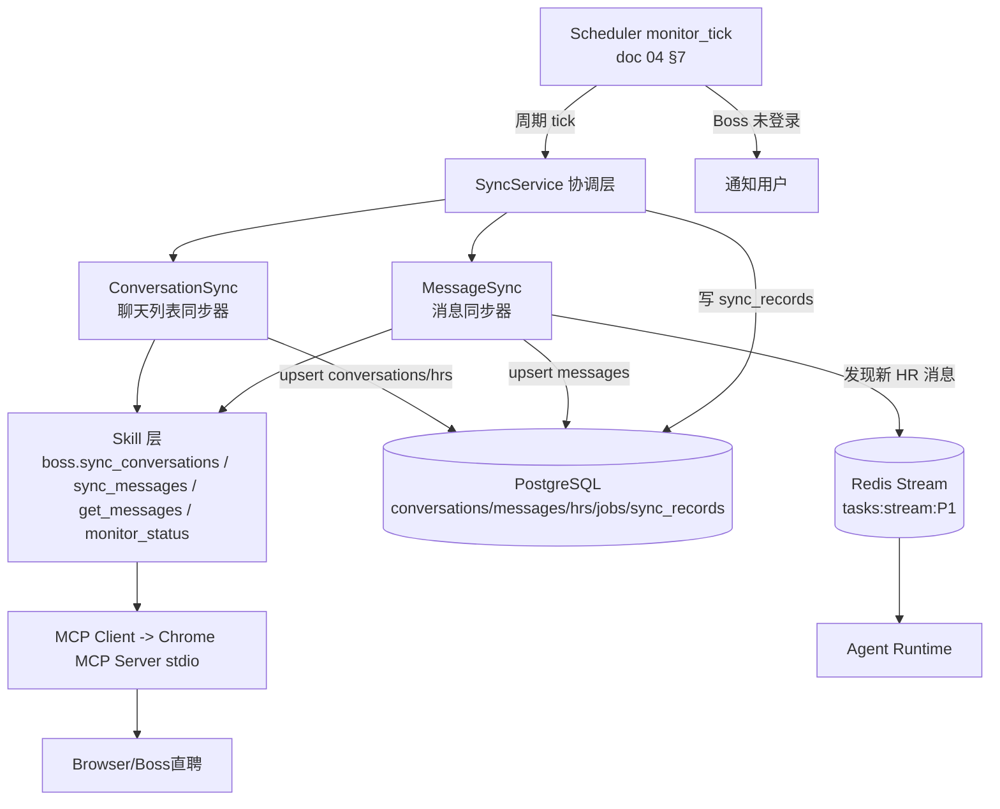
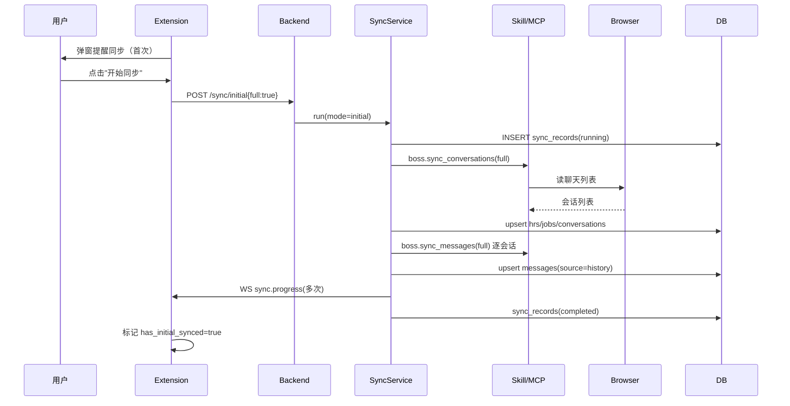
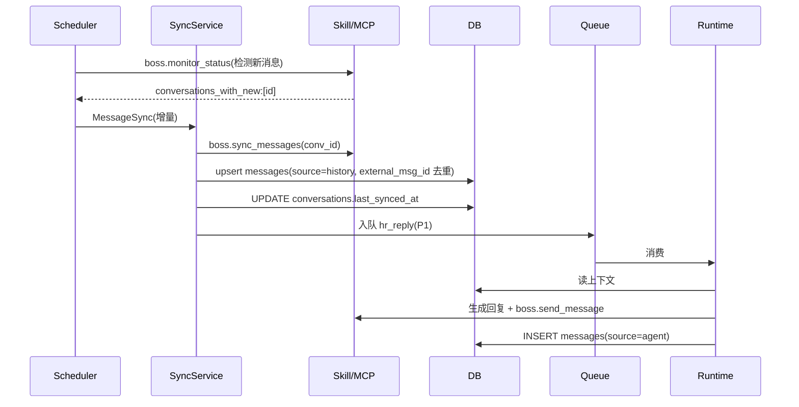
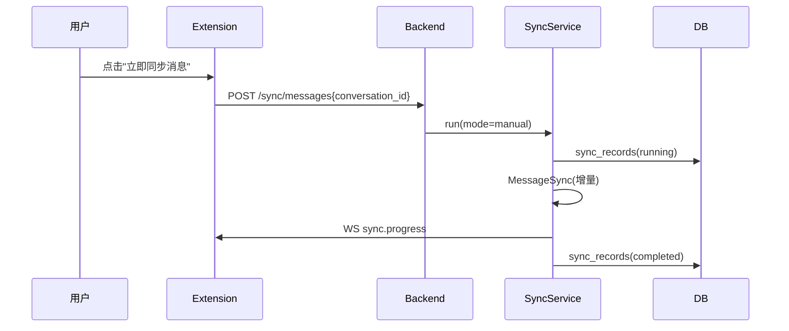

# 同步系统设计 V2.0

## 文档信息

| 项 | 值 |
|---|---|
| 文档名称 | 同步系统设计（LLD） |
| 版本 | V2.0 |
| 状态 | 设计基准 |
| 关联文档 | 02 系统架构 / 04 Agent Runtime / 05 Boss领域Runtime / 08 Boss Skill / 09 数据库 / 10 API / 11 Chrome Extension |
| 定位 | 双同步器（Conversation Sync + Message Sync）完整设计：同步策略 / 去重 / 映射 / 监听触发 / 首次同步 / 异常恢复 |

---

## 1. 设计目标

定义 Boss 聊天数据如何从浏览器同步至 DB，使 **DB 成为真实数据源**（Agent 读 DB 上下文，不实时读 DOM）。覆盖首次同步、增量同步、手动同步三种模式，严格去重与映射，且同步权属用户。取消旧 Resume Sync，拆为双同步器各司其职。

---

## 2. 背景

Prompt §10 要求：双同步器（Conversation Sync + Message Sync）；取消 Resume Sync；首次打开弹窗提醒同步、用户点击才开始；所有来源消息（Agent 发 / 用户手发 / HR 发）全量入库；DB 是真实数据源、LLM 主要读 DB。doc 04 §7 Scheduler 周期触发 Sync 检测新消息；doc 05 定义 Conversation/HR/Job 领域规则；doc 09 给表结构；doc 08 给 Skill 契约；doc 10 给 `/sync/*` 端点。

**架构红线（本文遵守）：**

1. 同步的浏览器操作经 Skill -> MCP（doc 07/08），**不写 DOM 解析 / XPath / CSS Selector**。
2. DB 为真实数据源；同步是"把浏览器态拉回 DB"的唯一正规通道。
3. 同步权属用户：首次同步须用户主动触发；不静默全量抓取。
4. Conversation ID = 系统UUID（`conversations.uuid`），不依赖 Boss ID；`external_chat_id` 仅作同步锚点。
5. 消息去重靠 `external_msg_id`；会话映射靠 `external_chat_id`。

---

## 3. 架构



**双同步器职责分离：**

| 同步器 | 范围 | 频率 | 触发 |
|---|---|---|---|
| ConversationSync | 聊天列表（会话元数据 + HR + 岗位映射） | 低频 | 首次 / 手动 / 监听周期低频 |
| MessageSync | 单会话消息内容 | 高频（增量） | 首次 / 手动 / 监听发现新消息 |
| ~~ResumeSync~~ | ~~简历同步~~ | **取消** | 简历走用户上传（doc 01 §6.9），不经浏览器同步 |

> 取消 ResumeSync 的理由：简历是用户主动资产，由用户上传后端抽摘要+Embedding（doc 09 resume_summaries），不应从 Boss 页面抓取；避免敏感数据外泄与合规风险。

---

## 4. 模块职责

### 4.1 SyncService（协调层）

- 接收同步请求（首次 / 手动 / 监听触发），创建 `sync_records` 记录。
- 编排 ConversationSync -> MessageSync 顺序（首次先列表后消息）。
- 推送 `sync.progress` WS 事件（doc 10 §13）。
- 失败标记 `sync_records.status=failed` + error。

### 4.2 ConversationSync

- 调 `boss.sync_conversations`（Skill -> MCP 读取聊天列表）。
- 对每条 Boss 会话：按 `external_chat_id` 映射；HR 按 `(user_id, platform, external_id)` upsert `hrs`；岗位按 `(platform, external_id)` upsert `jobs`；会话按 `(job_id)` 唯一约束 create_or_reuse（1 岗位 1 会话）。
- 输出 `{synced, new, updated}`。

### 4.3 MessageSync

- 调 `boss.sync_messages` / `boss.get_messages`（Skill -> MCP 读取会话消息）。
- 按 `external_msg_id` 去重 upsert `messages`；`source=history`（同步历史消息）；`role` 按发送方映射。
- 更新 `conversations.last_synced_at`。
- 发现新 HR 消息 -> 入队 `hr_reply` Task（P1）。
- 输出 `{synced, new_messages}`。

### 4.4 与 Scheduler 的关系（监听触发）

- Scheduler `monitor_tick`（默认 60s，doc 04 §7）调 `boss.monitor_status` 检测哪些会话有新消息。
- 有新消息 -> MessageSync 增量同步 -> 入队 `hr_reply`。
- 监听态由后端维护（`idle/monitoring/paused/stopped`，doc 04 §7.2）；Extension 仅启停（doc 11）。

### 4.5 与 Skill/MCP 的关系

- 同步**不直接操作 DOM**；经 Skill 描述目标（`boss.sync_*`），Skill 调 MCP 工具（`chrome_navigate`/`chrome_get_web_content`/`chrome_read_page`，doc 07）。
- DOM 变化由 Agent Runtime 的 `browser_recovery_agent` 处理（doc 15），同步层不感知。

---

## 5. 数据流

### 5.1 首次同步（full）

```
Extension 首次打开 -> 弹窗提醒（ext_flags.has_initial_synced=false）
-> 用户点击"开始同步" -> POST /sync/initial{full:true}
-> SyncService 创建 sync_records(mode=initial)
-> ConversationSync(full) 拉聊天列表 -> upsert hrs/jobs/conversations
-> MessageSync(full) 逐会话拉消息 -> upsert messages(source=history)
-> sync.progress 推送 -> sync_records.status=completed
-> 标记 ext_flags.has_initial_synced=true
```

### 5.2 增量同步（监听触发）

```
Scheduler monitor_tick(60s) -> boss.monitor_status 检测新消息
-> 命中会话 -> MessageSync(增量, since last_synced_at)
-> upsert messages(source=history, external_msg_id 去重)
-> 新 HR 消息 -> 入队 hr_reply(P1) -> Agent 生成回复 -> 发送 -> 落库(source=agent)
```

### 5.3 手动同步

```
用户在 Settings/同步 Tab 点击"立即同步" -> POST /sync/conversations 或 /sync/messages
-> SyncService(mode=manual) -> 对应同步器 -> sync.progress -> completed
```

### 5.4 消息落库（三来源全量入库）

| 来源 | source | role | 落库时机 |
|---|---|---|---|
| Agent 发送 | `agent` | agent | Skill/MCP 发送成功后（doc 02 §9.2） |
| 用户手发 | `manual` | user | POST /messages/send 经 Skill 发送后 |
| HR 发送（同步） | `history` | hr | MessageSync 拉取后 |

> 三来源统一入 `messages` 表，靠 `source` + `external_msg_id` 区分去重。Agent 读上下文统一读 DB，不区分来源。

---

## 6. 状态流

### 6.1 sync_records 状态机

```
running -> completed
        \-> failed
```

- `mode`：initial / manual / incremental。
- 失败记 `error`；不自动重试业务失败（见 §12）。

### 6.2 Conversation 同步态

`conversations.status`（doc 09）：`active / waiting_hr / closed`。

- 同步发现新 HR 消息 -> `active`。
- Agent 发送回复后 -> `waiting_hr`。
- HR 明确拒绝/超期无响应 -> `closed`（领域规则，doc 05）。

### 6.3 增量同步判据

- 全量（full=true）：重新拉取全部列表/消息，仍靠 `external_msg_id`/`external_chat_id` 去重。
- 增量（full=false）：按 `conversations.last_synced_at` + Boss 侧时间窗拉取新消息；`external_msg_id` 兜底去重。

---

## 7. 生命周期

| 对象 | 生命周期 |
|---|---|
| sync_record | 创建(running) -> 执行 -> completed/failed；保留作审计与进度查询 |
| 监听周期 | Scheduler job 随 monitoring 态启停（doc 04 §7.2）；stopped 时移除 |
| 首次同步标志 | `ext_flags.has_initial_synced`（Extension 侧，doc 11 §4.7）；完成后置 true |
| MCP 会话 | 同步经 Skill/MCP，MCP Server 跨任务保活（doc 07/16） |

---

## 8. 时序图

### 8.1 首次同步



### 8.2 监听增量同步触发回复



### 8.3 手动同步



---

## 9. 接口

### 9.1 SyncService（内部）

| 方法 | 说明 |
|---|---|
| `run_initial(user_id, full)` | 首次全量：ConversationSync + MessageSync |
| `run_conversations(user_id, full)` | 仅聊天列表同步 |
| `run_messages(user_id, conversation_id, full)` | 仅消息同步 |
| `run_incremental(user_id, conv_ids)` | 监听触发的增量（Scheduler 调） |

### 9.2 Skill 契约（引用 doc 08）

| Skill | 输入 | 输出 |
|---|---|---|
| `boss.sync_conversations` | `{full: bool=false}` | `{synced, new:[conv], updated}` |
| `boss.sync_messages` | `{conversation_id, full: bool=false}` | `{synced, new_messages:[msg]}` |
| `boss.get_messages` | `{conversation_id, limit=50}` | `{messages:[{role,content,external_msg_id,ts}]}` |
| `boss.monitor_status` | `{check_conversations:[id]}` | `{online, conversations_with_new:[id]}` |

> Skill 只描述目标；具体 MCP 工具调用由 Agent 决定（Goal-Oriented，doc 07/08）。

### 9.3 REST 端点（引用 doc 10 §9）

`POST /api/v1/sync/initial`、`POST /api/v1/sync/conversations`、`POST /api/v1/sync/messages`；均 202/200 + `sync.progress` WS 事件；支持 `Idempotency-Key`。

### 9.4 去重与映射规则

| 实体 | 去重键 | 映射 |
|---|---|---|
| HR | `(user_id, platform, external_id)` | Boss HR ID -> hrs.id |
| Job | `(platform, external_id)` | Boss 岗位 ID -> jobs.id |
| Conversation | `(job_id)` 唯一约束 | external_chat_id -> conversations.uuid（系统生成） |
| Message | `(external_msg_id)` | Boss 消息 ID -> messages.id |

- HR/Job/Conversation upsert：存在则更新 denorm 字段（hr_name/job_title），不存在则新建。
- Message：`external_msg_id` 冲突 -> 视为已同步，跳过（doc 09 §14）。
- Agent/用户手发的消息：`external_msg_id` 由发送成功后回填（Boss 返回的消息 ID），同样入库去重。

---

## 10. 异常处理

| 异常 | 处理 |
|---|---|
| Boss 未登录 | `boss.monitor_status` 返回 online=false -> 通知用户（WS + Extension 通知，doc 04 §7.3）；跳过本轮，不无限重试 |
| DOM 变化导致 Skill 读取失败 | 上抛 -> Agent Runtime `browser_recovery_agent` 恢复后重试（doc 15） |
| MCP Server 不可用 | Skill 返回错误 -> error_recovery（doc 15）；同步标记 failed |
| `external_msg_id`/`external_chat_id` 唯一冲突 | 视为去重，复用/跳过，不报错（doc 09 §14） |
| 部分会话同步失败 | 失败会话记 error，成功会话继续；sync_records 标 failed 但保留已同步量 |
| DB 事务失败 | 回滚当前批次；记日志；sync_records=failed |
| 监听态为 paused/stopped | Scheduler 不触发同步（doc 04 §7.2） |
| 网络超时 | Skill/MCP 层 30s 超时 -> error_recovery 重试 |

所有异常结构化记 `execution_logs`（trace_id/task_id/skill/tool/error，doc 15）。

---

## 11. Retry 与 Recovery

- **同步任务级 Retry**：sync Task 的 `retry_count` 上限 2（doc 09 tasks.max_retries=2）；超限入死信。
- **瞬时故障**：MCP 调用超时/网络抖动 -> error_recovery 子图 RetryPolicy(attempts=2)（doc 06/15）。
- **DOM 变化**：`browser_recovery_agent` 恢复页面后重试（doc 15）。
- **规则违反不重试**：Boss 未登录/DomainGuard 拒绝 -> 不重试，通知用户。
- **最终失败**：sync_records=failed；前端显示错误 + trace_id；用户可手动重试。
- **增量同步幂等**：靠 `external_msg_id` 去重，重试不产生重复消息。

---

## 12. 扩展设计

- **多平台**：`platform` 列已就绪（doc 09）；新增平台只需加对应 `boss.*` Skill 集 + CHECK 约束扩值。
- **批量并行同步**：V1 串行逐会话；量大时按会话分批并行（受浏览器锁约束，doc 04 §8.4）。
- **WebSocket 实时推送同步**：未来 Boss 若提供 WS，可替代轮询 monitor_tick；SyncService 接口不变。
- **同步频率自适应**：根据 HR 活跃度动态调整 monitor_tick 间隔（活跃会话高频，冷会话低频）。

---

## 13. 边界与约束

1. 同步经 Skill/MCP，不写 DOM/XPath/CSS。
2. DB 为真实数据源；同步是浏览器态 -> DB 的唯一正规通道。
3. 同步权属用户；首次须用户主动触发。
4. Conversation ID = 系统UUID；不依赖 Boss ID。
5. 简历不经同步（取消 ResumeSync）；用户上传。
6. 去重靠 `external_msg_id`；会话映射靠 `external_chat_id`。
7. 监听触发同步受 monitoring 态控制（doc 04 §7.2）。

---

## 14. 设计要点与风险

**【核心逻辑】**
- 双同步器职责分离：ConversationSync（低频列表）+ MessageSync（高频增量），取代单一大同步器与 ResumeSync，降低耦合与敏感数据风险。
- DB 为真实数据源：三来源消息统一入库（source 区分），Agent 读 DB 不读 DOM，解耦浏览器变化。
- 监听闭环：Scheduler monitor_tick -> 检测新消息 -> MessageSync -> 入队 hr_reply -> Agent 回复 -> 落库。

**【关键技术点】**
- **去重三键**：`external_msg_id`（消息）/`external_chat_id`（会话映射）/`(user_id,platform,external_id)`（HR），保证幂等同步。
- **1 岗位 1 会话**：`uq_conv_job` 唯一约束落地领域规则；同 HR 不同岗位 = 不同 Conversation。
- **HR 规范化**：hrs 表去重，避免 denorm hr_name 膨胀；支持同 HR 多会话关联。
- **经 Skill/MCP**：同步层不感知 DOM，DOM 变化由 Recovery 处理（doc 15），Boss 改版无需改同步逻辑。

**【潜在风险】**
- **增量同步漏消息**：Boss 侧时间窗与 `last_synced_at` 时钟漂移可能漏边界消息。**缓解**：每次增量重叠拉取一小段时间窗 + `external_msg_id` 兜底去重。
- **DOM 变化致同步中断**：Boss 改版使 Skill 读取失败。**缓解**：error_recovery + browser_recovery_agent（doc 15）；通知用户；Skill 无 selector 故改版影响小。
- **监听延迟**：monitor_tick 60s 周期 + Extension 脉冲模式（doc 11）可能叠加延迟。**缓解**：HR 回复非强实时场景可接受；活跃会话可动态提频。
- **全量首次同步耗时**：会话多时首次同步长。**缓解**：sync.progress 进度推送 + 分批；用户可后台进行。
- **三来源消息时序**：Agent 发送与 HR 消息可能乱序入库。**缓解**：`sent_at` 排序读取；`external_msg_id` 去重防止重复。
