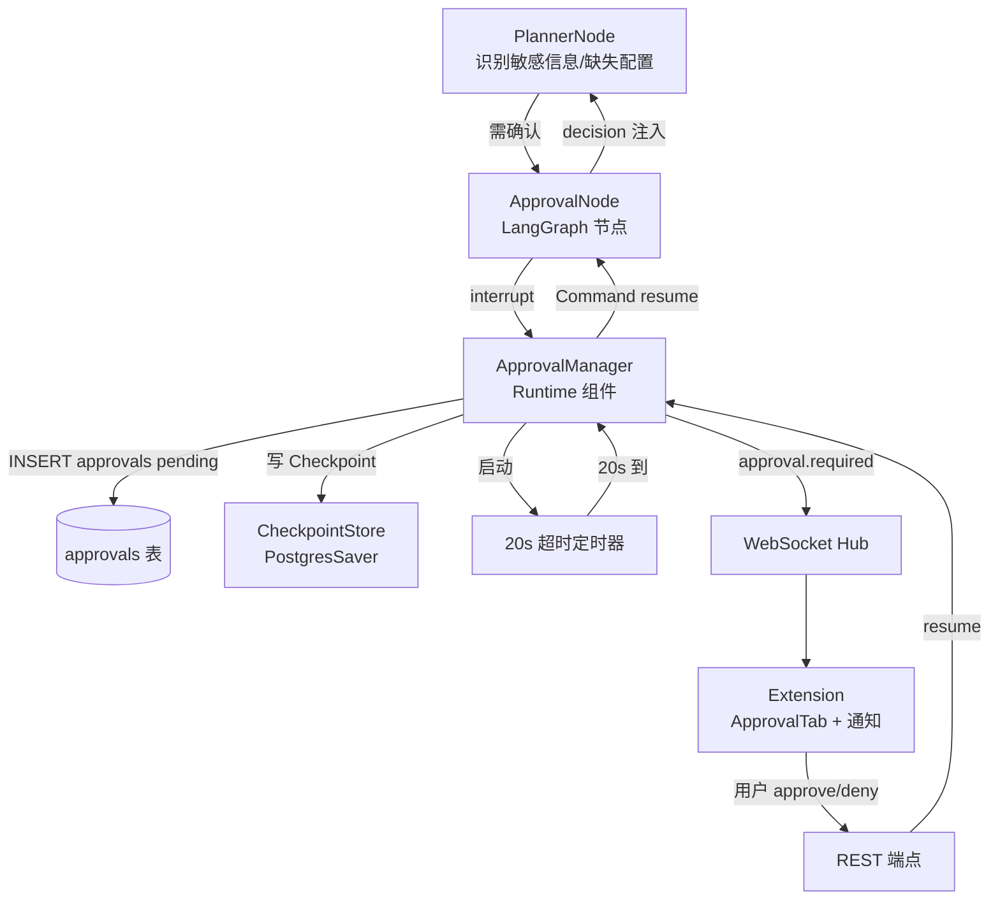
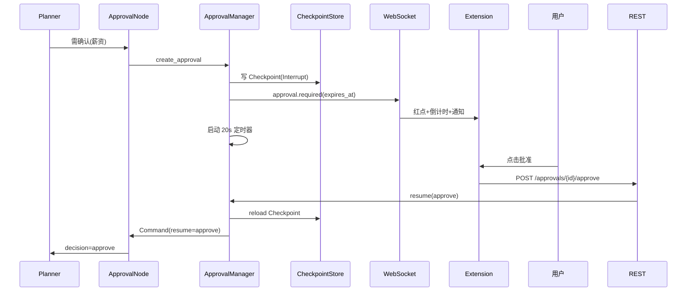
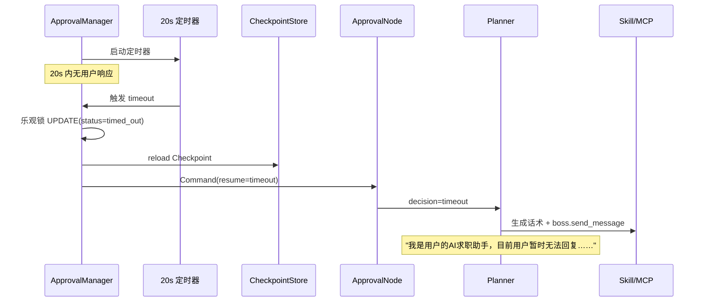
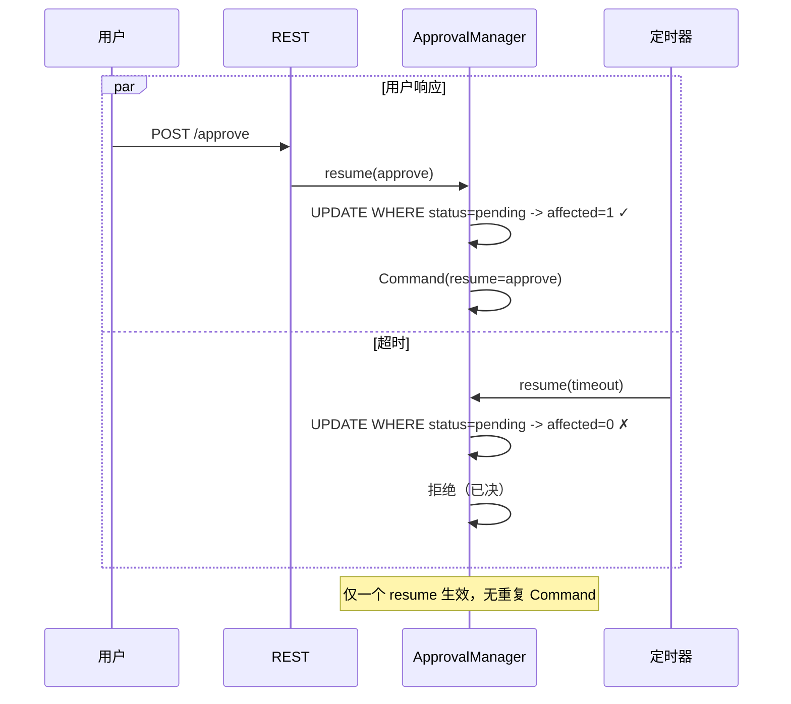

# Approval 人工确认系统设计 V2.0

## 文档信息

| 项 | 值 |
|---|---|
| 文档名称 | Approval 人工确认系统设计（LLD） |
| 版本 | V2.0 |
| 状态 | 设计基准 |
| 关联文档 | 03 Agent状态机 / 04 Agent Runtime / 06 LangGraph / 08 Boss Skill / 09 数据库 / 10 API / 11 Chrome Extension / 12 前端UI |
| 定位 | Approval 完整设计：触发规则 / Runtime 中断恢复 / 20s 超时 / 竞态处理 / 与 LangGraph Interrupt 集成 |

---

## 1. 设计目标

定义 Approval（人工确认）系统的触发条件、Runtime 中断与恢复机制、20s 超时自动话术、并发竞态处理。使 Agent 在涉及敏感求职信息时**强制暂停等待用户决策**，超时自动降级回复，且 Approval 逻辑归属 Runtime（非 Skill），可中断可恢复。

---

## 2. 背景

Prompt §14 要求：Approval 属 Runtime（不是 Skill）；触发敏感信息 7 类（薪资/工作地点/入职时间/加班/外包/异地/试用期工资）；用户未配置的项必须 Approval；流程为 Agent 暂停 -> `create_approval()` -> 通知用户 -> 等待 -> 恢复 Checkpoint；20s 无响应自动回复"我是用户的AI求职助手，目前用户暂时无法回复……"。doc 04 §10 定义 `create_approval()` 流程与 20s 定时器；doc 06 给 LangGraph `interrupt()`/`Command(resume)`；doc 09 给 `approvals` 表；doc 10 给 `/approvals/*` 端点；doc 11/12 给扩展侧交互。

**架构红线（本文遵守）：**

1. Approval 属 Runtime；**Skill 不实现 Approval**（doc 02 §16）。
2. 超时由后端定时器触发 `Command(resume="timeout")`，**不经端点**；端点仅处理用户主动 approve/deny。
3. 同一任务同时只能有一个 pending Approval。
4. 超时与用户响应可能竞争 -> 状态机 + 乐观锁保证只生效一次。
5. Approval 是业务暂停，非异常；恢复后回 `planner` 而非 `error_recovery`。

---

## 3. 架构



**组件职责：**

| 组件 | 职责 | 文档 |
|---|---|---|
| PlannerNode | 识别敏感信息 / Settings 缺失项 -> 决定是否需 Approval | doc 03 |
| ApprovalNode | LangGraph 节点，调 `interrupt()` 暂停，接收 `Command(resume)` 决策 | doc 06 |
| ApprovalManager | 创建 Approval、状态机、定时器、恢复注入 | doc 04 §10 |
| CheckpointStore | Interrupt 前写 Checkpoint，恢复时同 thread_id 续跑 | doc 04 §9 |
| 超时定时器 | 20s 触发 `Command(resume="timeout")` | 本文 |

---

## 4. 模块职责

### 4.1 ApprovalManager（Runtime 组件）

- `create_approval(type, payload, task_id, thread_id)` -> 写 `approvals`（pending, expires_at=now+20s）-> `interrupt(thread_id)` 写 Checkpoint -> WS 推 `approval.required` -> 启动 20s 定时器。
- `resume(approval_id, decision)` -> 校验状态机（乐观锁）-> reload Checkpoint -> `Command(resume=decision)` -> 状态置 approved/denied/timed_out。
- 创建前检查：同 task 已有 pending Approval -> 拒绝重复创建。

### 4.2 ApprovalNode（LangGraph 节点）

```python
# doc 06 Interrupt 用法
from langgraph.types import interrupt, Command

def approval_node(state):
    approval = create_approval(state)          # 写 DB + 启定时器
    decision = interrupt({                     # 暂停，等 Command(resume)
        "approval_id": approval.id,
        "type": approval.type,
        "context": approval.payload,
    })
    # decision ∈ {"approve", "deny", "timeout"}（Command(resume) 注入）
    return {"approval_decision": decision}     # -> planner 接收
```

- `interrupt()` 阻塞至 `Command(resume)` 到达；decision 作为返回值注入回节点 -> 传 `planner`。
- Checkpoint：Interrupt 前由 PostgresSaver 自动写；恢复时同 `thread_id` 续跑（doc 04 §9）。

### 4.3 超时定时器

- 后端 `asyncio.Task` 或 APScheduler one-shot job，`expires_at` 触发。
- 触发 -> `ApprovalManager.resume(approval_id, "timeout")` -> `Command(resume="timeout")`。
- **不经端点**：避免与用户 HTTP 响应竞争；统一经 `resume()` 状态机。

### 4.4 触发判定（Planner + DomainGuard）

- PlannerNode 分析 HR 消息/岗位信息，识别 7 类敏感信息是否涉及且 Settings 未配置 -> 输出 approval 需求。
- DomainGuard 前置硬规则（如"发现即投递"禁止，doc 05）-> 不经 Approval，直接拒绝。

---

## 5. 触发规则

### 5.1 七类敏感信息

| type | 含义 | 触发条件 |
|---|---|---|
| `salary` | 薪资 | HR 问期望薪资/给 offer 薪资，且 Settings 未配置 expected_salary |
| `location` | 工作地点 | 涉及工作地点确认，且未配置 location |
| `start_date` | 入职时间 | HR 问入职时间，且未配置 |
| `overtime` | 加班 | 涉及加班，且 accept_overtime 未配置 |
| `outsourcing` | 外包 | 涉及外包，且 accept_outsourcing 未配置 |
| `offsite` | 异地 | 涉及异地，且 accept_offsite 未配置 |
| `probation_salary` | 试用期工资 | 涉及试用期工资，且 accept_probation_salary 未配置 |

> **未配置（None）即必须 Approval**（doc 10 §10 job-rule：None 字段为 Approval 触发条件）。已配置且匹配的项不触发（Agent 按配置自动回复）。

### 5.2 触发 Skill 场景（doc 08）

| Skill | 触发 Approval 条件 |
|---|---|
| `boss.send_message` | 回复内容含敏感信息且对应 Settings 未配置 |
| `boss.apply_resume` | 自动投递开关关 / HR 索要简历但需确认 |
| `boss.detect_resume_request` | 置信度低（不确定 HR 是否索要简历）-> 转 Approval |
| `boss.score_job` | Settings 缺失致无法评分 -> 走 Approval 或跳过 |

### 5.3 不触发 Approval 的情形

- DomainGuard 硬规则拒绝（如发现即投递）-> 直接 failed/canceled，不经 Approval。
- 已配置项且 Agent 决策符合配置 -> 自动执行。
- 非敏感常规回复 -> 自动发送。

---

## 6. 数据流

### 6.1 创建 Approval（中断）

```
Planner 识别需确认 -> ApprovalNode
-> create_approval(type,payload,task_id,thread_id)
-> INSERT approvals(status=pending, expires_at=now+20s)
-> interrupt(thread_id) 写 Checkpoint
-> tasks.status = waiting_approval
-> WS 推 approval.required{approval_id,task_id,type,expires_at}
-> Extension ApprovalTab 红点 + 倒计时 + chrome.notifications
-> 启动 20s 定时器
```

### 6.2 用户响应（恢复）

```
用户点击批准/拒绝 -> POST /approvals/{id}/approve|deny
-> ApprovalManager.resume(id, "approve"|"deny")
  -> 乐观锁校验状态（须为 pending）
  -> UPDATE approvals(status=approved|denied, decision, decided_at)
  -> reload Checkpoint(thread_id)
  -> Command(resume=decision)
-> ApprovalNode 返回 decision -> planner 继续
-> tasks.status = running
```

### 6.3 超时（自动恢复）

```
20s 定时器触发 -> ApprovalManager.resume(id, "timeout")
  -> 乐观锁校验（仍 pending 才生效）
  -> UPDATE approvals(status=timed_out, decision=timeout)
  -> Command(resume="timeout")
-> ApprovalNode 返回 timeout -> planner 走超时分支
-> 生成话术"我是用户的AI求职助手，目前用户暂时无法回复……"
-> boss.send_message 发送 -> tasks.status=succeeded
```

---

## 7. 状态流

### 7.1 approvals 状态机

```
pending -> approved   (用户批准)
        \-> denied    (用户拒绝)
        \-> timed_out (20s 超时)
```

- 终态不可变更；任何终态后的 resume 尝试被拒绝（code 3003 Approval 已决，doc 10 §14）。
- `decision` 列：`approve / deny / timeout`（与 status 一一对应）。

### 7.2 竞态处理（用户 vs 超时）

- 超时定时器与用户 HTTP 响应可能同时到达。
- **乐观锁**：`resume()` 以 `WHERE id=? AND status='pending'` 更新（ affected_rows=1 才生效）；先到的生效，后到的拒绝。
- 保证同一 Approval 只生效一次恢复，`Command(resume)` 只发一次。

### 7.3 task 状态联动

```
running -> waiting_approval (create_approval)
        \-> running (resume: approve/deny/timeout)
```

- 超时分支不改变 task 终态走向：话术发送成功 -> succeeded。

---

## 8. 生命周期

| 对象 | 生命周期 |
|---|---|
| Approval 记录 | 创建(pending) -> 决策(approved/denied/timed_out) -> 保留作审计 |
| 20s 定时器 | create_approval 时启动；resume 时取消（若未触发） |
| Checkpoint | Interrupt 前写；resume 时 reload 同 thread_id |
| WS 订阅 | approval.required 推送；Extension 倒计时以 `expires_at` 为权威（doc 12） |
| Extension 通知 | approval.required -> chrome.notifications（doc 11）；用户点通知开 SidePanel 切实时 |

---

## 9. 时序图

### 9.1 用户确认



### 9.2 超时自动话术



### 9.3 竞态（用户与超时同时）



---

## 10. 接口

### 10.1 ApprovalManager（内部）

| 方法 | 说明 |
|---|---|
| `create_approval(type, payload, task_id, thread_id)` | 创建 pending Approval + Interrupt + 定时器 |
| `resume(approval_id, decision)` | 乐观锁状态机 + reload Checkpoint + Command(resume) |
| `cancel_pending(task_id)` | 任务 canceled 时清理 pending Approval（置 denied/timed_out） |

### 10.2 LangGraph 契约（引用 doc 06）

- 暂停：`decision = interrupt({"approval_id","type","context"})`
- 恢复：`await compiled.ainvoke(Command(resume="approve"|"deny"|"timeout"), config={...thread_id})`
- Checkpoint：PostgresSaver 自动管理；业务侧 `task_checkpoint_index` 做 task<->thread 映射（doc 09 §5.14）。

### 10.3 REST 端点（引用 doc 10 §11）

| 端点 | 说明 |
|---|---|
| `GET /api/v1/approvals/pending` | 返回 pending 列表 |
| `GET /api/v1/approvals/{id}` | 单条详情 |
| `POST /api/v1/approvals/{id}/approve` | 用户批准 -> `resume("approve")` |
| `POST /api/v1/approvals/{id}/deny` | 用户拒绝 -> `resume("deny")` |

> 超时**不经端点**（后端定时器直 `resume("timeout")`）。已决 Approval 再操作返回 code 3003（doc 10）。

### 10.4 WS 事件

`approval.required{approval_id, task_id, type, expires_at}`（doc 10 §13）；扩展侧 UI 见 doc 12 §9.2。

---

## 11. 异常处理

| 异常 | 处理 |
|---|---|
| 同 task 重复创建 pending Approval | create_approval 前检查；拒绝重复 |
| resume 时状态非 pending | 拒绝；返回 code 3003（已决） |
| Checkpoint reload 失败 | 标记 task failed；记日志；不强制恢复（doc 04 §17） |
| 定时器丢失（backend 重启） | 启动时扫描 `expires_at` 已过的 pending -> 补触发 timeout resume |
| Command(resume) 注入失败 | 标记 failed；记日志；人工介入 |
| Extension 未在线（脉冲延迟） | approval.required 经 chrome.notifications；超时兜底（doc 11/12） |
| 任务被 cancel | `cancel_pending` 置 Approval 终态；不 resume |

所有异常结构化记 `execution_logs`（trace_id/task_id/node=approval，doc 15）。

---

## 12. Retry 与 Recovery

- **Approval 本身不 Retry**：它是人工决策点，非瞬时故障。
- **超时是正常分支**：非失败；自动话术后 task 正常 succeeded。
- **Checkpoint 恢复**：resume reload Checkpoint；崩溃后 Worker 重启可扫描 pending Approval + 未 ACK 任务恢复（doc 04 §18）。
- **定时器补偿**：backend 重启后扫描过期 pending -> 补 timeout，防 Approval 永久挂起。
- **竞态幂等**：乐观锁保证 resume 一次生效；重复 resume 拒绝。

---

## 13. 扩展设计

- **可配置超时**：20s 为默认；未来按 type 设不同超时（薪资长、常规短）。
- **多级 Approval**：复合敏感信息合并为一个 Approval（payload 含多项），减少中断次数。
- **Approval 历史**：用户决策历史沉淀 Memory（doc 04 §11），未来同类场景 Agent 可参考历史自动决策。
- **批量 Approval**：多任务并发时（多用户扩展），Approval 队列化。

---

## 14. 边界与约束

1. Approval 属 Runtime；Skill 不实现 Approval（doc 02 §16）。
2. 超时由后端定时器触发，不经端点。
3. 同一任务同时仅一个 pending Approval。
4. 竞态靠乐观锁，resume 只生效一次。
5. 未配置项必须 Approval；已配置项自动执行。
6. Approval 是业务暂停非异常；恢复回 planner 不回 error_recovery。
7. 超时话术固定（"我是用户的AI求职助手，目前用户暂时无法回复……"）。

---

## 15. 设计要点与风险

**【核心逻辑】**
- Approval 属 Runtime，经 LangGraph `interrupt()`/`Command(resume)` 实现可中断可恢复；decision 注入回 planner，业务逻辑无感知中断。
- 超时由后端定时器触发 `Command(resume="timeout")`，不经端点，统一经 `resume()` 状态机，避免与用户响应竞争。
- 乐观锁保证竞态下只生效一次恢复。

**【关键技术点】**
- **LangGraph functional interrupt**：`interrupt()` 返回值即 `Command(resume)` 注入值，天然支持 decision 传递，无需自定义恢复通道。
- **Checkpoint 续跑**：Interrupt 前写、resume 时 reload 同 `thread_id`，保证状态一致（doc 04 §9）。
- **乐观锁状态机**：`UPDATE WHERE status='pending'` 原子更新，affected_rows 判定生效，无锁竞争。
- **定时器补偿**：backend 重启扫描过期 pending 补 timeout，防永久挂起。

**【潜在风险】**
- **脉冲模式撞 20s 窗口**（doc 11/12 已识别）：SidePanel 关时 approval.required 可能延迟 ≤30s 到达，用户可能错过窗口。**缓解**：chrome.notifications 即时弹出 + 超时话术兜底（用户体验可接受，非数据正确性问题）。
- **定时器丢失**：backend 崩溃致定时器未触发。**缓解**：启动时扫描过期 pending 补 timeout。
- **Checkpoint 与 Approval 不一致**：Approval 已决但 Checkpoint 损坏。**缓解**：标记 task failed + 记日志，不强制恢复（doc 04 §17）。
- **高频 Approval 打断体验**：多个敏感项逐个确认致体验中断。**缓解**：未来多级合并 Approval（§13）。
- **超时话术生硬**：固定话术可能不适所有场景。**缓解**：V1 固定保底；未来按 type/context 微调。
