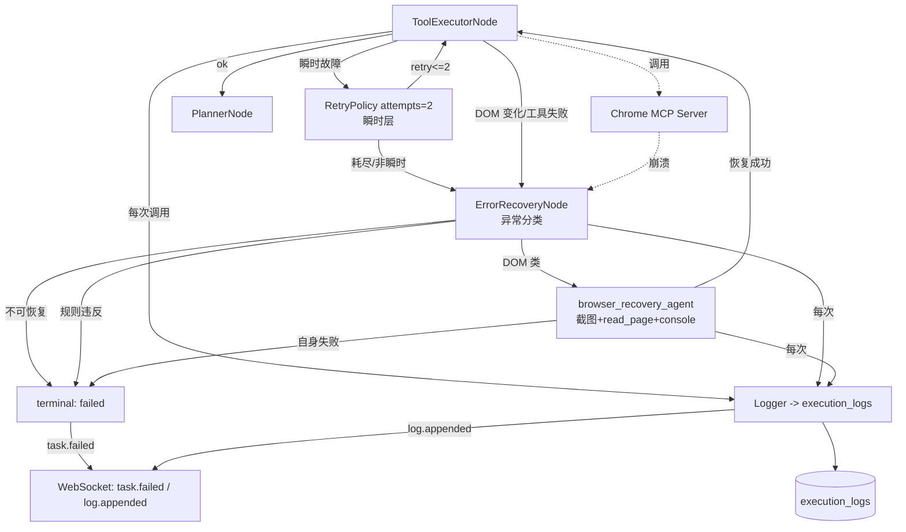
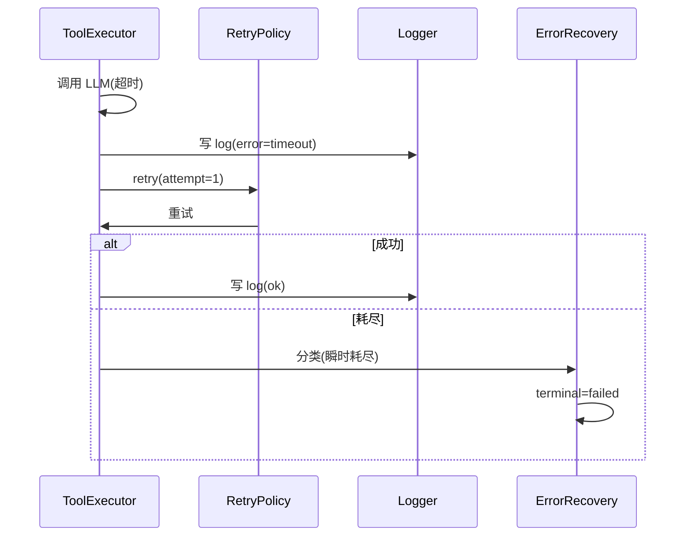
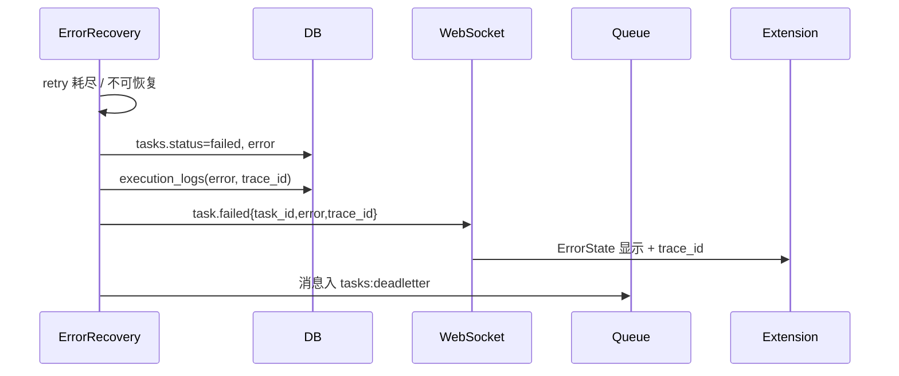

# 异常恢复与日志系统设计 V2.0

## 文档信息

| 项 | 值 |
|---|---|
| 文档名称 | 异常恢复与日志系统设计（LLD） |
| 版本 | V2.0 |
| 状态 | 设计基准 |
| 关联文档 | 03 Agent状态机 / 04 Agent Runtime / 06 LangGraph / 07 MCP与Tool / 08 Boss Skill / 09 数据库 / 10 API |
| 定位 | 双层 Retry + browser_recovery + 结构化日志 + trace_id 全链路可观测的完整设计 |

---

## 1. 设计目标

定义失败处理与可观测体系：所有失败结构化记日志（时间/Task/Skill/Tool/参数/错误/trace_id）；双层 Retry（瞬时故障 + DOM 变化恢复）；最多 2 次重试仍失败则停止任务并前端报错；DOM 变化经 `browser_recovery_agent` 恢复；trace_id 全链路贯通。使 Agent 失败可解释、可恢复、可追溯。

---

## 2. 背景

Prompt §20/§21 要求：所有失败记日志（时间/Task/Skill/Tool/参数/错误）；自动 Retry 最多 2 次；仍失败停止任务、前端显示错误；DOM 变化经 `browser_recovery_agent` 处理（页面变化/DOM 异常/页面恢复）。doc 03 定义 ErrorRecoveryNode；doc 04 §18 定义双层 Retry；doc 06 定义 RetryPolicy 与 error_recovery 子图；doc 07 定义 MCP Server 崩溃处理；doc 08 定义 Skill 失败上抛；doc 09 定义 `execution_logs` 表；doc 10 定义 `task.failed`/`log.appended` 事件。

**架构红线（本文遵守）：**

1. 规则违反（DomainGuard 拒绝）**不重试**，直接终态。
2. Recovery 自身失败上抛，**不递归无限恢复**。
3. Retry 仅限瞬时故障（LLM/网络/限流），`retry_on` 限定异常类型。
4. 所有失败必记结构化日志，含 trace_id。
5. 最终失败停止任务，不静默吞错。

---

## 3. 架构



**双层 Retry：**

| 层 | 机制 | 适用 | 上限 |
|---|---|---|---|
| 瞬时层 | `RetryPolicy(attempts=2)`（LangGraph，绑定节点） | LLM 超时/网络抖动/限流 | 2 次 |
| 恢复层 | error_recovery 子图 + `retry_count` | DOM 变化/工具失败/MCP 崩溃 | 2 次 |

> 两层独立计数；瞬时层先兜底瞬时故障，恢复层处理需页面恢复的故障。规则违反两层都不重试。

---

## 4. 模块职责

### 4.1 ErrorRecoveryNode（doc 03）

- 接收 ToolExecutor/Skill 失败，**异常分类**：
  - 瞬时故障 -> 交 RetryPolicy（若未耗尽）。
  - DOM 变化/元素失效 -> 调 `browser_recovery_agent`。
  - MCP 不可用 -> 触发 MCP 重启后重试。
  - 规则违反（DomainGuard）-> 直接终态 failed，不重试。
  - 不可恢复 -> 终态 failed。
- 子图流转：`tool_executor --error--> error_recovery --(分类)--> tool_executor | planner | END`（doc 06）。

### 4.2 browser_recovery_agent

- 职责：DOM 变化 / DOM 异常 / 元素失效的页面恢复。
- 手段（经 Skill/MCP，不写 selector）：
  1. `chrome_screenshot` 截图诊断。
  2. `chrome_read_page` 重新获取元素 ref（抗 DOM 变化，doc 07）。
  3. `chrome_console` 读取控制台错误。
  4. 必要时 `chrome_navigate` 回到已知页面。
- 恢复后返回新 ref -> ToolExecutor 用新 ref 重试。
- **边界**：Recovery 自身失败上抛 -> 终态 failed，不递归。

### 4.3 RetryPolicy（瞬时层，doc 06）

```python
from langgraph.pregel import RetryPolicy
# 绑定到 LLM 调用节点
retry = RetryPolicy(attempts=2, retry_on=(httpx.TimeoutException, RateLimitError, ...))
```

- `retry_on` 限定可重试异常类型；业务规则违反不在此列 -> 不重试。
- 指数退避；仅瞬时故障。

### 4.4 日志服务（Logger）

- 每次节点执行 / Skill 调用 / Tool 调用 / Recovery 写 `execution_logs`（doc 09 §5.13）。
- 字段：`trace_id, task_id, node, skill, tool, input, output, error, latency_ms, created_at`。
- 关键日志经 WS `log.appended` 推送（可订阅，doc 10 §13）。

### 4.5 trace_id 链路

```
Extension(request_id) -> Backend -> Worker -> Agent -> Skill -> Tool -> MCP -> Log
```

- Extension 每次 REST 请求生成 `request_id`；Backend 注入 `trace_id`（贯穿 task）。
- LangGraph 回调接 LangSmith/OTel，trace_id 对齐。
- WS 事件携带 `trace_id`；前端错误显示 trace_id 供排查（doc 12 ErrorState）。

---

## 5. 数据流

### 5.1 瞬时故障 Retry

```
ToolExecutor 调 LLM/MCP -> 超时/网络/限流异常
-> RetryPolicy(attempts=2) 指数退避重试
-> 重试成功 -> 继续 planner
-> 耗尽 -> ErrorRecoveryNode 分类 -> failed
-> 每次尝试写 execution_logs
```

### 5.2 DOM 变化 Recovery

```
ToolExecutor 调 Skill(点击/填写) -> 元素失效/DOM 变化
-> ErrorRecoveryNode -> browser_recovery_agent
-> screenshot + read_page(取新 ref) + console 诊断
-> 恢复成功 -> ToolExecutor 用新 ref 重试(retry_count++)
-> retry_count<=2 成功 -> 继续
-> retry_count 耗尽 -> failed
```

### 5.3 MCP Server 崩溃

```
MCP Client 30s ping 检测崩溃 / 单次调用 30s 超时
-> 终止旧子进程 -> 重新拉起 chrome-mcp-server
-> 当前 Tool 调用返回错误 -> ErrorRecoveryNode
-> 重启后重试(retry_count++)
-> 仍失败 -> failed
```

### 5.4 最终失败

```
Retry 耗尽 / 不可恢复 / 规则违反
-> tasks.status = failed, error 写入
-> WS 推 task.failed{task_id, error, trace_id}
-> 前端 ErrorState 显示错误 + trace_id
-> Queue 消息入死信(tasks:deadletter)留存排查
```

### 5.5 日志写入

```
节点执行 / Skill / Tool / Recovery 每次
-> Logger 写 execution_logs(trace_id,task_id,node,skill,tool,input,output,error,latency_ms)
-> 关键日志 WS log.appended
```

---

## 6. 状态流

### 6.1 task 状态（恢复相关）

```
running -> recovering (ErrorRecovery/browser_recovery 进行中)
        \-> running (恢复成功)
        \-> failed (耗尽/不可恢复/规则违反)
```

- `recovering` 态（doc 03/09）标记正在恢复，前端显示"恢复中"。
- 恢复成功回 `running`；失败终态 `failed`。

### 6.2 retry_count 流转

- 节点级 `retry_count`：0 -> 1 -> 2，上限 2（doc 03 §16）。
- 任务级 `tasks.retry_count`：Queue 消息级，上限 2（doc 04 §18, doc 09 max_retries=2）。
- 两者独立：节点级管单次操作重试，任务级管整个任务重投。

---

## 7. 生命周期

| 对象 | 生命周期 |
|---|---|
| ErrorRecovery 会话 | 失败触发 -> 分类 -> 恢复/终态；不持久（Checkpoint 记 recovering 态） |
| browser_recovery | 单次恢复尝试；成功回 ToolExecutor，失败上抛 |
| RetryPolicy | 绑定节点，节点执行期间生效 |
| execution_logs | 写入即持久；按 task_id 查询；终态后保留排查 |
| 死信消息 | failed 任务 Queue 消息入 `tasks:deadletter`；保留排查 |

---

## 8. 时序图

### 8.1 瞬时故障 Retry



### 8.2 DOM 变化 Recovery

```mermaid
sequenceDiagram
    participant TE as ToolExecutor
    participant ER as ErrorRecovery
    participant BR as browser_recovery_agent
    participant MCP as MCP
    participant LG as Logger
    TE->>MCP: click_element(ref)
    MCP-->>TE: 元素失效
    TE->>LG: 写 log(error=element_stale)
    TE->>ER: 分类(DOM 变化)
    ER->>BR: 恢复
    BR->>MCP: screenshot + read_page(取新 ref)
    BR-->>ER: 新 ref
    ER->>TE: 用新 ref 重试(retry_count++)
    TE->>MCP: click_element(新 ref)
    MCP-->>TE: ok
    TE->>LG: 写 log(ok)
```



### 8.3 最终失败



---

## 9. 接口

### 9.1 ErrorRecoveryNode 契约

| 输入 | 输出 |
|---|---|
| `{task_id, thread_id, error, skill?, tool?, context}` | `{route: "retry"|"planner"|"failed", new_ref?, retry_count}` |

- 条件边按 `route` 分流（doc 06）。

### 9.2 日志服务 API

| 方法 | 说明 |
|---|---|
| `log_execution(trace_id, task_id, node, skill?, tool?, input?, output?, error?, latency_ms?)` | 写 execution_logs |
| `get_logs(task_id)` / `get_logs_by_trace(trace_id)` | 查询 |

### 9.3 WS 事件（引用 doc 10 §13）

| 事件 | data |
|---|---|
| `task.failed` | `{task_id, error, trace_id}` |
| `log.appended` | `{task_id, level, node, msg}`（可订阅） |

---

## 10. 异常分类与处理策略

| 异常类 | 分类 | 策略 | 重试 |
|---|---|---|---|
| LLM 超时/限流 | 瞬时 | RetryPolicy 指数退避 | 是（≤2） |
| 网络抖动 | 瞬时 | RetryPolicy | 是（≤2） |
| 元素失效/DOM 变化 | DOM | browser_recovery 重定位 ref | 是（≤2） |
| 页面异常/控制台报错 | DOM | browser_recovery 截图诊断 + navigate 回已知页 | 是（≤2） |
| MCP Server 崩溃 | 基础设施 | 重启 Server 后重试 | 是（≤2） |
| MCP 单次调用超时(30s) | 基础设施 | kill+重启+重试 | 是（≤2） |
| Boss 未登录 | 业务 | 通知用户；不重试 | 否 |
| DomainGuard 拒绝（如发现即投） | 规则违反 | 直接 failed | 否 |
| Approval 已决 | 规则违反 | 拒绝（code 3003） | 否 |
| 参数校验失败 | 业务 | 422；不重试 | 否 |
| Checkpoint 损坏 | 不可恢复 | failed；记日志；不强制恢复 | 否 |
| Recovery 自身失败 | 不可恢复 | 上抛 -> failed | 否 |

---

## 11. Retry 与 Recovery（详细）

- **瞬时层**：`RetryPolicy(attempts=2, retry_on=(Timeout, Network, RateLimit))`；指数退避；绑定 LLM 调用节点。
- **恢复层**：error_recovery 子图 + 节点 `retry_count`（上限 2）；处理 DOM/工具/MCP 故障。
- **任务级**：Queue 消息 `retry_count`（上限 2）；超限入死信 `tasks:deadletter`（doc 04 §6.2）。
- **崩溃恢复**：Checkpoint + stalled 消息 XCLAIM 重投（doc 04 §6.3）。
- **Recovery 边界**：browser_recovery 自身失败上抛，不递归；retry_count 耗尽即终态。
- **规则违反不重试**：DomainGuard/Boss 未登录/Approval 已决 -> 直接终态或通知。
- **最终失败**：task failed + 死信 + 前端报错 + trace_id。

---

## 12. 可观测性

### 12.1 结构化日志

- 全部经 `structlog`/`logging` 结构化输出（doc 02 §7 可观测性优先）。
- 字段：`trace_id, task_id, thread_id, node, skill, tool, latency_ms, error`。
- 禁 `print`；禁裸 `except: pass`（CLAUDE.md）。

### 12.2 trace_id 全链路

```
Extension request_id -> Backend trace_id -> Worker -> Agent -> Skill -> Tool -> MCP -> execution_logs
```

- LangGraph 回调接 LangSmith/OTel；trace_id 对齐。
- 前端 ErrorState 显示 trace_id（doc 12）。

### 12.3 指标（V1 基线）

- 任务成功率/失败率、平均 latency、Retry 次数分布、Recovery 成功率、MCP 崩溃次数。
- 经 `log.appended` / Prometheus（V2+）采集。

### 12.4 死信排查

- `tasks:deadletter` 留存失败任务消息；按 task_id 关联 execution_logs 复盘。

---

## 13. 扩展设计

- **告警**：失败率/Recovery 失败率超阈值告警（V2+）。
- **自动根因聚类**：日志按 error 模式聚类，识别 Boss 改版/高频故障。
- **Recovery 策略学习**：历史 Recovery 成功模式沉淀，未来同类故障优先用成功策略。
- **分布式追踪**：OTel 全链路 span（Extension -> Backend -> MCP）。
- **日志分区**：execution_logs 量大时按时间分区（doc 09 §17）。

---

## 14. 边界与约束

1. 规则违反不重试；Recovery 不递归。
2. Retry 仅瞬时故障；`retry_on` 限定异常类型。
3. 所有失败必记结构化日志 + trace_id。
4. 最终失败停止任务，不静默吞错。
5. Recovery 经 Skill/MCP，不写 selector（DOM 变化靠 read_page 重定位 ref）。
6. 密钥/敏感不进日志明文。

---

## 15. 设计要点与风险

**【核心逻辑】**
- 双层 Retry 职责清晰：瞬时层（RetryPolicy）兜底网络/LLM 抖动，恢复层（error_recovery + browser_recovery）处理 DOM/基础设施故障，规则违反直接终态。
- browser_recovery 经 read_page 重定位 ref，使 DOM 变化可恢复且 Skill 无 selector（Boss 改版影响小）。
- trace_id 全链路 + 结构化日志 + 死信，保证失败可解释、可追溯、可复盘。

**【关键技术点】**
- **RetryPolicy retry_on**：限定异常类型避免对业务规则违反重试（如 DomainGuard 拒绝重试无意义且有害）。
- **error_recovery 子图**：条件边分流（retry/planner/failed），LangGraph 原生支持（doc 06）。
- **browser_recovery_agent**：screenshot+read_page+console 三件套诊断，抗 DOM 变化。
- **trace_id 传播**：request_id -> trace_id 贯穿，LangSmith/OTel 对齐，前端显示供排查。
- **死信 + Checkpoint**：failed 任务消息入死信留存，崩溃靠 Checkpoint + XCLAIM 恢复。

**【潜在风险】**
- **Recovery 风暴**：高频 DOM 变化触发反复 Recovery。**缓解**：retry_count 上限 2 + Recovery 边界不递归；耗尽即终态。
- **Retry 放大故障**：对下游限流场景重试可能加重负载。**缓解**：指数退避 + retry_on 限定；限流类用更长退避。
- **trace_id 断链**：跨进程（Worker/MCP 子进程）传播遗漏。**缓解**：MCP 调用注入 trace_id 头；LangGraph 回调统一注入。
- **日志膨胀**：execution_logs 量大。**缓解**：按 task_id 索引 + 时间分区（doc 09 §17）；关键日志才经 WS 推送。
- **Checkpoint 损坏致无法恢复**：**缓解**：标记 failed + 记日志，不强制恢复（doc 04 §17），人工介入。
