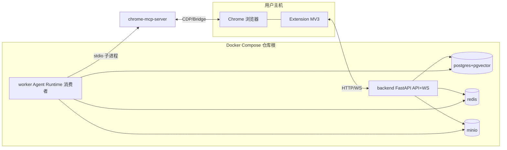

# 部署与开发计划 V2.0

## 文档信息

| 项 | 值 |
|---|---|
| 文档名称 | 部署与开发计划（LLD） |
| 版本 | V2.0 |
| 状态 | 设计基准 |
| 关联文档 | 02 系统架构 / 04 Agent Runtime / 07 MCP与Tool / 09 数据库 / 11 Chrome Extension |
| 定位 | 部署拓扑 / 仓库结构 / 环境配置 / 数据库迁移 / 工具链 / 开发顺序 / 质量门禁 / 已知陷阱 |

---

## 1. 设计目标

定义系统的部署拓扑、服务编排、配置管理、数据库迁移路径、开发工具链与开发顺序。使开发人员可据此搭建环境、按 Phase 推进、避开已知陷阱，并明确 V1 单用户单平台范围与生产扩展方向。

---

## 2. 背景

Prompt §16 要求部署与开发规范；doc 02 §8 给部署拓扑（docker-compose：backend/worker/postgres/redis/minio；MCP stdio 子进程）；doc 07 给 MCP Server 配置与生命周期；doc 09 §9 给 9->14 表迁移路径。V1.2 §11 给 Phase 1-9 开发顺序。Phase 0 前置基础设施已落地并全量验证（2026-07-26）；Phase 1 扩展骨架已落地（`feature/phase1-extension`）。本文整合已落地决定、踩坑与未决风险。

**V1 范围约束：** 仅 Boss 直聘；单用户；桌面 Chrome；backend/worker 可合并单进程。

---

## 3. 部署架构

引用 doc 02 §8 拓扑：



- `docker-compose.yml` 放**仓库根**（不放 deploy/，避免 .env 读取错配，见 §18 陷阱 1）。
- `chrome-mcp-server` 由 Worker 以 stdio 子进程拉起，**不作为独立 compose 服务**（doc 02/07）。
- V1：backend 与 worker 可合并单进程启动（简化）；生产建议拆分（doc 02 §8）。

---

## 4. 服务清单

| 服务 | 镜像/构建 | 职责 | 端口 |
|---|---|---|---|
| backend | `backend/` 构建 | FastAPI HTTP+WS 接口、Service、Scheduler | 8000 |
| worker | `backend/` 构建（消费者模式） | Queue 消费、Agent Runtime、LangGraph、MCP Client | -- |
| postgres | postgres+pgvector | 业务表 + LangGraph Checkpoint 表（同实例，独立前缀） | 5432 |
| redis | redis | Stream 队列 + 锁 + 缓存 | 6379 |
| minio | minio | 简历文件/截图/执行证据对象存储 | 9000/9001 |
| chrome-mcp-server | node 子进程 | 浏览器能力（18 工具，doc 07） | --（stdio） |

> backend 与 worker 共享 `backend/` 代码库，分别以 API 模式与消费者模式启动（doc 02 §8）。

---

## 5. 仓库结构（monorepo）

```
AI_Job_Agent_Runtime/                 # 仓库根
├── docker-compose.yml                # 编排（根，自动读根 .env）
├── .env / .env.example               # 环境配置（根）
├── backend/                          # Python 后端 + Agent Runtime
│   ├── pyproject.toml                # uv 项目定义
│   ├── uv.lock                       # 锁文件
│   ├── .python-version               # Python 3.12（强制 git add -f）
│   ├── alembic.ini                   # 仅 ASCII（编码陷阱，§18）
│   ├── alembic/versions/
│   │   ├── 0001_initial_schema.py    # Phase 0 9 表（已落地）
│   │   └── 0002_target_schema.py     # 9->14 表（待写，doc 09 §9）
│   └── app/
│       ├── api/ service/ repository/ model/ schema/ core/ infra/
│       └── main.py
├── extension/                        # Chrome Extension（Vue3+Vite）
│   ├── package.json / pnpm-lock.yaml
│   ├── vite.config.ts
│   ├── manifest.json
│   └── src/
└── docs/                             # 设计文档（V2.0 设计集为权威）
```

- 决定：Python 工具链（pyproject/uv.lock/.python-version）迁入 `backend/`，根目录只留编排文件（Phase 0 决定，见 [[phase0-decisions]]）。
- `backend/` 与 `extension/` 平级，真 monorepo。

---

## 6. 环境与配置管理

### 6.1 环境隔离

`dev -> test -> staging -> prod`（Prompt §11）。V1 落地 dev + test；staging/prod 留扩展。

| 环境 | 用途 | 配置 |
|---|---|---|
| dev | 本地开发 | compose up + .env；热重载 |
| test | CI/自动化测试 | compose + 测试库；pytest |
| staging | 预发布 | 独立 compose 项目；生产镜像 |
| prod | 生产 | 拆分 backend/worker；独立 PG/Redis/MinIO |

### 6.2 配置管理

- **禁止硬编码** Token/密码/环境变量（CLAUDE.md §11）。
- `.env` 放仓库根（compose 自动读）；`.env.example` 提交模板；真实 `.env` 不入库。
- 后端 `core/config.py`（pydantic-settings）读根 `.env`，向上 4 级寻址（doc 02 §5）。
- **.env 格式严格**：仅 `KEY=VALUE`/注释/空行；docker compose 解析比 python-dotenv 严格（见 §18 陷阱 2）。
- 密钥：LLM api_key 加密存 DB（`users.llm_api_key_encrypted`，doc 09 §5.1）；不进日志/记忆明文。

### 6.3 关键环境变量

| 变量 | 说明 |
|---|---|
| `DATABASE_URL` | postgres+pgvector 连接串 |
| `REDIS_URL` | Redis 连接串 |
| `MINIO_*` | MinIO endpoint/key/secret/bucket（建议补全，见 §18 风险） |
| `LLM_*` | 默认 LLM 配置（用户 Settings 覆盖） |
| `MCP_SERVER_PATH` | chrome-mcp-server.js 路径 |
| `T_HEARTBEAT` | 监听心跳超时（默认 120s，doc 04 §7.2） |

---

## 7. 数据库迁移（9 -> 14 表）

Phase 0 已建 9 表（`0001_initial_schema.py`，含 `CREATE EXTENSION vector` + 外键 + Check + 索引）。目标态 14 表（doc 09 §3）。

### 7.1 迁移内容（`0002_target_schema.py`，待写）

| 类型 | 内容 |
|---|---|
| 新增表 | settings / hrs / resume_summaries / memory / task_checkpoint_index |
| 列扩展 | jobs(hr_id,source_url) / conversations(job_id,hr_id,thread_id,status,external_chat_id) / tasks(thread_id,priority) / resumes(version,status) / execution_logs(trace_id,skill) / approvals(decision) |
| 枚举迁移 | jobs.status(analyzed->scored,+chatting/closed/skipped) / tasks.status(大小写+值映射) / approvals.status(+timed_out) |
| 默认值 | tasks.max_retries 3->2 |
| 数据迁移 | users.settings JSONB -> settings 表；resumes.embedding -> resume_summaries；conversations.hr_name -> hrs |

### 7.2 迁移原则

- 向后兼容：新增列可空/有默认；枚举先扩后缩。
- 数据回填脚本单独验证；每步可回滚。
- **先在测试库验证**再应用 dev（记忆 v2-doc-rewrite-decisions 风险项）。
- 详见 doc 09 §9。

> 迁移脚本未写；实现 Phase 2 前必须先完成并验证。

---

## 8. MCP Server 部署

### 8.1 配置（doc 07）

```json
{
  "mcpServers": {
    "chrome-mcp": {
      "command": "node",
      "args": ["/path/to/chrome-mcp-server.js"]
    }
  }
}
```

- 协议：**stdio**（非 HTTP/SSE）；不暴露本地端口（doc 02 §6）。

### 8.2 生命周期（doc 07）

- Worker 启动时（或首次任务前）拉起子进程；跨任务保活（单例复用）。
- 健康检查：周期 ping（30s）。
- 崩溃：终止旧子进程 -> 重新拉起 -> 当前调用返回错误 -> error_recovery（doc 15）。
- 空闲回收：>10min 无任务可选回收；V1 常驻。
- Worker 关闭时优雅终止子进程。

---

## 9. backend / worker 合并 vs 拆分

| 模式 | 适用 | 说明 |
|---|---|---|
| 合并（V1） | 单用户/开发/小规模 | backend 与 worker 同进程；FastAPI + QueueConsumer 共事件循环；单任务锁用进程内 `asyncio.Lock`（doc 04 §8.1） |
| 拆分（生产） | 多用户/扩容 | backend（API+WS+Scheduler）与 worker（Queue 消费+Agent）独立扩缩；Redis 分布式锁 `lock:agent:execute`；Stream 消费者组多 consumer（doc 04 §19） |

- V1 采用合并模式简化部署；代码以"可拆分"组织（Service/QueueConsumer 边界清晰）。
- 单任务执行锁：V1 `asyncio.Lock`；扩容切 Redis 分布式锁（doc 04 §8.1）。

---

## 10. 开发环境与工具链

### 10.1 后端（backend/）

- Python 3.12（`.python-version`，强制 git add -f）。
- 包管理：`uv`（`uv sync` 重建 venv）。
- 迁移：`alembic`（`alembic.ini` 仅 ASCII，§18 陷阱 1）。
- 运行：`uv run uvicorn app.main:app --reload`。
- 脚本：`uv run python -m` / `-c`；直接 `python scripts/x.py` 需 `sys.path.insert`（§18 陷阱 3）。

### 10.2 前端（extension/）

- Node + pnpm 9。
- 构建：`pnpm build`（vue-tsc + vite + @crxjs）。
- 加载：Chrome `chrome://extensions` 开发者模式加载 `dist/`。

### 10.3 质量工具

| 工具 | 配置 | 要点 |
|---|---|---|
| ruff | 忽略 RUF001/2/003（中文标点故意的）；移除 ANN101/102 | 全绿（Phase 0 验证） |
| mypy | `ignore_missing_imports=true`；排除 alembic/ | pre-commit 钩子用 `uv run --directory backend` |
| pre-commit | ruff/mypy 本地钩子；`pass_filenames=false` + 显式路径 | **未 install**（§18 风险，待 `pre-commit install`） |
| pytest | 单元+集成 | Phase 0: 2 passed |

### 10.4 基础设施启动

```bash
# 仓库根执行
docker compose up -d                 # postgres/redis/minio（+ backend/worker）
uv sync --directory backend          # 后端依赖
cd extension && pnpm install         # 前端依赖
uv run --directory backend alembic upgrade head   # 迁移
```

> 端口 5432/6379 被本机服务占用时先关本机服务（§18 陷阱 5）。

---

## 11. 开发顺序（V1.2 §11）

> 开发顺序与已冻结技术栈以 V1.2 为准（project-docs）。Phase 0 为前置基础设施（V1.2 无编号）。

| Phase | 内容 | 状态 | 对应文档 |
|---|---|---|---|
| Phase 0 | 基础设施：compose / FastAPI 分层骨架 / 9 表 + alembic / 健康检查 / ruff+pre-commit | ✅ 已落地（2026-07-26 验证） | doc 02/09 |
| Phase 1 | Chrome Extension 骨架（Settings/SidePanel/SW） | ✅ 已落地（`feature/phase1-extension`） | doc 11/12 |
| Phase 2 | Backend 基础服务（REST + WS + Service + Repository） | ⏳ 待开发 | doc 10/02 |
| Phase 3 | MCP stdio 连接（MCP Client + Server 生命周期） | ⏳ | doc 07 |
| Phase 4 | Boss Skill（Goal-Oriented Skill 集） | ⏳ | doc 08 |
| Phase 5 | 聊天同步（双同步器） | ⏳ | doc 13 |
| Phase 6 | Task 系统（Queue + Scheduler + 并发） | ⏳ | doc 04/03 |
| Phase 7 | LangGraph Agent（StateGraph + 节点 + Checkpoint） | ⏳ | doc 06/03 |
| Phase 8 | 自动回复（ReAct + Recovery） | ⏳ | doc 03/15 |
| Phase 9 | 自动投递（Approval + 投递流程） | ⏳ | doc 14 |

**Phase 2 启动前置：** 先写 `0002` 迁移（9->14 表，doc 09 §9）并在测试库验证；从 `main` 新切 `feature/phase2-backend-api` 分支（记忆 project-phase-status）。

---

## 12. CI/CD 与质量门禁

### 12.1 质量门禁（pre-commit）

- ruff check + mypy（经 `uv run --directory backend`）。
- **待执行 `pre-commit install`**（§18 风险，至今未触发）。
- 前端：`pnpm build`（vue-tsc 类型检查）。

### 12.2 CI（V1 基线）

- 后端：`uv sync` -> `alembic upgrade head`（测试库）-> `pytest` -> `ruff check`。
- 前端：`pnpm install` -> `pnpm build`。
- 服务健康：`check_services`（postgres/redis/minio 连通）。

### 12.3 提交规范（CLAUDE.md §13）

```
feat(auth): add jwt refresh token support
fix(redis): resolve async connection leak
```

一个功能 -> 一个测试 -> 一个 Commit -> 一个 Push。

---

## 13. 异常处理（部署相关）

| 异常 | 处理 |
|---|---|
| 容器凭证 ≠ 后端 .env 凭证 | compose 放仓库根自动读根 .env（§18 陷阱 1） |
| .env 解析失败 | 仅 KEY=VALUE 格式；awk 过滤清理（§18 陷阱 2） |
| 端口 5432/6379/9000 占用 | 关本机服务或改端口；`down -v` 重建卷 |
| 迁移失败 | 回滚到上一迁移；测试库先验证 |
| MCP Server 拉起失败 | 检查 node + 路径；Worker 健康检查降级 |
| uv sync 文件锁（Windows） | 重试 / `UV_LINK_MODE=copy`（§18 陷阱 4） |
| alembic 中文注释报错 | alembic.ini 仅 ASCII（§18 陷阱 1） |

---

## 14. Retry 与 Recovery（部署相关）

- **服务重启恢复**：Queue 持久化（Redis Stream）+ Checkpoint（PostgresSaver）-> 容器重启后 stalled 消息 XCLAIM + Checkpoint 续跑（doc 04 §6.3/§9）。
- **Approval 定时器补偿**：backend 重启扫描过期 pending 补 timeout（doc 14 §11）。
- **MCP Server 重启**：崩溃自动重启 + error_recovery（doc 07/15）。
- **数据库重连**：asyncpg 自动重连 + 事务重试（doc 09 §15）。
- **不丢任务**：Stream 持久化 + 死信留存（doc 04 §6）。

---

## 15. 扩展设计

- **多用户**：JWT + 租户隔离；表加 user_id 索引 + RLS；Queue 按用户分流（doc 02 §17）。
- **多平台**：host_permissions 扩；新增平台 Skill 集；`platform` 列已就绪（doc 09 §17）。
- **生产拆分**：backend/worker 独立扩缩；Redis 分布式锁；Stream 消费者组（doc 04 §19）。
- **K8s**：compose -> k8s manifests；HPA 扩缩 worker；PG/Redis/MinIO 转托管服务。
- **可观测平台**：LangSmith/OTel + Prometheus + Grafana（doc 15 §12）。

---

## 16. 边界与约束

1. V1 仅 Boss 直聘、单用户、桌面 Chrome。
2. MCP 仅 stdio；不自建 Browser Client。
3. 密钥加密存储，不进 .env 明文之外的记忆/日志。
4. compose 放仓库根；.env 仅 KEY=VALUE。
5. 迁移先测试库验证；向后兼容。
6. 开发顺序以 V1.2 §11 为准；V2.0 设计为权威。

---

## 17. 部署拓扑生命周期

| 对象 | 生命周期 |
|---|---|
| Compose 栈 | `up -d` 启动；`down` 停止；`down -v` 清卷重建 |
| backend | 常驻；uvicorn 热重载（dev） |
| worker | 常驻；QueueConsumer 持续消费 |
| postgres/redis/minio | 常驻；数据卷持久化 |
| MCP Server | worker 拉起/回收；跨任务保活 |
| Extension | 随浏览器启停；SW 事件驱动（doc 11 §7） |

---

## 18. 设计要点与风险（含 Phase 0 已知陷阱）

**【核心逻辑】**
- monorepo（backend/ + extension/ 平级）+ compose 仓库根 + .env 统一配置，规避凭证错配。
- V1 合并单进程简化部署，代码以可拆分组织；生产按需拆分 + 分布式锁。
- 迁移 9->14 表是 Phase 2 前置；先测试库验证。
- 开发顺序 V1.2 §11 为准；V2.0 设计为权威。

**【Phase 0 已知陷阱与规避】**（见 [[phase0-pitfalls-and-risks]]，勿重复踩）

1. **alembic.ini 中文注释 -> UnicodeDecodeError**（Windows gbk）：alembic.ini 仅 ASCII；pyproject/.env 不受影响。
2. **根 .env 被流程图 ASCII 污染 -> compose 解析失败 -> 凭证错配**：.env 仅 KEY=VALUE；awk 过滤清理；compose 解析比 python-dotenv 严格。
3. **`uv run python scripts/x.py` -> No module named 'app'**：脚本顶部 `sys.path.insert(0, parents[1])`；或用 `uv run python -m`。
4. **uv sync Windows trampoline exe 文件锁**：重试 / `UV_LINK_MODE=copy`。
5. **端口 5432/6379 被本机服务占用**：关本机服务；`down -v` + `up` 重建。
6. **`.python-version` 被 .gitignore 忽略**：`git add -f backend/.python-version`。

**【未决风险】**（见 [[phase0-pitfalls-and-risks]]）

- **用户 .env stale**：有 `RABBITMQ_*`（无害），缺 `MINIO_*`（用默认值恰与 compose 一致能跑）。建议补 MinIO 删 RabbitMQ，待用户决定。
- **pre-commit 未 install**：`.git/hooks/pre-commit` 不存在，commit 未触发 ruff/mypy。需 `pre-commit install`。
- **mypy --strict 未实跑**：structlog kwargs 可能需放宽。
- **structlog 中文日志 Windows gbk 控制台乱码**：仅显示问题；prod JSON 渲染正常。
- **Windows git autocrlf 警告**：可加 `.gitattributes` 规范。
- **0002 迁移未写**：Phase 2 前置，需先测试库验证。
- **backend/worker 合并/拆分未定**：Phase 2 实现时需定（记忆 v2-doc-rewrite-decisions 风险 #2）。

**【潜在风险】**
- **MCP Server 路径硬编码**：不同环境路径不同。**缓解**：`MCP_SERVER_PATH` 环境变量 + 配置校验。
- **单进程合并的阻塞风险**：V1 合并模式下 Agent 长任务可能阻塞 API。**缓解**：asyncio 非阻塞；API 与 Worker 共事件循环但 QueueConsumer 不独占；监控事件循环延迟。
- **数据卷丢失**：`down -v` 清卷致数据丢。**缓解**：dev 可接受；prod 用独立卷/托管 DB。
