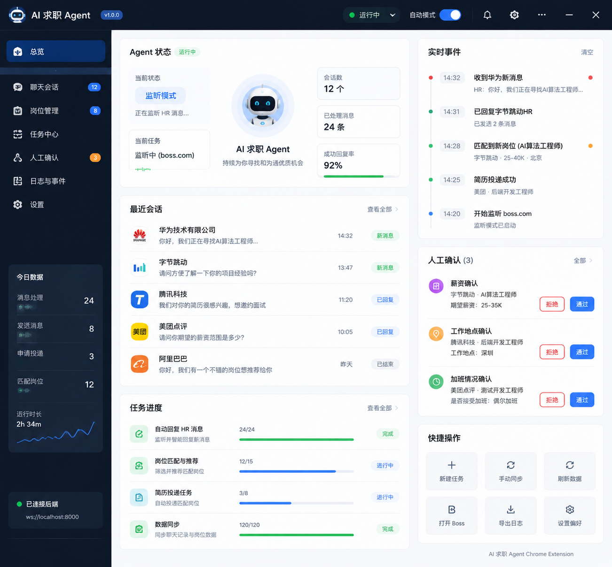

# AI求职Agent Chrome Extension 前端视觉与交互设计文档 V1.0

## 1. 文档定位

本文档不是开发Spec，而是前端视觉设计与交互规范。

用于指导：

-   Chrome Extension SidePanel设计
-   Settings页面设计
-   Popup设计
-   组件视觉统一
-   用户交互体验

## 2. 产品视觉定位

AI求职Agent定位：

个人AI求职工作台。

不是普通聊天插件。

视觉关键词：

-   专业
-   高信息密度
-   AI工作台
-   可观察
-   可控制

参考风格：

-   Linear
-   Raycast
-   VS Code

## 3. UI主题

默认主题：

Dark Mode

原因：

Agent运行过程中会展示：

-   日志
-   状态
-   时间线
-   Tool调用

## 4. 颜色规范

主色：

#6366F1

用途：

-   主按钮
-   Agent状态
-   当前任务

Hover：

#818CF8

成功：

#22C55E

运行：

#3B82F6

等待：

#F59E0B

错误：

#EF4444

背景：

#111827

卡片：

#1F2937

边框：

#374151

## 5. 字体规范

中文：

-   PingFang SC
-   Microsoft YaHei

英文：

Inter

字号：

标题：

16px

正文：

14px

辅助：

12px

## 6. Chrome Extension页面结构

    extension

    ├── SidePanel
    ├── Popup
    ├── Settings
    └── Notification

# 7. SidePanel设计

## 尺寸

宽度：

400px

高度：

跟随浏览器窗口。

## 页面布局

### 7.1 总览页视觉参考

> 以下为主页面（总览 / Dashboard）高保真布局图，作为前端实现的视觉基准。
> 包含：左侧导航 + 今日数据、主内容区（Agent 状态 / 最近会话 / 任务进度）、右侧信息流（实时事件 / 人工确认 / 快捷操作）。

### 7.2 结构层级

    Header

    Agent状态

    当前任务

    HR聊天

    Approval

    Agent Timeline

    输入区域

## Header

高度：

56px

内容：

左：

AI求职Agent

右：

运行状态 + 设置按钮

状态：

Idle

Running

Monitoring

Waiting Approval

Error

## Agent状态卡片

高度：

100px

展示：

-   当前状态
-   当前步骤
-   任务进度

示例：

正在分析岗位

Step 2/5

## 当前任务区域

显示：

-   岗位名称
-   公司
-   HR
-   当前执行节点

按钮：

暂停

停止

## HR聊天区域

类似聊天软件。

HR：

左侧。

Agent：

右侧。

Agent消息显示：

AI Generated

## Approval区域

重要人工确认窗口。

触发：

-   薪资
-   地点
-   入职时间
-   加班
-   外包
-   试用期工资

弹窗：

宽度：

360px

结构：

问题

↓

Agent建议

↓

修改 / 确认发送

## Timeline

展示：

Agent执行过程。

例如：

14:20

调用 boss.get_messages

14:21

分析HR意图

14:22

生成回复

14:23

发送成功

# 8. Popup设计

尺寸：

400×600px

用途：

快速控制。

内容：

-   Agent状态
-   自动回复开关
-   自动投递开关
-   打开SidePanel

# 9. Settings设计

尺寸：

900px。

布局：

左侧菜单：

220px

右侧：

680px

菜单：

    LLM配置

    Agent策略

    求职规则

    回复风格

    简历管理

    数据同步

# 10. Settings详细

## LLM配置

字段：

-   Provider
-   Base URL
-   API Key
-   Model

按钮：

测试连接。

## Agent策略

配置：

-   自动回复
-   自动投递
-   最大HR并发
-   后台监听时间

## 求职规则

配置：

-   薪资
-   地点
-   加班
-   外包
-   异地
-   试用期工资

## 回复风格

默认：

正式、有度、简洁、突出匹配度。

## 数据同步

按钮：

立即同步Boss聊天记录。

# 11. Notification设计

Toast：

右上角。

成功：

消息发送成功。

错误：

Boss页面变化，需要恢复。

# 12. Loading设计

禁止普通转圈。

使用Agent状态：

例如：

Agent正在分析岗位...

# 13. 前端组件规划

    AgentStatus.vue

    TaskCard.vue

    ChatPanel.vue

    ApprovalModal.vue

    Timeline.vue

    SettingsForm.vue

    StatusBadge.vue

# 14. 状态管理

AgentStore：

-   status
-   currentTask
-   events

ConversationStore：

-   conversationId
-   messages

ApprovalStore：

-   approvals

SettingsStore：

-   configuration

# 15. 动效规范

允许：

-   状态变化
-   Modal出现
-   Toast

禁止：

-   大量动画
-   影响阅读的效果

# 16. 设计原则

1.  用户永远知道Agent正在做什么。

2.  用户永远可以接管Agent。

3.  重要行为必须可确认。

4.  失败必须可解释。

5.  信息展示优先于视觉装饰。
