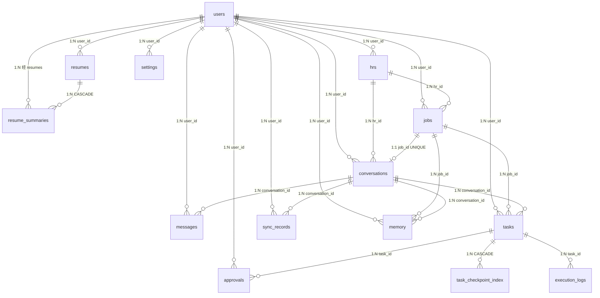

# 数据库表设计文档 · 总览

> **权威来源**：本文档以 `backend/app/models/*.py` 中真实 ORM Model 与
> `backend/alembic/versions/*.py` 迁移脚本为准，**不参考**旧设计文档。
> 如与旧文档冲突，以本目录（及代码）为准。

- 数据库：**PostgreSQL 16**（`pgvector` 扩展用于向量检索）
- 存储引擎：PostgreSQL 默认
- 字符集：UTF-8
- 主键策略：`BIGSERIAL`（`BigInteger` 自增），业务侧不用 UUID 作主键
- 时间戳：统一 `TIMESTAMPTZ`（`DateTime(timezone=True)`），UTC 存储
- 扩展依赖：`vector`（`CREATE EXTENSION IF NOT EXISTS vector`，见迁移 0001）

## 1. 表清单（14 张）

| # | 模块 | 表名 | 说明 |
|---|------|------|------|
| 1 | 用户与设置 | `users` | 用户基本信息 + 兼容缓存 settings JSONB |
| 2 | 用户与设置 | `settings` | 用户配置键值对（权威入口） |
| 3 | 简历 | `resumes` | 简历元数据（文件 / 文本） |
| 4 | 简历 | `resume_summaries` | 简历摘要 + 512 维向量（多版本） |
| 5 | 岗位与HR | `jobs` | 招聘岗位（含匹配分） |
| 6 | 岗位与HR | `hrs` | HR 独立实体（去重规范化） |
| 7 | 会话与消息 | `conversations` | 一个平台 HR 聊天窗口 |
| 8 | 会话与消息 | `messages` | 聊天消息 |
| 9 | 会话与消息 | `sync_records` | 消息同步批次记录 |
| 10 | 任务与执行 | `tasks` | Agent 任务（状态机） |
| 11 | 任务与执行 | `task_checkpoint_index` | Task ↔ LangGraph Checkpoint 索引 |
| 12 | 任务与执行 | `execution_logs` | 执行日志（append-only） |
| 13 | 人工确认 | `approvals` | 敏感信息人工确认 |
| 14 | 长期记忆 | `memory` | 长期记忆 + 512 维向量 |

## 2. 模块索引

| 文档 | 覆盖表 |
|------|--------|
| [01-用户与设置.md](./01-用户与设置.md) | `users`、`settings` |
| [02-简历模块.md](./02-简历模块.md) | `resumes`、`resume_summaries` |
| [03-岗位与HR模块.md](./03-岗位与HR模块.md) | `jobs`、`hrs` |
| [04-会话与消息模块.md](./04-会话与消息模块.md) | `conversations`、`messages`、`sync_records` |
| [05-任务与执行模块.md](./05-任务与执行模块.md) | `tasks`、`task_checkpoint_index`、`execution_logs` |
| [06-人工确认与长期记忆模块.md](./06-人工确认与长期记忆模块.md) | `approvals`、`memory` |

## 3. 整体 ER 关系

## 4. 关键设计要点

1. **主键全部为 `BigInteger` 自增**，避免外部分发；`uuid` 仅作为业务标识/去重锚点。
2. **向量统一 512 维**（`bge-small-zh-v1.5` 模型），建在 `resume_summaries`、`memory` 两张表，用 `ivfflat` 向量索引（`lists=100`，cosine 距离）。
3. **`users.settings` 为兼容缓存层**，`settings` 表是权威配置入口（见迁移 0002 回填策略）。
4. **`resumes.embedding` 已废弃**，向量迁移至 `resume_summaries`，字段保留兼容。
5. **状态字段全部用 `String` + `CHECK` 约束**兜底（无 PG 原生 ENUM），值为全小写。
6. **`execution_logs` 为 append-only**：只有 `created_at`，无 `updated_at`，不更新只插入。
7. **CASCADE 删除仅用于强归属子表**：`resume_summaries.resume_id`、`hrs.user_id`、`settings.user_id`、`memory.user_id`、`task_checkpoint_index.task_id`。
8. **部分索引**：`approvals` 的超时扫描用 `expires_at WHERE status='pending'` 部分索引加速。

## 5. 文档图例

- **类型**：PostgreSQL 实际类型（`VARCHAR(n)` / `JSONB` / `TIMESTAMPTZ` / `VECTOR(512)` / `UUID`）
- **NULL**：`N` 表示 NOT NULL，`Y` 表示允许 NULL
- **默认值**：展示 SQL 层 `server_default`；模型层 Python 默认值若与 SQL 默认不同会在备注说明
